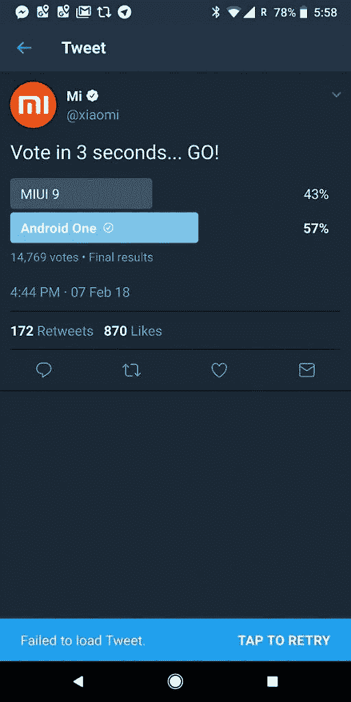

# 当更多人更喜欢 Android One 而不是 MIUI 时，小米删除了 Twitter 民意调查

> 原文：<https://www.xda-developers.com/xiaomi-deletes-twitter-poll-android-one-miui/>

# 当更多人更喜欢 Android One 而不是 MIUI 时，小米删除了 Twitter 民意调查

小米最近在 Twitter 上进行了一次关于 MIUI 和 Android One 之间用户偏好的调查。当事情不尽如人意时，他们删除了投票。

XDA 开发者论坛的一大亮点是基于 AOSP 的定制 rom 的可用性，如 LineageOS、ResurrectionRemix、ParanoidAndroid 等等。因此，与 MIUI 等第三方 OEM ROM 相比，我们的大多数读者更喜欢普通 Android 的外观也就不足为奇了。MIUI 是小米发布其所有手机(除了[小米 Mi A1](https://www.xda-developers.com/xiaomi-mi-a1-xda-android-review/) )的大幅修改的 Android 版本。虽然你可能会认为小米的许多主流消费者群是 MIUI 而不是 Android 的粉丝，但似乎大量小米客户实际上更喜欢 Android One 而不是 MIUI，至少根据小米官方 Twitter 账户发布的一项现已删除的民意调查显示。

 <picture></picture> 

Source: [@rajupp](https://twitter.com/rajupp/status/961939943655333888)

用户被要求在 MIUI 9 和 Android One 之间投票选择他们更喜欢的 Android 软件体验。很可能是 Twitter 账户背后的社交媒体团队误读了自己的受众，结果事与愿违。公司经常这样做，因为这可以炫耀他们的声誉，甚至可以说服对他们的产品感兴趣的消费者购买他们的产品，如果他们看到粉丝投票顺利的话。然而，在这条推文上线后不久，它就被删除了，因为在大约 15，000 名选民中，有 57%的人投票支持 Android One 而不是 MIUI 9。糟糕。

不足为奇的是，小米硬件的许多粉丝都是 Android 的粉丝，因为根据 LineageOS 的统计数据(不包括 T2 未知的类别)，印度和中国分别是 LineageOS 安装数量的第一名和第三名。这些都是小米最受欢迎的地区，所以结果并不像乍看上去那么令人惊讶。

我们不知道小米是否会将这一特殊的反馈放在心上，因为它看起来只是该公司的社交媒体试图让观众参与一场无聊的投票，而不是真正提出一个严肃的问题。这并不是说，当用户面对一个定制的 Android 皮肤时，他们不会更喜欢 MIUI。这对该公司来说最终是一场相当尴尬(但有趣)的考验，并显示出当你预计自己的产品会获胜时，在官方社交媒体页面上发布有争议的民意调查的危险。

* * *

[**Via:/r/小米【1】**](https://www.reddit.com/r/Xiaomi/comments/7wldm2/remember_the_android_one_v_miui_poll_on_twitter)

[**Via:/r/Android【2】**](https://www.reddit.com/r/Android/comments/7wrbay/xiaomi_deletes_an_android_one_vs_miui_poll_after/)