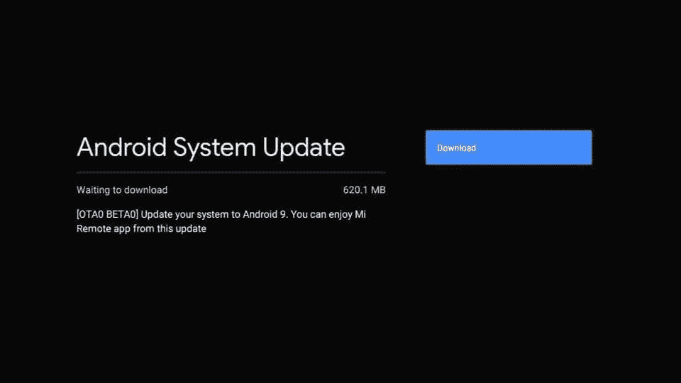

# 小米终于准备推出 Android 9 派到了米盒子 3

> 原文：<https://www.xda-developers.com/xiaomi-finally-prepares-roll-out-android-9-pie-mi-box-3/>

# 小米终于准备推出 Android 9 派到了米盒子 3

小米盒子 3(在美国简称为“小米盒子”)终于收到了小米的 Android Pie 测试版。继续阅读，了解更多信息！

早在 2016 年推出的小米 3 是今天的[小米盒子 4K](https://www.xda-developers.com/xiaomi-mi-true-wireless-earphones-2-android-tv-mi-box-4k-india/) 或[小米电视棒](https://www.xda-developers.com/xiaomi-mi-tv-stick-india-launch-challenges-amazon-fire-tv-stick/)的前身。事实上，[在美国销售的“米盒子”](https://www.xda-developers.com/xiaomi-launches-the-mi-box-in-usa-for-69/)不过是一个重新命名的米盒子 3。中国 OEM 厂商出货的设备带有安卓棉花糖，跳过了承诺的牛轧糖更新，[直接跳到安卓奥利奥](https://www.xda-developers.com/xiaomi-mi-box-android-oreo-update-2/)。虽然它的继任者 Mi Box S 在几个月前选择了 Android Pie 更新，但 Mi Box 3 的用户至今仍使用 Android Oreo。如果你仍然持有旧的 Mi Box，你会很兴奋地知道小米现在推出了期待已久的 Mi Box 3 的 Android Pie 更新，以选择 beta 测试人员。

最初的公共测试版本(软件版本 **R2810** )是为 Mi Box 3 的 MDZ-16-AB 版本设计的，它的大小接近 620MB。包含的 changelog 非常小，因此我们只知道 OTA 在漂亮的机顶盒中加入了 Android Pie，同时支持 Mi Remote 应用程序。尽管没有稳定版本何时登陆的预计时间，但这将是该设备的第三次主要安卓操作系统更新(算上未发布的安卓牛轧糖版本)，对于这样一个负担得起的认证安卓电视盒子来说，这是非常令人印象深刻的。

 <picture></picture> 

Thanks to Reddit user [u/Askmetech](https://www.reddit.com/user/Askmetech/) for the screenshot!

考虑到 Mi Box 3(代号:once)和 Mi Box S/Mi Box 4K(代号:oneday)之间的内部相似性，我们希望前面提到的 Android Pie beta 固件附带后者稳定的 Android Pie build 的大多数 bugfix 补丁。请注意，这两个流设备的固件包互不兼容，**因此不要尝试执行交叉闪存**。

Mi Box 3 支持 60fps 的 4K 视频播放，这要归功于设备内部的四核 Amlogic SoC 和 Mali 450 GPU 以及 2GB RAM。还支持杜比数字加音频播放，尽管据报道测试版固件会破坏一些用户的高清音频传输。