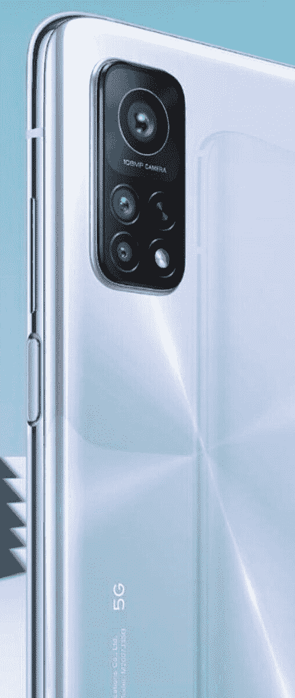

# 这是小米即将推出的米 10T Pro 旗舰智能手机

> 原文：<https://www.xda-developers.com/xiaomi-mi-10t-pro-flagship-smartphone-leak/>

小米的 Mi 10 系列是该公司目前的旗舰产品阵容，它由 Mi 10，Mi 10 Pro，Mi 10 Lite，Mi 10 Lite Zoom 和 Mi 10 Ultra 组成。不过，小米并没有完全完成其小米 10 系列的扩张。最近的传言指向该公司将推出一个新的“小米 10T”系列，我们现在有了我们认为是这个新系列中最高端型号的第一张现场图片:小米小米 10T Pro。

在在线移动市场 [OfferUp](https://offerup.com/) 上，我们发现了一个小米“全新手机”的列表(h/t [@Tech_Savvy](https://twitter.com/Tech__Savvy) ),代号为“阿波罗”，型号为 M2007J3SG。我们将“关于手机”屏幕中显示的两个 IMEI 与 IMEI 数据库进行了交叉引用，以确认该设备的型号名称确实是 M2007J3SG。此外，XDA 成员(也是小米的经常线人) [kacskrz](https://forum.xda-developers.com/member.php?u=8240900) 在小米最新的[基于 Android 11 的 MIUI 12 beta](https://www.xda-developers.com/download-xiaomi-mi-10-mi-10-pro-first-miui-12-china-beta-android-11/) 中发现了代码，该代码将型号名称 M2007J3SC、M2007J3SI、M2007J3SP、M2007J3SG 和 M2007J3SY 与小米 10T 和小米 10T Pro 的营销名称联系起来。我们还[在小米的相机应用](https://www.xda-developers.com/xiaomi-working-another-smartphone-108mp-64mp-camera-gauguin-gauguinpro-china-india-international/)中发现了“阿波罗”代号的引用，揭示了标准型号具有 64MP 三摄像头设置，而“阿波罗 pro”型号具有 108MP 三摄像头设置。同样的代码表明，将有“阿波罗”和“阿波罗 pro”的全球和印度版本，因此我们可以预计米 10T 和米 10T Pro 将在全球推出。

OfferUp 列表有 8 张照片，其中 5 张显示了 Mi 10T Pro 的背面，3 张显示了正面。由于光线不同，每张照片的封底颜色看起来都大相径庭，尽管下面画廊中最右边的图像中看到的颜色可能最接近实际颜色。我们认为这是因为它与 Twitter 用户 [Abhishek Yadav](https://twitter.com/yabhishekhd/status/1298645623906787334) 发布的泄露渲染图中显示的颜色相匹配。

*小米 Mi 10T Pro 可能的现场图片*

 <picture></picture> 

Alleged press render of the Xiaomi Mi 10T Pro. Credits: @yabhishekhd

显示 Mi 10T Pro 正面的 3 张照片证实了该设备具有薄边框和左侧的单个打孔切口。这些图像显然是预生产单元，因为显示的软件是库存 Android 10 而不是 MIUI 12。

据@ yabhishekhd 报道，小米 10T Pro 的一些规格可能包括 5000 毫安时电池，144 赫兹显示屏和侧装指纹扫描仪。我们无法证实电池容量或指纹扫描仪的位置，但内核源代码分析确实证实了 144Hz 刷新率的支持。我们还从内核资源中了解到，该设备可能由[高通骁龙 865](https://www.xda-developers.com/qualcomm-snapdragon-865-processor-specifications-features/) 或[骁龙 865 Plus](https://www.xda-developers.com/qualcomm-snapdragon-865-plus-launch/) 驱动。我们没有关于该设备的其他规格、定价或发布日期的信息，但鉴于媒体渲染和现场图像已经开始泄露，我们很快就会了解更多关于 Mi 10T Pro 的信息。