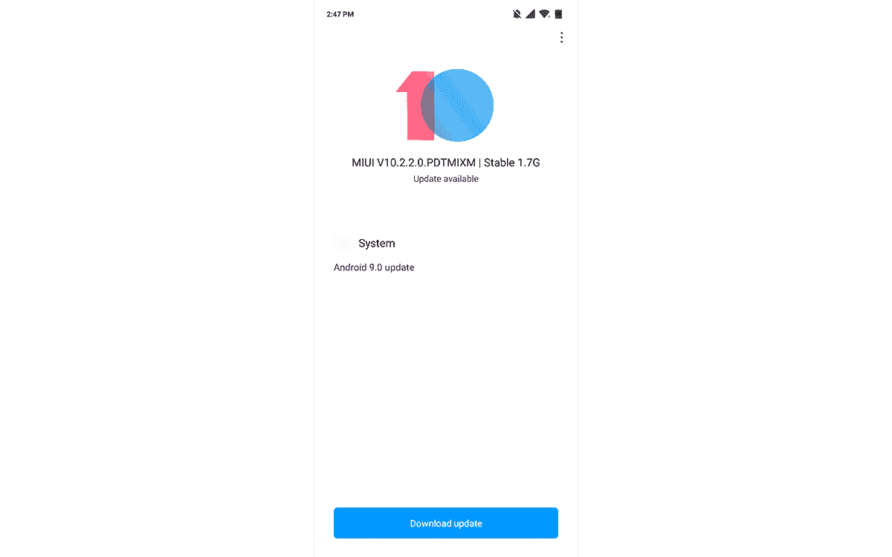

# 小米 Mi 8 Lite 稳定的基于 Android 馅饼的 MIUI 10 全球更新正在推出

> 原文：<https://www.xda-developers.com/xiaomi-mi-8-lites-stable-android-pie-based-miui-10-global-update-is-rolling-out/>

# 小米 Mi 8 Lite 稳定的基于 Android 馅饼的 MIUI 10 全球更新正在推出

在 12 月开始对 Android Pie 进行测试后，小米 8 Lite 的中国版本最近收到了最新的 MIUI 10 更新。

已经获得稳定 Android Pie 更新的小米设备的列表正在不断增长。虽然这些 Pie 更新中的大部分仍然是中国独有的，但包括 [POCO F1](https://www.xda-developers.com/xiaomi-poco-f1-design-display-gaming-performance-review/) 在内的设备已经在全球范围内收到了更新，现在小米 Mi 8 Lite 也在跟进。

[**米 8 Lite 论坛**](https://forum.xda-developers.com/t/mi-8-lite)

在去年 12 月开始的 Android Pie 的 [beta 测试之后，小米 8 Lite](https://www.xda-developers.com/xiaomi-mi-8-lite-android-pie-beta-china/) 的[中国版本最近获得了最新的 MIUI 10 更新。该更新现在正在全球范围内进行，基于 Android 9 Pie 的 MIUI 10.2.2 现在可以在中国以外的 Mi 8 Lite 设备上下载。](https://www.xda-developers.com/xiaomi-mi-max-3-and-mi-8-lite-android-pie/)

Mi 8 Lite 配备了高通骁龙 660 芯片组和 4GB 或 6GB 的内存。虽然低于 300 欧元的价格是它的优势之一，但 2400 万像素的自拍相机绝对是它有吸引力的属性之一。这是由 12MP+5MP 双后置摄像头补充的，现在 Android Pie 使这笔交易更具吸引力——至少在小米在印度和中国以外的市场推出 [Redmi Note 7 系列](https://www.xda-developers.com/xiaomi-redmi-note-7-pro-go-india-launch/)之前是如此。

要安装更新，请下载下面链接的 ZIP 文件，并使用恢复功能刷新它。您也可以使用“设置”>“关于手机”>“系统更新”中的三点式菜单中的“选择更新包”选项。

[**下载基于 Android 9 派的 MIUI 10 稳定版 for Mi 8 Lite(全球)**](https://bigota.d.miui.com/V10.2.2.0.PDTMIXM/miui_MI8LiteGlobal_V10.2.2.0.PDTMIXM_34311698c3_9.0.zip)

*感谢 XDA 资深会员[阿卡罗巴](https://forum.xda-developers.com/member.php?u=5722562)的下载链接！*