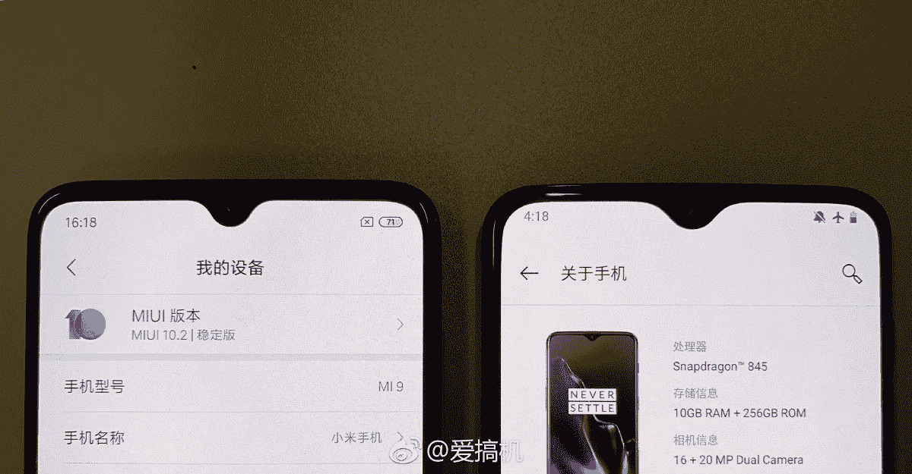
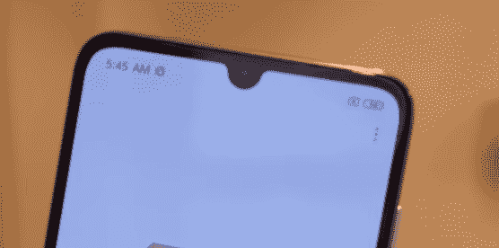

# 小米 Mi 9 的首次更新增加了一加 6T 风格的水滴凹槽覆盖

> 原文：<https://www.xda-developers.com/xiaomi-mi-9-update-adds-oneplus-6t-style-waterdrop-notch-overlay/>

# 小米 Mi 9 的首次更新增加了一加 6T 风格的水滴凹槽覆盖

小米 Mi 9 刚刚在中国进行了首次更新，它增加了一个切口覆盖，使 Mi 9 具有类似于一加 6T 的水滴切口。

小米 Mi 9 于[一周前](https://www.xda-developers.com/xiaomi-mi-9-specifications-launch/)在中国发布，就在 MWC 之前。这是首批配备 7 纳米高通骁龙 855、至少 6GB 内存、128GB UFS 2.1 内部存储、3300 毫安时电池、6.39 英寸 FHD+有机发光二极管显示屏、显示指纹扫描仪和基于 Android 9 Pie 的 MIUI 10.2 的设备之一。就其价格而言，这款手机是 2019 年 H1 最佳手机的早期竞争者。在 MWC 期间，小米[还宣布](https://www.xda-developers.com/xiaomi-mi-9-snapdragon-855-europe-launch/)面向欧洲的 Mi 9 起价为 449 欧元。在宣布该设备和今天之间的短暂时间内，小米已经发布了第一次软件更新。

你可能已经知道，小米 Mi 9 的显示屏顶部有一个 U 形凹口。显然，中国论坛上的一些用户抱怨它的形状。小米听到了抱怨，并发布了一个软件更新来解决这个“问题”，老实说，这听起来真的很傻，通过添加一个用户可以在设置中应用的凹槽覆盖。你可以看到一个新的缺口覆盖后，米 9 的缺口和一加 6T 的缺口进行了比较。

 <picture></picture> 

Left: Xiaomi Mi 9 with waterdrop notch overlay after update. Right: OnePlus 6T.

 <picture></picture> 

Xiaomi Mi 9's U-shaped notch. Source: [PocketNow's hands-on of the Mi 9](https://www.youtube.com/watch?v=WlI0GsVRHk0).

更新的 changelog 还提到了相机质量的优化和一些人工智能模式的添加，以及录制视频时的动态拍摄功能。变更日志是中文的，所以我们只能得到这么多。XDA 认识到开发者 yshalsager 已经分享了更新的下载链接。它被标记为版本 10.2.11.0，大小为 2.4GB。请记住，这是 MIUI 中国版，意味着它不附带 Google Play 服务和许多语言选项。欧洲型号智能手机的买家，因此 MIUI Global 10.2 的用户，可能需要再等一会儿。

[**下载小米 Mi 9 的 MIUI 10 中国稳定 10.2.11.0 更新**](http://bigota.d.miui.com/V10.2.11.0.PFACNXM/miui_CEPHEUS_V10.2.11.0.PFACNXM_4f19972866_9.0.zip)

* * *

[**Via:PiunikaWeb**](https://piunikaweb.com/2019/02/26/mi-9-receiving-first-update-brings-oneplus-6t-like-waterdrop-notch/)