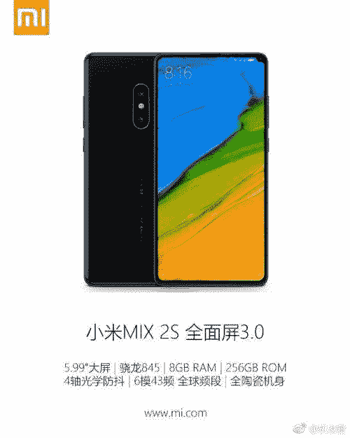

# 小米 Mix 2S 花絮:底部前置摄像头，无线充电，ARCore 支持

> 原文：<https://www.xda-developers.com/xiaomi-mi-mix-2s-bottom-front-facing-camera-wireless-charging-arcore/>

小米可能不是第一个推出高通骁龙 845 设备的设备制造商(三星凭借 [Galaxy S9](https://www.xda-developers.com/samsung-galaxy-s9-s9-plus-hands-on/) 摘得桂冠)，但他们肯定是第一个宣布采用该芯片组的设备:[小米 7](https://www.xda-developers.com/xiaomi-mi-7-qualcomm-snapdragon-845/) 。不管出于什么原因，该公司推迟了小米 7 的发布日期，而是准备宣布取代它的[小米 Mix 2S](https://www.xda-developers.com/xiaomi-mi-mix-2s-qualcomm-snapdragon-845-march-27/) 。虽然该设备有一个发射日期，唯一得到官方确认的信息是，它的运动骁龙 845。通过固件文件 *XDA 开发者*独家获得，我们[早些时候报道了](https://www.xda-developers.com/xiaomi-mi-mix-2s-android-oreo-3400-mah-battery/)关于这款设备的几条关键信息，今天我们带着新的花絮信息回来。

* * *

## 小米 Mi Mix 2S 花絮

上个月，我们确认了一些关于该设备的信息。它将拥有 3400 毫安时的电池，18:9 的 2160x1080 显示屏，Android 8.0 Oreo，双 SIM 卡支持，以及红外增强器。我们当时获得的固件相当接近最终版本，但该设备仍然在整个固件中使用其代号“北极星”。不过，这一次，我们已经获得了与最终设备发布时发现的软件更接近的固件，因此我们可以确认几条新信息。

得益于 [@FunkyHuawei](https://twitter.com/FunkyHuawei) 获得的固件文件，这位 [FunkyHuawei.club](https://funkyhuawei.club/) 服务的幕后人，允许用户[更新](https://funkyhuawei.club/models)、 [unbrick](https://www.reddit.com/r/FunkyHuawei/comments/7d5wsi/introducing_funkyhuawei_unbrick_flash_tool/) 或[更名](https://www.reddit.com/r/FunkyHuawei/comments/7a5sab/introducing_funkyhuawei_rebrand_tool_rebrand_any/)华为，并对手机收费。他已经开始为一些小米设备提供 [OTA 更新文件的链接](https://funkyhuawei.club/mimix2builds)，并与 XDA 开发者独家共享 Mi Mix 2S 固件文件。

### 双摄像头

首先，如果有人怀疑 Mi Mix 2S 会提供双摄像头或“人工智能功能”，让这张照片打消这些疑虑。

上面是手机的摄像头水印(我已经禁用了透明度，以便更容易看到)，它自豪地展示了一个事实，即该设备不仅将拥有双摄像头，而且将拥有一个“人工智能双摄像头”。不管那是什么意思。

### 设计

无论如何，这款手机将提供双摄像头，尤其是“人工智能功能”，这一事实从未受到质疑，因为小米已经在网上发布了许多预告。有疑问的是这款手机的设计。下面转载的是流传最广的**所谓的**米 Mix 2S 的渲染图。

 <picture></picture> 

Alleged Design of the Mi Mix 2S. Source: [Weibo](https://www.weibo.com/2117681714/G2sHBsbRa?ref=home&rid=4_0_8_2669678691131414039&type=comment#_rnd1518287454887)

这个渲染最引人注目的是显示屏右上角的凹口，似乎容纳了前置摄像头:这一设计避开了在世界移动通信大会期间宣布的智能手机[最近的凹口趋势](https://www.xda-developers.com/mobile-world-congress-2018-discussion/)。在我们上一份报告的时候，我们没有任何证据可以证明这种渲染的有效性，但是，随着我们获得的最新固件文件，这种情况已经发生了变化。

在 XDA 初级成员[弗兰茨特斯卡](https://forum.xda-developers.com/member.php?u=8229896)的帮助下，我们在 MiuiCamera 应用程序中发现了代码，表明 Mi Mix 2S 将在底部安装一个**前置摄像头**——类似于 Mi Mix 和 Mi Mix 2。这个事实**使上面的渲染**不可信，因为它将表明 Mix 2S 将具有类似于 Mix 2 的设计，而不是渲染所声称的激进的拐角凹口。

以上是来自 MiuiCamera.apk 内的 com.android.camera 类的方法。该应用程序使用该方法来检查相机的前置相机传感器是否安装在底部，如果是，则需要在相机应用程序中启用自动旋转，以便相机取景器在自拍时正确定向。IS_A8、IS_D5 和 IS_D5X 在前面的课程中分别定义为“锂”、“chiron”和“polaris”，它们分别是 Mi Mix、Mi Mix 2 和 Mi Mix 2S 的代号。因此，如果该设备是 Mi Mix 设备之一，此方法将返回 true，这表明 Mix 2S 前置摄像头确实位于显示屏的底部。

### 无线充电

传言称小米 Mi 7 是第一款支持无线充电的小米设备，但我无法在其固件中找到直接证据。然而，我能够找到我认为是[小米 Mi Max 3](https://www.xda-developers.com/xiaomi-mi-max-3-wireless-charging-iris-scanner/) 的固件文件，其中确实显示了无线充电的证据。在 Mi Mix 2S 的最新固件中，我也在 MiuiKeyguard 应用程序中找到了类似的证据，证明该设备具有无线充电功能。

本页顶部的特征图像是一张静态图像，展示了我最初认为是一款具有无线充电功能的小米设备的普通图像，但鉴于前置摄像头的底部位置，这种设计有可能是 Mi Mix 2S(不出所料，这意味着它看起来非常类似于 Mi Mix 2)。下面，我嵌入了当用户在将设备与 Qi 无线充电板对齐时出现问题时，MIUI 将向用户显示的帮助视频。

### ARCore 支持

在与 Project Tango 短暂合作后，谷歌的 ARCore 将为数百万安卓设备带来增强现实。公司[最近宣布](https://www.xda-developers.com/google-lens-arcore-augmented-reality/)他们将把 ARCore 1.0 带到 Galaxy S7/S7 Edge、LG V30/V30+(在[奥利奥](https://www.xda-developers.com/lg-g6-lg-v30-update-android-oreo/)上)、华硕 Zenfone AR 和 OnePlus 5 等设备上。此外，谷歌宣布与许多公司合作，以确保即将推出的智能手机支持 ARCore 开箱即用。其中一家公司是小米，似乎 Mi Mix 2S 将在发布时支持增强现实平台。

这就是我们目前要分享的所有信息。如果我们了解到更多信息，我们将在 XDA 门户网站上为您提供最新消息。关注我们新的[专属标签](https://www.xda-developers.com/tag/exclusive/)以便在这些帖子上线时立即捕捉它们！