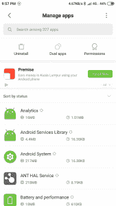

# MIUI 10 中的广告妨碍了小米红米 Note 7 Pro 的体验:下面是如何禁用它们的方法

> 原文：<https://www.xda-developers.com/xiaomi-miui-ads-hamper-user-experience/>

小米的 MIUI 不仅仅是一个以 Android 为主题的“皮肤”。通过 MIUI，小米对 Android 操作系统进行了巨大的框架级改变，改变了操作系统的外观和所有设备的功能。这些变化中有很多是以增加功能的形式出现的，为最终消费者增加了大量的实用性，因此，许多普通用户最终喜欢上了 MIUI。但是，有一个方面是所有 MIUI 用户一致反感的，那就是广告。

毫无疑问，MIUI 存在广告问题，而且这个问题最近一直在恶化，尤其是在 MIUI 10 和印度地区。回到 2018 年 9 月，用户[开始在设置应用程序中发现横幅广告](https://www.reddit.com/r/Xiaomi/comments/9g1mbc/safe_to_uninstallfreeze_msa/)，这引起了消费者的强烈反对，小米不得不重新考虑其决定。我们最近[在我们的小米 9 评测中也提到了它](https://www.xda-developers.com/xiaomi-mi-9-review/)。

 <picture></picture> 

Ads within the Settings Panel, which were rolled back after consumer backlash

小米[在一个相关案例](https://www.theverge.com/2018/9/19/17877970/xiaomi-ads-settings-menu-android-phones)中发表了一份声明，这对于理解为什么这些广告首先存在于 MIUI 中是不可或缺的:

广告一直是并将继续是小米互联网服务的一个组成部分，是该公司商业模式的一个关键组成部分。与此同时，我们将通过提供关闭广告的选项以及不断改进我们的广告方法(包括调整广告出现的时间和地点)来维护用户体验。我们的理念是广告应该不引人注目，用户总是可以选择接受较少的推荐。

当务之急是了解小米的商业模式，以了解该公司如何赚钱，以及为什么这些广告对他们的存在很重要。小米的创始人兼首席执行官雷军[曾经提到该公司如何遵循“铁人三项”商业模式](https://www.techinasia.com/xiaomi-ipo-business-model)——它投资生产硬件的公司，通过其在线和线下商店销售这些产品，并提供在这些设备上使用的服务。这三项全能运动的最后一站，即互联网服务将为公司带来大部分收入，另外两项是到达最后一站所必需的。为了确保更多人获得这些互联网服务，小米努力在不影响质量的情况下生产尽可能便宜的智能手机，并以超高性价比出售。他们激进的定价策略使得消费者选择加入小米互联网服务生态系统非常有利可图。

## MIUI 内的货币化

小米通过两种主要形式将 MIUI 货币化:预载应用和广告。

当你第一次启动设备时，预装的应用程序(很多人称之为“膨胀软件”)就已经存在了。由于小米设备因其价值而非常受欢迎，应用程序开发者对向小米支付费用以将其应用程序预加载到智能手机上的想法持开放态度。亚马逊购物、脸书、Dailyhunt、Opera News 和 Opera Mini 等应用，以及小米支持的 ShareChat 都预装在我们评测的 Redmi Note 7 Pro [上。公平地说，并给予小米应有的信任，所有这些应用程序都可以完全卸载，即使有一个锁定的引导加载程序，但它们的存在和摆脱它们所需的步骤令客户烦恼。所有这些应用程序都导致了每天的广告通知，而普通消费者并不总是能够在他们的手机上找到广告的来源。](https://www.xda-developers.com/xiaomi-redmi-note-7-pro-review/)

另一种形式是广告。最令人讨厌的主要是小米提供的增值服务，如小米音乐和小米视频，其次是深度集成(例如 App Vault)。这些广告对于小米继续以他们追求的激进价格提供优秀的硬件非常重要。

正如该公司所坚持的，广告大多不引人注目，因为它们采取横幅“推荐”的形式，作为通知推送到设备上。问题是这些广告的频率，以及膨胀软件的总效果，膨胀软件的广告，小米自己的增值服务的广告，以及深度集成。所有这些都被归为“MIUI 上的广告”这一类，每一个都阻碍了用户体验。

## 广告问题

[注意到 Idrees 对小米红米 Note 7 Pro](https://www.xda-developers.com/xiaomi-redmi-note-7-pro-review/) 评测单元的体验，并通过我自己对 XDA 自购红米 Note 7 Pro 的体验予以肯定:

在过去的一年里，小米开始在一些地区更频繁地在 MIUI 中显示广告，尤其是在印度。广告和促销通知会淹没手机，除非用户把它们扼杀在萌芽状态。当安装任何应用程序时，广告都会显示在 MIUI 安全应用程序中，在打开之前会进行扫描，尽管 Google Play Protect 否定了这一“功能”的有用性。幸运的是，锁定屏幕上的“浏览”功能在默认情况下是禁用的，但启用它将导致“新闻更新”显示在锁定屏幕上。小米的许多系统应用程序，如文件管理器、mi 应用程序、主题和其他应用程序都包含广告。Mi Store 应用程序会为即将到来的 flash 销售发送通知。**这一切完全没有必要，在最坏的情况下，等于侵犯了用户隐私。**

像浏览器这样的应用有大量的“推荐”和标签等等。这可以与同样出现在谷歌 Chrome 中的推荐文章列表相比较。但是在 Mi 浏览器中，UI 的主要目的更倾向于使这些内容更容易访问，而不是让您浏览网页。甚至在推荐内容中也有广告，这是我在手机上看到的最大程度的广告。

以下是我在手机上看到的一些广告的截图。

小米确实让禁用广告变得“容易”,也就是他们所说的*推荐*。这很简单，因为你不需要修改你的设备，甚至不需要解锁它的引导程序。添加的引用是为了表明这不是绝对容易的，因为没有单一的开关可以简单地切换这些广告。相反，你需要从几个应用程序和通过不同的设置菜单分别禁用它们。

考虑到印度文化，我在手机上收到的一个广告可能被认为是不合适的。小米为自己辩护说，这则广告似乎是一则普通广告，并不是专门针对 NSFW 或令人反感的内容。更多的责任在于音乐应用提供的视频和视频缩略图(是的，视频的通知是通过 Mi 音乐应用而不是 Mi 视频应用来的。可以从音乐 app 播放音乐视频)。即便如此，也应该有更好的过滤器来过滤掉不适合年轻观众的内容。在应用程序中偶然发现这样的内容是一回事；主动接受推送通知是另一回事。

## 解决方案 1 -禁用广告

由于小米确实提供了禁用广告的方法，我们将它们列出来是为了更容易禁用它们。我们明白广告是小米商业模式不可或缺的一部分——作为一个同样依赖广告收入的新闻网站，我们确实如此。但是广告已经变得太频繁了，在某些情况下，令人反感，很容易被忽视。我们希望小米考虑减少这些广告的数量，以消除对这些文章的需求。

这些步骤是在一台运行 MIUI 10 全球稳定 10.2.7.0 PFHINXM build 的小米红米 Note 7 Pro 上进行的。下面的步骤在其他小米 MIUI 10 设备上应该是相当类似的。

### 1.撤销 MSA 应用程序的授权

从 MSA app 开始，它是“MIUI 系统广告”的简称。此应用在您的主屏幕上不可用。要禁用它，进入**设置>附加设置>授权和撤销**，从列表中选择 **msa** 。点击切换按钮，等待 10 秒钟时间过去，然后撤销。如果你第一次尝试不成功，继续尝试，直到你最终成功。撤销对 MSA 的授权应该会大大减少散布在系统中的广告数量。如果没有，请继续执行其他步骤。

### 2.禁用广告标识符

这可以在**设置>附加设置>隐私>用户体验程序**中找到。关闭那里唯一的开关。这并不影响广告的数量，但它将不再像它声称的那样，为广告量身定制并收集信息。

### 3.禁用 APK 安装程序/病毒扫描程序中的广告

为此，从 Play Store 安装任何应用程序，以触发 APK 安装程序来“扫描”应用程序。在扫描过程中，单击右上角的齿轮设置图标，并关闭“**接收建议”**选项。如果您愿意，也可以在此屏幕上禁用安全扫描功能。

### 4.禁用已安装应用的广告

导航到**设置>已安装应用**，点击右上角三点菜单，打开**设置**，禁用**推荐**

### 5.从应用锁定中禁用广告

在**设置> App Lock** 中定位，然后点击齿轮设置图标，禁用**接收推荐**

### 6.从文件管理器禁用广告

打开 app，从左侧打开导航抽屉，进入**设置>关于**禁用**推荐。**

### 7.禁用安全应用中的广告

打开安全应用，点击齿轮设置图标，禁用“**接收建议。**接下来，在同一个应用程序中，进入**设置>清洁器**以及**设置>加速**并禁用**接收建议**。

### 8.禁用 Mi 浏览器中的广告

打开浏览器 app，点击右下角菜单按钮，进入**设置>隐私&安全**禁用为您推荐的**。**

### 9.禁用下载应用程序中的广告

打开下载应用，点击右上角的三点菜单按钮，禁用“**显示推荐内容。**

### 10.禁用来自 MIUI 主题的广告

打开主题应用，点击右下角的个人资料按钮，进入设置，禁用“**推荐。**"如果您愿意，也可以禁用**个性化壁纸选择**功能。

### 11.禁用来自小米音乐的广告

单击左上方的图标，打开左侧导航抽屉。进入**设置>高级设置**，禁用**接收建议**。您也可以在“高级设置”页面中更改应用程序的更新设置。

### 12.禁用 Mi 视频中的广告

打开小米视频 app，进入**账号>设置**，关闭**在线推荐。**“您也可以禁用**推送通知**”。

做好所有这些步骤，有望消除操作系统上源自系统的广告。正如你所看到的，有一大堆相关的步骤，选项隐藏在一些应用程序中，很容易被忽略。但是如果你有足够的决心，你可以禁用 MIUI 上的广告，而不需要解锁你的引导加载程序，甚至不需要将你的设备连接到电脑上。我在禁用我的设备后使用了两天(在之前的评估中使用了几个延长的时间段),没有再收到任何通知广告。

## 解决方案 2 -删除应用程序

如果你看了上面的步骤，并意识到有很多应用程序需要处理，那么你是对的。要禁用所有广告，你必须经历重重关卡，即便如此，也不能保证没有(系统)广告会再接触你的设备。如果您不打算使用这些应用程序中的任何一个，并且想要一个更永久的解决方案(每次安装更新时都必须重复)，您可以考虑从您的设备中删除这些应用程序，**风险自担**。您可以使用 ADB 命令删除应用程序，或者您可以使用我们论坛上提供的几个脚本和工具包来做同样的事情。

我正在试用 Saki-Eu 的(非官方)[小米 ADB / Fastboot 工具，因为该工具是开源的，并且有一个易于使用的 GUI。你所要做的就是](https://github.com/Saki-EU/XiaomiADBFastbootTools)[从它的 GitHub 页面](https://github.com/Saki-EU/XiaomiADBFastbootTools/releases/)下载该工具的最新版本，运行。jar 可执行文件并以 ADB 模式连接设备。如果你需要更多帮助，这里有一个[说明、常见问题和故障排除页面](https://saki-eu.github.io/XiaomiADBFastbootTools/)。

默认情况下，该工具只显示可以安全卸载的应用程序——这意味着你可以卸载这些应用程序，而无需对你的设备进行软屏蔽，但**这样做无疑意味着你将失去一些功能，具体取决于你卸载的内容**。还有一个重新安装标签，以防你想重新安装应用程序。你也可以正常安装在线旅行社或其他更新，但请记住，这些应用程序将返回，你将不得不重做这些步骤。

## 解决方案#3 -改变区域

这不是真正的解决方案，因为更改区域可能会影响您的网络功能。一些功能，如面部解锁，也依赖于地区。但是如果你愿意，你可以将你的区域设置为欧盟内的任何一个国家。这大大减少了广告的数量。如果小米也开始大量货币化这些地区的用户，这种方法可能不会有效。

* * *

[小米红米 Note 7 Pro 是一款很棒的硬件](https://www.xda-developers.com/xiaomi-redmi-note-7-pro-first-impressions/)，我同意[我的同事 Idrees 在他的评论](https://www.xda-developers.com/xiaomi-redmi-note-7-pro-review/)中提出的所有要点。这款设备的一个主要缺点是 MIUI，特别是散布在系统中并推送到你设备上的大量广告。希望这篇文章能揭示广告问题，并提供一些小小的缓解，让用户平静地享受他们的设备。

我们开始看到越来越多的中低端设备借助系统中的广告来有效地补贴设备，这是一个令人担忧的趋势。我们将在未来探索更多的设备，看看它们的广告体验是否令人讨厌和不愉快。

*注意:在[小米宣布他们正在寻求通过未来的更新消除 MIUI](https://www.xda-developers.com/xiaomi-remove-obnoxious-ads-miui-add-new-features/) 上真正令人讨厌的广告之前，我们的文章正在进行中。这些声明是就 ROM 的中文版本作出的，我们不知道这些决定是否会适用于其他地区。另外，在广告消失之前会有一段时间的滞后。因此，我们的文章仍然具有相关性。*