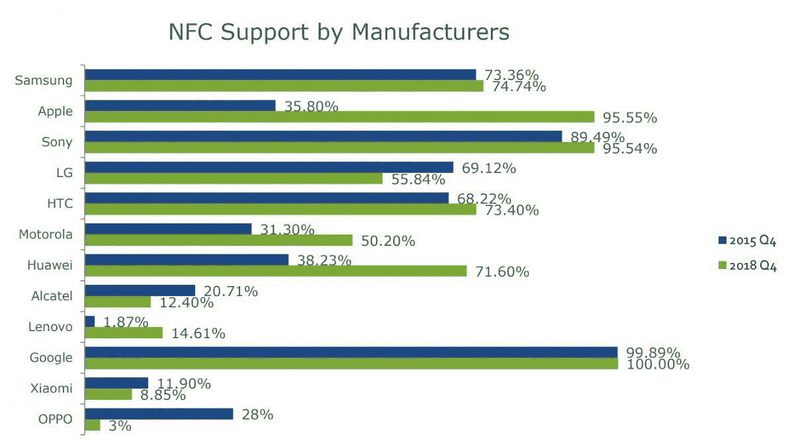

# 小米、OPPO、LG 和阿尔卡特在 4 年内减少了 NFC 手机

> 原文：<https://www.xda-developers.com/xiaomi-oppo-lg-alcatel-fewer-nfc-phones/>

NFC 或近场通信是一项非常有用的技术，你可以在许多中端和高端智能手机上找到。使用 NFC，你可以轻触耳机等其他配件，通过蓝牙与之连接，在 PoS 机上支付，通过 [Android Beam (RIP)](https://www.xda-developers.com/google-deprecate-android-beam-api-nfc-share-files/) 共享文件，甚至用智能手机读取存储在可编程 [NFC 标签](https://www.xda-developers.com/tasker-beta-navigation-bar-nfc-tags/)中的数据。

NFC 显然有很多好处，但它对大多数亚洲人来说仍然是陌生的。以至于在非洲站稳脚跟的制造商生产的 NFC 设备比以前少了。

由*科学家 Mobile* 撰写的最新一期**手机概览报告**显示，世界上最大的四家智能手机制造商已经将 NFC 从他们的设备中剔除。这些品牌包括小米、OPPO、LG 和阿尔卡特。根据现有数据，LG 现在在略多于一半的设备上提供 NFC，小米仅在 9%的机型上提供 NFC，阿尔卡特在 12%，OPPO 仅在 3%的智能手机上提供 NFC。

 <picture></picture> 

Credits: ScientiaMobile

此举令人惊讶，因为自 2015 年以来，世界上大多数其他制造商越来越多地使用这项技术。苹果、华为、摩托罗拉和联想等品牌在其智能手机上大幅增加了对 NFC 的支持，而三星和索尼则略有增加。

对 NFC 支持减少的一个合理解释是这些品牌生产的智能手机的平均价值。小米、阿尔卡特和 OPPO 主要为东亚部分地区的入门级和中档市场提供智能手机，尤其是世界上最大的两个智能手机市场——中国和印度。因此，取消 NFC 是有意义的，即使它只会减少几美元的设备成本。

其次，在中国和印度，可扫描二维码(而非 NFC)是发起支付的首选模式。像微信支付和支付宝(中国)，以及 Paytm 和 UPI(印度)这样的服务比 Apple Pay 或 Google Pay 要普遍得多。谷歌甚至在印度发布了一个定制版的 Google Pay——之前被称为“[Tez](https://www.xda-developers.com/google-tez-7-5-million-users-india/)”——它使用音频 QR 或简单的超声波频率在收款人和付款人之间建立联系。

然而，就 LG 而言，更合适的解释是该手机制造商自 2015 年以来生产的型号数量减少。LG 的智能手机部门在最近两年未能实现盈利，2018 年最后一个季度的亏损高达 807 亿韩元(7250 万美元)。显然，这一趋势并不意味着全球性的转变，而仅仅是东西半球消费者偏好的差异。

* * *

[**Via:安卓权威**](https://www.androidauthority.com/nfc-support-smartphones-953465/) [**来源:ScientiaMobile**](https://www.scientiamobile.com/)