# 小米 POCO F1 设计、显示、速度和流畅度评测

> 原文：<https://www.xda-developers.com/xiaomi-poco-f1-design-display-gaming-performance-review/>

只有少数几款 Android 智能手机可以被我们自信地称为游戏改变者。传奇的 HTC Evo 4G 证明了 Android 智能手机有能力与 iPhone 竞争。2013 年的 HTC One 向我们展示了 Android 智能手机不仅可以在构建质量上与 iPhone 抗衡，而且远远超过它。然后是 2014 年的 OnePlus One，这是一款名副其实的“黑仔旗舰”智能手机，这款智能手机给了我们安卓书呆子想要的东西，却没有花很多钱。此外还有中国智能手机制造商小米，它以比基本上所有人都低的价格异军突起。早在 2016 年，我们就将小米的 Redmi Note 3 誉为廉价智能手机领域的[之王](https://www.xda-developers.com/xiaomi-redmi-note-3-xda-review/)，现在小米又推出了另一款价格几乎同样激进的智能手机:小米 Poco F1，也被称为小米 Pocophone F1。

在一个名为“ [Poco](https://www.xda-developers.com/xiaomi-launches-poco-brand-india/) 的新品牌下，小米希望用 Poco 手机颠覆旗舰智能手机市场，就像他们的廉价 Redmi 手机曾经做过的那样。以卢比的价格。20，999 在印度， [Poco 将为您提供一款 Poco F1](https://www.xda-developers.com/xiaomi-poco-f1-specs-pricing-availability-india/) ，配备高通骁龙 845 片上系统，6GBs 内存，4，000mAh 电池，6.18 英寸 FHD+显示屏，双 12MP 和 5MP 后置摄像头，20MP 前置摄像头，64GBs 可通过 microSD 卡插槽扩展的内部存储，Android 8.1 Oreo，以及红外传感器增强的面部解锁功能。在这个价位上，你找不到类似的智能手机。

但仅靠顶级规格并不能让智能手机变得伟大。总是有妥协要承受，但通过 Poco F1，小米的目标是取悦 Android 爱好者群体。这就是为什么该公司强调 Poco F1 的性能，特别是在游戏、现实世界的响应能力和基准测试方面。小米 Poco F1 是“速度大师”，就像 OnePlus One 是“旗舰黑仔”一样吗在这篇评论中，我们测试了 Poco F1 的速度和流畅度，但我们也会告诉您我们对设计和显示的想法，以便您可以考虑 Poco F1 是否适合您。

***关于这个评论**:我有一个装甲版 Pocophone F1 在印度卖，品牌是 Poco F1。Poco F1 装置由 Poco India 提供，用于审查目的。*

[**设计**](#1) [**显示**](#2) [**基准**](#3) [**游戏分析**](#4) [**UX 速度**](#5) [**UI 流畅度**](#6) [**结论**](#7)

### 小米 Poco F1 规格(点击展开表格)

| 

规格

 | 

详述

 | 

规格

 | 

详述

 |
| --- | --- | --- | --- |
| **软件** | 安卓 8.1 奥利奥配 MIUI 9 | **连通性** | 混合双卡槽(nano SIM + nano SIM/microSD)。双 4G 电压，全球定位系统，USB 型端口。无 NFC |
| **CPU** | 高通骁龙 845(8 个 Kyro 385 内核-4 个改进型 Cortex-A75，4 个改进型 Cortex-A55)。“液体冷却”技术。 | **音频** | 3.5 毫米耳机插孔。迪拉克高清音响。 |
| **GPU** | 肾上腺素 630 | **后置摄像头** |  |
| **RAM 和存储器** | 6GB LPDDR4x 内存和 64GB/128GB UFS 2.1 存储 8GB LPDDR4x 内存和 256GB UFS 2.1 存储(microSD 最高支持 256GB) | **前置摄像头** |  |
| **电池** | 4，000 毫安时，支持快充 4.0 | **指纹扫描仪** | 是(后置) |
| **显示** |  | **在盒子里** |  |
| **无线网络** | wi-Fi 802.11 a/b/g/n/AC(2.4 GHz/5 GHz) | **颜色** | 钢蓝、罗索红、石墨黑、装甲版 |
| **蓝牙** | 蓝牙 5.0 LE | **网络频段** |  |

* * *

## **设计**

在一个每个高端旗舰智能手机都拥有某种形式的玻璃和金属机身的时代，Poco 选择了一种良好的旧聚碳酸酯塑料作为他们的材料选择。我的审查设备是 Poco F1 装甲版，但是，我有机会在活动中与常规聚碳酸酯模型一起度过了一些实践时间。不得不说他们无论如何都不觉得便宜。事实上，它们看起来更令人兴奋:特别是罗索红，比我的沉闷无趣的装甲版更有吸引力。选择塑料的原因无疑是为了节省成本，但尽管如此，它也应该增加设备的整体耐用性——与相当脆弱的玻璃相比，它更有可能承受一两次意外跌落。

正面被大猩猩玻璃 3 覆盖。虽然不是最难的，但还是很高兴知道船上有一定程度的保护。凹口容纳一系列传感器，包括用于面部解锁的传感器、接近传感器和前置摄像头模块。通知 LED 被移到了底部，很好地隐藏在下巴下面。

右侧是单独的音量控制键和电源按钮，左侧是混合 SIM 卡托盘。在最上面，你可以找到 3.5 毫米耳机插孔和辅助麦克风，以帮助阻止通话过程中的噪音。这里的列表中缺少的是小米手机上普遍存在的红外发射器。放弃 IR blaster 的决定很可能是因为该公司面临着严格的设计限制。事实上，在包括面部解锁机制顶部的传感器后，看起来没有任何空间来容纳红外发射器。这对我来说没什么大不了的，但如果你来自小米设备，并且已经习惯了使用该功能，就要记住这一点。

移动到后面，你会发现一个垂直排列的双摄像头设置位于上半部分。指纹传感器位于相机正下方，略微凹陷，因此您可以通过触摸轻松找到它，而不会意外弄脏相机镜头。没有摄像头凸起，这是在 2018 年看到这么多设备带着它们后的一大解脱。最后，品牌标志和一个小圆点位于底部，该公司表示这是凯夫拉尔制造工艺的一部分。

这款设备摸起来很结实，拿在手里会给人一种放心的感觉。得益于倒角边缘和牢固的握持，单手使用不成问题。边角圆润，不抠手掌。由于该设备是全塑料的，所以你不会在顶部和底部看到分散注意力的天线线路——这是金属材料设备中用于信号传输的常见设计实践——从而实现干净无缝的外观。框架也是由塑料制成的，由于其良好的哑光表面，我最初误以为是金属，后来当我试图划伤表面时才意识到。电源和音量按钮是唯一由金属制成的组件。

作为一个额外的奖励，该设备还可以防溅，正如公司最近证实的[。这意味着它应该很容易承受意外的水溅和其他液体溢出。然而，你不能把它浸泡在水箱里，也不能把它带进游泳池，因为它不防水。](https://twitter.com/IndiaPOCO/status/1039491890029256706)

最后，关于 Poco F1 的设计没有什么可抱怨的。它不会赢得任何设计奖项，但它在不牺牲任何可用性的情况下完成了工作——对于这个价格的设备来说，这完全没问题。

* * *

## **显示**

Poco F1 使用的是中国显示器制造商 Tianama 提供的 6.18 英寸 IPS 液晶面板。面板本身质量非常好，是我们目前看到的比较好的液晶面板之一。色彩鲜艳逼真，对比度也非常适合液晶面板。视角也令人印象深刻，即使在偏离角度观看时，也没有明显的色彩偏移。显示器校准到 sRGB 色彩空间，并提供准确的色彩再现。不支持像 DCI-P3 那样更宽的色域，但从好的方面来说，它支持 HDR 内容。手动模式下的最大亮度为 450 尼特。在自动模式下以及查看 HDR 内容时，最高可达 500 尼特。

如果默认颜色对您来说不够有力，Poco F1 还在其设置中提供了各种颜色配置文件，让您根据自己的喜好调整色温、白平衡和对比度。阳光能见度也很好，在艾哈迈达巴德阳光明媚的日子里，我在户外使用这款设备没有任何问题。当然，它不会像三星的有机发光二极管面板那样亮，但它足够亮，足以让你舒适地在屏幕上观看图片或阅读文本。为了进一步提高室外可见度，您还可以将对比度设定为自动模式，这样在查看照片或视频时，对比度和其他显示参数会自动增加。

虽然我们对显示器本身的质量没有问题，但我们发现有一点令人恼火的是，底部角落的半径异常大。不是我们不喜欢圆角，而是 Poco F1 上的显示角不正常地圆到了实际上切入应用程序内容的地步。这也不仅仅是视觉审美的问题:不寻常的圆角也会影响用户在游戏中的体验，在游戏中，位于最右边角落的指示器、按钮和文本在横向模式下会被稍微截断。例如，在 PlayerUnknown 的战场中，网络指示灯被完全阻挡，而电池图标也被轻微切割。

其他一些游戏也受到了影响，但好消息是，这不会妨碍游戏的可玩性，因为大多数游戏不会将重要的控件或按钮推到角落里。尽管如此，它增加了糟糕的用户体验，并提出了在最终确定设计选择之前是否进行了足够的测试的问题。

当我们谈到显示器这个话题时，我们也来谈谈屏幕出血。似乎有些 Poco F1 装置在显示器的底部出现漏光现象。出血的强度因设备而异，但根据一些用户提供给我的图像，我可以确认少数设备确实存在该问题。它并不存在于每台设备上，看起来更像是一个与批处理相关的问题。就像其他评论者一样，我的单位没有表现出任何这样的出血。

LCD 面板上轻微的背光出血并不少见，其他带切口的 LCD 设备用户也报告了类似的问题。由于这与显示器硬件有关，因此无法通过软件更新来解决。好的一面是，在大多数受影响的设备上，只有当屏幕显示纯色或深色背景时，出血才会明显。如果你的设备表现出过多的出血，以至于妨碍了你的正常观看体验，如果你还在更换期，你肯定应该考虑更换你的设备。

* * *

## **基准**

随着小米大力强调 Poco F1 的性能，看看这些说法是否真的转化为更好更快的真实性能将是一件有趣的事情。我们对小米 Poco F1 进行了一系列测试，不仅强调其原始硬件潜力，而且更重要的是，它的真实性能。

Futuremark 的 PCMark 是一个标准的基准测试工具，可以让设备经历一系列常见的日常工作负载，如网页浏览、视频编辑和照片编辑。在这方面，它是比各种基准测试(如 AnTuTu 或 Geekbench 4)的大多数部分更可靠的真实性能预测器，这些基准测试对其工作负载使用特定的计算繁重的算法，因此当作为设备在应用程序中的最终 UI 性能的代理时，结果可能没有那么有用。

从 PCMark 的浏览测试开始，该测试测量网页渲染的性能并利用原生的 Android WebView，我们看到 Poco F1 的性能与其他顶级设备相当一致，但却落后于去年的旗舰设备。

视频测试利用 OpenGL ES 2.0、原生 Android MediaCodec API 和 ExoPlayer 来强调视频播放、编辑和保存性能。这也是对 CPU 响应能力以及芯片组解码器/编码器性能的一个很好的测试。在这里，小米 Poco F1 落后于三星 Galaxy S9+骁龙变种和谷歌 Pixel XL 2 等产品，谷歌 Pixel xl2 在这次测试中获得了第一名，但它的得分接近 OnePlus 6。

照片编辑测试加载一组照片，对它们应用常见的效果，并在最终保存它们之前调整一些参数。该测试依赖于最新版本的 Android renderscript API，图像处理应用程序经常利用该 API 来运行计算密集型任务，这反过来也是对 CPU 和 GPU 加速的一个很好的测试。在这里，Poco F1 领先于 OnePlus 6 和三星 Galaxy S9+骁龙变体。

最后，在数据处理和最终的 PCMark 性能得分方面，Poco F1 以微弱优势击败了 OnePlus 6，夺得第一名，同时轻松击败了骁龙三星 Galaxy S9+和去年的旗舰产品。虽然到目前为止结果相当令人印象深刻，不言而喻，但它们是否真的会在现实生活中带来更好的表现，这是我们将在接下来的部分中测试的事情。

* * *

## **游戏分析**

小米 Poco F1 的一大亮点是其强大的游戏性能，虽然我们知道 Adreno 630 的原始功能，但 OEM 的实施也发挥了重要作用。该公司采用了他们所谓的“LiquidCool”系统(铜热管)，以便在运行游戏等密集型工作负载时，将处理器中的多余热量散发到其他区域。这个想法本身并不像 Poco 希望你相信的那样新奇。这是高端设备中的常见做法，我们已经看到三星、索尼和 Razer 等原始设备制造商在他们的设备中使用铜热管。也就是说，在这个价格范围内，它仍然是一个不错的额外津贴，但它是否真的达到了它的目的，我们将在下一节中找到答案。

我们在小米 Poco F1 上测试了来自谷歌 Play 商店的热门游戏，并使用 [GameBench](https://www.gamebench.net/) 收集了我们会话期间的帧率、功耗和内存使用等统计数据。GameBench 使得任何人都可以使用 [Android](https://play.google.com/store/apps/details?id=com.gamebench.metricscollector&hl=en_US) 或[桌面应用](https://www.gamebench.net/products/desktop-app)在 Android 设备上测试手机游戏的性能。

从 [PlayerUnknown 的战场](https://play.google.com/store/apps/details?id=com.tencent.ig)(俗称 PUBG)开始，我们看到该设备在最大设置下处理这款图形密集型游戏没有问题。Poco F1 能够在整个游戏过程中轻松地持续达到 40FPS 的上限。

 <picture>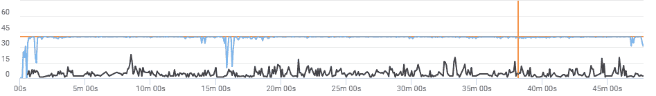</picture> 

PUBG — Framerate over time

PUBG Mobile 是评估设备游戏能力的绝佳选择。基于虚幻引擎 4 的广受好评的皇家战役游戏是图形最密集的手机游戏之一，具有出色的图形，真正扩展了设备的 GPU 能力。在最大设置下玩 PUBG Mobile 会有很好的体验，这种一致性和流畅度也真的令人印象深刻。

 <picture>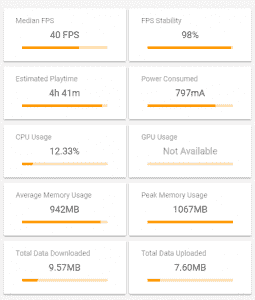</picture> 

PUBG - Other stats

接下来，我们玩了[沥青 9:传奇](https://play.google.com/store/apps/details?id=com.gameloft.android.ANMP.GloftA9HM)，这是广受欢迎的沥青 8 的更新版本。新版本由 Gameloft 的巴塞罗那工作室开发，具有改进的图形，更好的多人支持，新的知名汽车，以及 nitro shockwave 的回归，这是以前《沥青 8》中缺失的一个流行功能。

 <picture>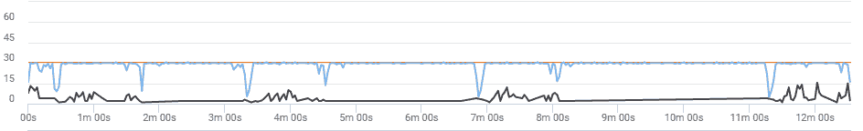</picture> 

Asphalt 9: Legends — Framerate over time

虽然它不像 PUBG Mobile 那样要求苛刻，但这款游戏是谷歌 Play 商店最受欢迎的赛车游戏之一，在发布后不到 2 个月的时间里就有超过 500 万的安装量。小米 Poco F1 相对轻松地处理沥青 9: Legends，在我们 15 分钟的会话中没有帧丢失或滞后的迹象。遗憾的是，即使在最大设置下，游戏也只能达到 30FPS，因为现在的旗舰设备显然比这更强大，我们真的希望 Gameloft 在这方面能够加强他们的*游戏*。

 <picture>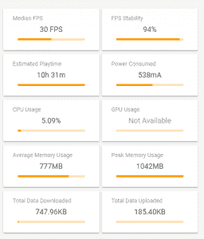</picture> 

Asphalt 9: Legends — Other stats

接下来是由 Netmarble 开发的[血统 2:革命](https://play.google.com/store/apps/details?id=com.netmarble.lin2ws)。该游戏使用虚幻引擎 4 引擎，并拥有一些真正令人印象深刻的智能手机游戏图形，以及一个巨大的游戏世界。

 <picture>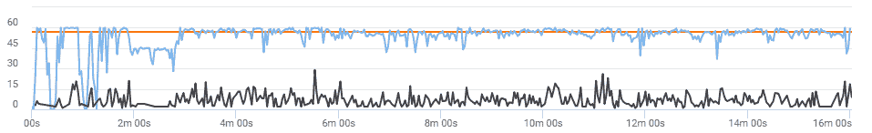</picture> 

Lineage 2: Revolution — Framerate over time

在小米 Poco F1 上以最大设置玩这个游戏并不是特别顺利，有些时候我们会遇到掉帧和滞后的情况，但在大多数情况下，它提供了令人尊敬的性能，中位数为 57FPS，稳定性为 92%。

 <picture>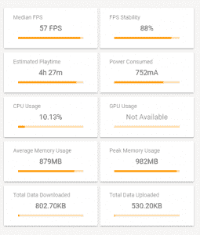</picture> 

Lineage II: Revolution — Other stats

我们还带着 Fornite Mobile for Android 兜了一圈。我们在史诗般的环境下连续打了 3 场比赛，结果都很满意。在整个会话过程中，帧速率保持相当稳定。该游戏仍处于测试阶段，因此出现了一些小问题，但总体性能非常符合我们之前在测试的[其他高端设备。不幸的是，我们无法在 GameBench 中记录游戏指标，因为 Epic Games 修补了唯一允许在启用 USB 调试的情况下玩游戏的工作区。但是根据我们的主观经验，当这款游戏在今年晚些时候进入稳定渠道时，用户玩这款图形密集型游戏应该没有任何问题。](https://www.xda-developers.com/fortnite-mobile-android-testing-performance/)

小米 Poco F1 几乎突破了我们测试的所有游戏的 FPS 上限，同时在整个游戏过程中仍然保持了惊人的稳定性。在全亮度、游戏设置为最大、环境温度高达 34°C 的情况下，即使在室内和室外长时间玩游戏时，该设备也不会感到不舒服。在一场马拉松 PUBG 移动会议中，我们连续玩了 6 场比赛，时间约为 2 小时 25 分钟，该设备能够保持高性能，没有任何热节流或无法忍受的温度水平。

就游戏性能而言，小米 Poco F1 没有辜负它的承诺。更大的电池与散热系统相结合，允许长时间长时间的游戏，而不会引起明显的热量限制。一个带有精细控制的专用游戏模式将是一个很好的补充，可以进一步改善游戏体验，并且可以在未来的更新中轻松实现。对于那些在中端价格区间寻找具有出色游戏性能的设备的人来说，小米 Poco F1 确实值得你关注。

* * *

## **UX 速度**

从应用程序打开速度测试开始，我们测量了 Gmail、谷歌 Play 商店和 YouTube 的冷启动。请记住，我们并不是在测量一个应用程序在所有元素都绘制在屏幕上的情况下完全渲染所需的时间。相反，我们通过记录应用程序创建应用程序的主要活动所花费的时间来使用代理。我们包括的时间度量包括启动应用程序流程、初始化其对象、创建和初始化活动、展开活动的布局以及第一次绘制应用程序。它忽略了不会阻止应用程序初始显示的内联进程，这反过来意味着记录的时间不会真正受到外部变量的影响，例如获取繁重资产的网络速度。

Poco 声称与 OnePlus 6 相比，应用程序打开速度加快了 28%，他们甚至在现场主题演讲中展示了一段视频，比较了两款设备上的应用程序启动时间，其中 Poco F1 实际上成功超过了 OnePlus 6。虽然我们无法证实这些说法(假设我们无法在理想条件下测试这两款设备)，但应用程序的启动时间通常非常快，连续快速打开多个应用程序似乎根本不会降低设备的速度。更快的打开和关闭动画，更快的闪存存储，CPU 加速和资源缓存意味着小米 Poco F1 可以快速启动应用程序和进行多任务处理。如果您使用的是经济型或中档设备，这种速度差异会更加明显。

为了进行比较，下面的表格显示了小米 Poco F1 与小米 Redmi Note 5 Pro 在 Gmail、Play Store 和 YouTube 上混合运行的应用程序启动时间，每个应用程序重复 150 次。

| 

设备

 | 

小米 Redmi Note 5 Pro

 | 

小米 Poco F1

 |
| --- | --- | --- |
| Gmail(平均毫秒数) | 916.2 | 527.4 |
| 播放存储(平均毫秒) | 1106.8 | 810.2 |
| YouTube(平均毫秒数) | 1621.3 | 1163.2 |

与其他骁龙驱动的旗舰产品类似，当启动应用程序和游戏时，该设备会提升 CPU 频率，以加快加载时间，并最大限度地减少 CPU 瓶颈。

 <picture>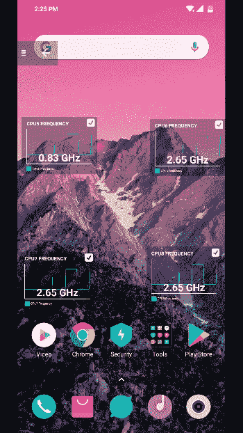</picture> 

CPU Boosting

Poco 在他们的活动中提到，他们增加了 20 多项“深度系统优化”，以确保 Poco F1 随着时间的推移保持其快速性能。他们添加的许多优化与我们已经在一加设备上看到的非常相似，包括启动速度提升，更好地为经常使用的应用程序分配资源，以及玩游戏时的网络提升。Poco 还加快了动画的速度，所以即使在基本的动画比例下，过渡看起来也非常快。像拉下通知阴影、打开应用抽屉、应用内转换和滑动体验这样的交互似乎很快，给人一种即时感。

* * *

### **闪存和内存管理**

小米 Poco F1 共有四种存储和内存组合。基本型号提供 6GB 的内存和 64GB 的存储空间，而顶级型号 Armored Edition(我们正在审查)配备了强大的 8GB 内存和 256GB 的内部闪存。尽管 2018 年 RAM 价格相对上涨，但我们开始看到更多高端设备在基本型号中转向 6GB RAM，提供高达 8GB 的高端产品。Android 是否真的需要那么多内存是有争议的。我个人认为，4GB 对于游戏和多任务处理来说绰绰有余，虽然 6GB 对于在内存中容纳更多应用程序(如大型游戏)来说是有用的，但超过这条线就有点大材小用了。

在我的测试和日常使用中，小米 Poco F1 能够轻松地将我所有的应用程序保存在内存中，而不必在重新打开它们时重新创建它们的活动。在任何给定的时间，我都可以让谷歌 Chrome 打开 10 个以上的标签，YouTube、Twitter、Instagram、WhatsApp、谷歌照片、收件箱( [RIP](https://www.xda-developers.com/inbox-by-gmail-discontinued-march-2019/) )、谷歌 Keep、Slack、Trello 和 PUBG Mobile 都可以毫无困难地驻留在内存中。在这方面，小米 Poco F1 比我们测试的其他运行 MIUI 的小米设备有了明显的改善，MIUI 通常为后台应用程序设置了积极的政策。

闪存存储性能对于快速可靠的实际性能至关重要，甚至比 CPU 和 RAM 容量更重要。Poco 在这一领域没有偷工减料，因为他们已经推出了采用通用闪存存储 2.1 技术的存储芯片。在较长时间的操作中，如游戏加载和在文件夹之间移动大文件时，可以明显感受到更快存储的差异。

* * *

## **UI 流畅度**

在衡量设备的真实性能时，我们没有看到用户界面流畅性受到太多关注。正如我们一次又一次看到的，强大的硬件并不总是现实世界性能更好的标志。无论芯片组多么强大，如果软件优化不佳，用户感受到的性能仍然会令人失望。鉴于[盛行的基准测试作弊](https://www.xda-developers.com/huawei-p20-huawei-nova-3-honor-play-cheating-benchmarks/)，我们停止依赖综合基准测试分数来评估设备的实际性能变得更加重要。

与 UI 速度不同，设备平滑度更难定性测量，因为并非所有用户对口吃都有相同的敏感度。GPU 评测是客观和定量测量 UI 流畅性的标准方法。为了确保流畅的性能，60Hz 设备必须能够在 16.7 毫秒的严格期限内渲染每一帧，这在直方图上以绿色水平线显示。

平滑度取决于设备以 60FPS 的速度持续渲染用户界面的能力，甚至是帧间距。每次一帧或一组帧超过 16.7 毫秒的截止时间，您都会看到竖条越过绿色水平线，这可能会导致明显的口吃。通常，竖条在绿线上方的位置越高，越过绿线的竖条越多，用户就越容易感觉到口吃。就流畅度而言，谷歌的 Pixel 设备是黄金标准，这要归功于其[惊人的全面软件优化](https://www.xda-developers.com/google-pixel-fastest-android-phone-eas/)。从历史上看，定制皮肤臃肿的设备仍然是流畅度方面最糟糕的罪犯，尽管这种[的情况似乎正在慢慢改变](https://www.xda-developers.com/note-8-real-world-analysis-performance/)。

**方法:**为了测试真实世界的流畅性，我们不会仅仅展示 gif 或显示 GPU 性能分析条的截图。相反，我们将向您展示提取的帧时间，绘制在直方图中，用于我们的每个测试。我们整合了一个工具来提取和解析帧数据，以及一个 UI 自动化系统，该系统允许我们通过模拟触摸输入(滚动、加载新活动或窗口，以及使用复杂的 UI 导航进行复合测试)来构建模拟现实世界用例的宏。

首先，我们开始测试小米 Poco F1 在谷歌 Play 商店和 Gmail 中的滚动性能，因为我们经常在优化较差的设备上看到这些应用程序出现严重的丢帧和口吃。测试会预先加载列表，因此缩略图和条目加载不会中断测试期间的滚动活动。首先，它启动谷歌 Play 商店应用程序，快速滚动浏览排行榜应用程序，然后移动到 Gmail 应用程序，滚动浏览主要收件箱条目。

 <picture>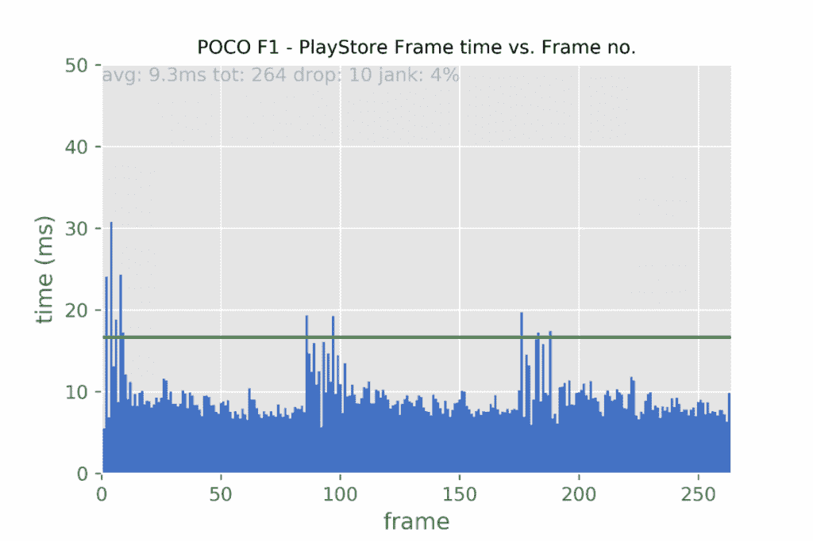</picture> 

Play Store Scrolling

小米 Poco F1 在两项测试中都表现出色，没有大量丢帧。在一些交互中有一些微小的口吃，但是在正常使用中没有一个能被真正察觉。

 <picture>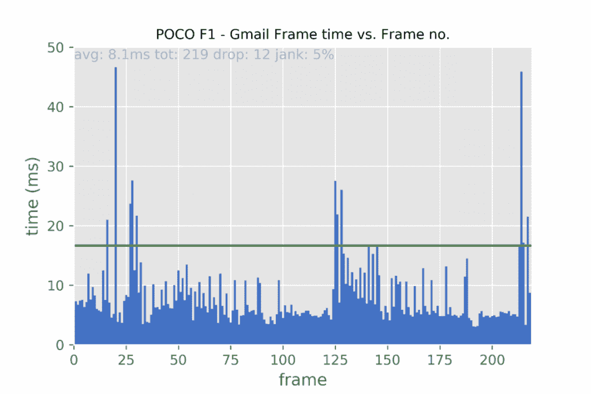</picture> 

Gmail Scrolling

接下来，我们对小米 Poco F1 进行了一系列复合 UI 测试，包括元素加载以模拟真实世界的场景，如打开应用程序、导航应用程序 UI、滚动列表等。

从 YouTube 复合 UI 测试开始，该测试循环三次，并执行一系列受控操作，如搜索内容、滚动、播放视频、在面板之间滑动等等。测试结果如下图所示。请记住，结果不包括视频播放的帧时间。

 <picture>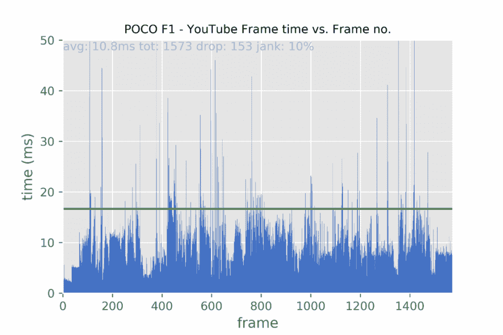</picture> 

YouTube Compound Test

小米 Poco F1 在将 janky 帧数保持在 10%方面做得很好，尽管它不是特别平滑。当打开视频条目并最小化播放时，可以看到一些帧丢失，但在其他情况下，滚动、在水平菜单之间滑动以及其他过渡处理起来相对容易。

我们还看了一下 Play Store，它本身就是一个资源密集型应用。拥有如此多的菜单、按钮、缩略图和长列表，它是分析设备应用内性能的绝佳选择。测试从滚动“排行榜”应用程序开始，然后打开应用程序列表并向下滚动到用户评论部分，最后，它从侧面板移动到音乐选项卡，在那里滚动热门歌曲，然后返回到 Play Store 主屏幕。该测试在相同条件下重复三次，最终结果如下所示。

 <picture>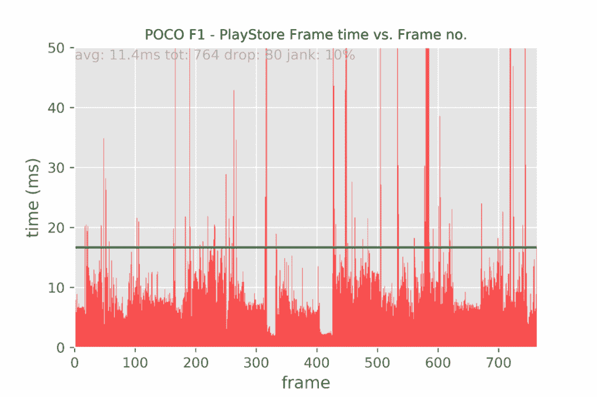</picture> 

Play Store Compound

加载应用列表一直是几乎所有 Android 设备的痛点，在这里，我们也看到在打开和关闭应用列表以及切换到音乐标签时的高帧丢失。像往常一样，滚动部分保持平稳，整体表现令人满意。

最后，Gmail 的最后一个复合测试包括滚动主收件箱、打开侧面板、检查垃圾邮件框、打开窗口撰写电子邮件，以及导航应用程序的其他部分。同样，该测试在受控环境中重复三次。

 <picture>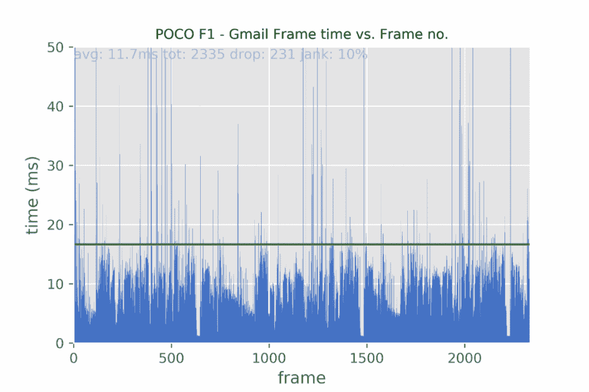</picture> 

Gmail Compound Test

在这里，小米 Poco F1 也显示了类似的行为，尽管考虑到 Gmail 相对较轻，我预计它的表现会好一点，但 Poco F1 仍然做得非常好，没有丢帧太多，也没有出现任何明显的口吃。

我们还测试了用户界面的其他部分，如默认的应用程序启动器和 Gmail 应用程序中的侧面板，作为侧面板的代理。

 <picture>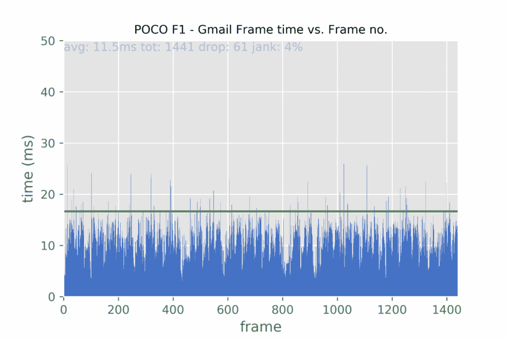</picture> 

Gmail side panel test

侧板在这里似乎不是问题。正如你在上面的图表中看到的，它实际上表现得相当好，没有高于绿线的高杆拍摄。

 <picture>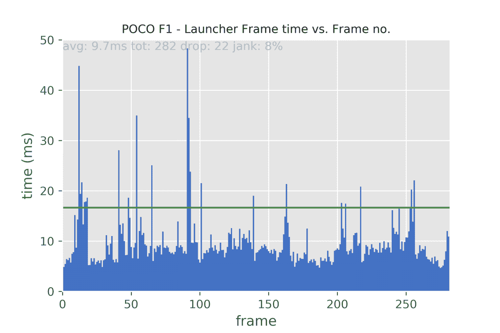</picture> 

POCO Launcher test

在默认的 Poco 启动器上，打开应用程序抽屉，然后第一次滚动几乎总是会丢失一些帧。这不是特别明显，但我们测试的其他第三方发射器，如 Lawnchair 和 Aamir Zaidi 的无根像素发射器，在 Poco F1 上提供了更流畅的体验，没有任何丢帧。

* * *

## **结论**

总而言之，Poco F1 在这些测试中的表现令人印象深刻，远远超出了我们的预期。虽然就流畅度而言，它可能无法与 Google Pixel 相提并论，但它本身仍然表现得相当不错，提供了一致且相当流畅的 UI 性能。我的主观经验和现实世界的观察也反映了同样的观点，我不记得在我的使用过程中我不得不面对任何 UI 冻结、严重口吃或意外应用程序强制关闭的情况。

* * *

[**访问 XDA** 上的小米 Poco F1 论坛](https://forum.xda-developers.com/poco-f1)

[**从 Flipkart 购买 Poco F1**](https://www.flipkart.com/search?q=poco%20f1)

[**从 Mi.com 购买 Poco F1**](https://store.mi.com/in/buy/product/poco-f1)