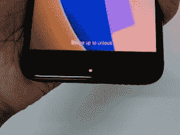

# 小米 Redmi 4 Mini-Review:一百美元的 Android 让你走得很远

> 原文：<https://www.xda-developers.com/xiaomi-redmi-4-review-a-hundred-dollars-of-android/>

印度智能手机市场由数百家公司组成，分布在很大的预算范围内。但是，在一个人均收入(人均年收入)在上一个财政年度仅为 1450 美元的国家，瞄准拥有巨大未开发潜力的低端市场对于品牌识别变得至关重要。

小米的 Redmi 系列智能手机旨在将小米品牌带给大众。Redmi 系列智能手机是入门级设备，面向首次购买者或需求和预算有限的人。新推出的 Redmi 4 没有花哨的旗舰规格，也没有我们可以痴迷的花哨的旗舰性能。相反，我们得到的是一个小而实用的设备，可以满足基本用户的所有需求，甚至一些需求，而不需要挤他的小口袋。

迷你评论不同于我们深入的 XDA 评论，它们旨在让你在通常的实际操作之外，对一款设备有一个更广泛的了解。我们选择对较小的版本、较小制造商的设备或发展前景不确定的设备进行小型审查。

| 

设备名称:

 | 

小米 Redmi 4

 | 

发布日期/价格

 | 

现已上市，₹6,999(约 109 美元)起

 |
| --- | --- | --- | --- |
| 安卓版本 | 6.0.1 (MIUI 全球 8.2 ROM) | 显示 | 5.0 英寸 720p IPS 液晶屏(294p ppi) |
| 芯片集 | 骁龙 435，八核 Cortex-A53，8x 1.4GHz，Adreno 505 GPU | 电池 | 4100 毫安时不可拆卸 |
| 随机存取存储 | 2/3/4GB LPDDR3 | 传感器 | 指纹、加速度计、陀螺仪、接近度、环境光、电子罗盘 |
| 储存；储备 | 16/32/64GB eMMC | 连通性 | USB 2.0 微型 USB、混合 SIM 卡托盘(微型 SIM + Nano SIM 或微型 SIM +微型 SD 卡)、3.5 毫米音频插孔、红外发射器 |
| 规模 | 139.2 x 70 x 8.7 厘米(屏幕与机身的比例约为 70.7%) | 后置摄像头 | 1300 万像素，PDAF，f/2.0，1080p@30FPS 视频 |
| 重量 | 150 克 | 前置摄像头 | 500 万像素，f/2.2，1080p 视频 |

## 索引

[spacer color="F85050"]

## 设计

对于任何关注小米最新设备的人来说，Redmi 4 都将是一张熟悉的面孔。Redmi 4 借用了 Redmi Note 4 的设计线索，没有任何冒险的实验。就其价格而言，Redmi 4 看起来比入门级设备的预期要好。

与其他几款 Redmi 和 Redmi Note 智能手机一样，**仿一体结构**由金属主背板组成，两侧是顶部和底部的塑料盖。塑料盖由锯齿状的装饰线隔开，为设备增添了更多特色。背面在侧边弯曲，补充了手机的尺寸和手感。然而，哑光黑色的背板很容易变脏(手指上的油渍)，由于某种原因，它无法用简单的湿巾清洁。背面的**指纹传感器**也放得更高，但考虑到设备的大小，新的定位是有意义的，因为它更靠近你手指将要休息的区域。

该设备的正面采用了 **5 英寸高清显示屏和 2.5D 弧面玻璃**，底部有三个电容按钮，顶部有听筒和前置摄像头以及其他传感器。关闭时隐藏的是位于电容式按键下方的**通知 LED。我们的审查单位是哑光黑色的颜色变化，看起来非常光滑的隐形黑色外观。注意，电容式按键**下方没有**背光。**

该设备底部的特点是中央有**微型 USB 端口**，两侧有相同的扬声器孔，尽管只有右边的扬声器位于其背后。设备的右侧有电源按钮和音量摇杆。除 SIM 托盘外，左侧是干净的。设备顶部有**3.5 毫米耳机插孔**(耶！)，一个**红外发射器**和一个辅助麦克风。

总的来说，这款手机看起来非常适合入门级设备。这是一款 5 英寸显示屏的设备，所以拿着和拿着手机对我来说是小菜一碟，尤其是在我体验过 6.44 英寸的 Mi Max 手机之后。第一次使用智能手机的用户应该也不会有任何问题，因为 Redmi 4 的小尺寸对于日常使用、单手操作和便携性来说非常舒适。该设备与 Karbonn、Micromax、联想和 Moto E 系列等印度原始设备制造商竞争；手感肯定排在前面。尽管价格低廉，但这款手机并不便宜，也不塑料，这是主流消费者会喜欢的东西。

[spacer color="F85050"]

## 软件

*MIUI 8 . 2 . 4 . 0 MAMMIEA 上的安卓 6.0.1 棉花糖，安卓安全补丁:01-03-2017*

红米 4 以安卓 6.0.1 棉花糖为基础，小米的 MIUI 8 UX 为基础。

在同一版本的 MIUI 上，不同设备的 MIUI 体验往往是一致的。因此，红米 4 的软件体验与红米 Note 4 相比只有一些差异，红米 Note 4 都在 Android 6.0.1 上运行 MIUI 8。我们想参考一下[红米 Note 4 的评测，对小米的皮肤](https://www.xda-developers.com/xiaomi-redmi-note-4-xda-review-in-depth/)进行一次全面的测试，否则这次评测将会充满重复。

MIUI 有一些变化，主要是为了说明从 MIUI 8.1 到 **MIUI 8.2** 的跳跃。

首先，**通知现在可以从锁屏**中取消。小米花了足够长的时间才走到这一步，但他们终于实现了这一功能。现在你可以直接从锁屏中刷走通知，而不需要之前解锁。是的，你以前不能这么做。

其他恼人的问题仍然存在:通知窗格上的通知仍然默认为小通知，只有用双指向下滑动才能扩展。这极大地影响了单手使用其他单手设备，也限制了你一眼就能看到的信息。

RAM 和多任务处理仍然是问题所在，但整体性能也遇到了另一个瓶颈，即入门级处理器(我们将在性能部分详述处理器)。我们的审查单位配备了 3GB 的内存。所有应用程序都被“清除”出内存后，3GB 内存中只有 1.6GB 可供应用程序使用。一旦空闲内存接近 1GB，MIUI 的侵略性就开始发挥作用，因为后台的应用程序会定期关闭并失去它们最后的位置。

应用程序之间的多任务处理速度慢了一秒，因为动画阻碍了体验，处理器开始显示其入门级限制。Redmi 4 提供了一种最多可以称为入门级的多任务处理体验，与 Redmi Note 系列相反， **Redmi 系列及其入门级 SoC 将受益于 MIUI** 的低调版本。在 Redmi Note 系列的第三方定制 ROM 场景中，更接近 AOSP 的股票 Android / options 很受欢迎，但在 Redmi 4 中，小米应该考虑采用更轻便的东西，以最大限度地利用有限的处理能力。

我们在这一点上采取的立场可能看起来很苛刻，因为首次购买智能手机的人不太可能注意到小的滞后和延迟(或者他们可能注意到了，但无论如何都忽略了它，特别是在这个价格范围内)，但我可以注意到延迟，因为我是从旗舰日常驱动程序下来的。不过，在多任务处理方面，Redmi 4 的竞争对手确实表现更好。即使是两年前的 Elephone P8000，其 MTK6753 SoC 和 3GB RAM 也比 3GB RAM 的 Redmi 4 更好更快地进行多任务处理。如果客户购买 2GB RAM 变体，这种体验可能会变得复杂和恶化，因为有限的物理 RAM 将会成为另一个瓶颈，影响设备的未来可靠性。

我在红米 4 上使用 MIUI 8 的总体体验是:T1 还可以，T3 是 T2。我仍然喜欢 MIUI 带来的各种附加功能，但这款设备上的 MIUI 也开始接近骁龙 435 SoC 的极限。对于这款设备的价格和它的目标受众来说，这些缺点是可以原谅的，尽管我们热切希望看到 MIUI 更好地适应低端硬件，因为即使谷歌也宣布了它打算通过 Android Go 这样做。

[spacer color="F85050"]

## 表演

印度的红米 4 在中国被称为红米 4X，但为了简单起见，我们称它为红米 4。

Redmi 4 配备了**高通骁龙 435 SoC** ，在印度，它有三种内存和存储版本: **2GB+16GB、3GB+32GB 和 4GB+64GB** 。我们的审查单位是 3GB 内存和 32GB 内部存储的中间变量。

小米 Redmi 4 是一款入门级设备，并且配备了一款入门级 SoC。高通骁龙 435 是对骁龙 430 的增量升级，主要区别在于 435 上的**更快的 X8 LTE 调制解调器。**

骁龙 435 由 8 个主频为 1.4GHz 的 Cortex-A53 内核组成，采用 28 纳米工艺制造。GPU 由支持 Vulkan 和 OpenGL ES 3.1 的 **Adreno 505** 处理。

正如预期的那样，Redmi 4 不是人们为了炫耀基准测试能力而购买的智能手机。基准测试反映了其 SoC 的低端范围，明显低于我们过去多次评估的骁龙 625。该芯片组是为主流、消费者和预算导向的决策而放在这款手机中的，这一事实在基准测试中得到了反映。

SoC 提供了尚可的单核分数，但八核芯片组的多核分数较低。即使是联发科的旧中低端 SOC，如 MT6753，也比 Redmi 4 的多核性能更好。然而，GPU 肯定是有能力的，提供比更老的 MT6753 更好的价值和性能。

目前，这款 SoC 的主要竞争对手将来自骁龙自己的老款骁龙 430，它仍然是预算领域的热门选择，2017 年即将推出 4XX 替代车型。诺基亚最近推出的设备包括诺基亚 5 和诺基亚 6，它们使用骁龙 430。但是 430 和 435 之间的差异主要在于 X8 LTE 调制解调器和时钟速度的轻微提升(1.4GHz 对 1.2GHz)，因此最终用户不太可能在 CPU 性能方面体验到任何明显的差异。

关于热量，手机在正常的日常任务中表现得像微风一样。只有在游戏和基准测试场景下，手机才会在指纹传感器周围发热。但谢天谢地，热度仍在控制之中。虽然很明显，但它不会累积到引起任何不适的程度，一旦你离开繁重的活动，它就会很好地消散。

只有轻微的热节流迹象。在连续几次运行后，GeekBench 的得分略有下降，下降与高温相吻合。分数的变化很小，由于这是一款不太可能因其处理能力而购买的设备，少量的热节流是情有可原的，但为了保持审查的客观性，值得一提。

就 GPU 而言，Adreno 505 没有热节流，所以这是一个好消息(但它一开始并不那么强大)。

大多数较高强度的标题在低图形上工作良好，较高的选项会导致丢帧和游戏不流畅。也有明显的热量产生，但它消散得很好，不会对现有帧下降之外的游戏性能产生任何明显的影响。休闲标题在设备上处理得更好，所以对预算用户来说至少还有一些希望。

就存储速度而言，Redmi 4 的性能优于人们对经济型设备的预期。AndroBench 的结果将格式化为 **EXT4** 的 **32GB eMMC** 存储放置在接近 Redmi Note 4 的位置，具有相似的顺序读写速度。相对于随机读取速度有所提高，这至少是令人惊讶的。

总的来说，Redmi 4 在智能手机体验的实用方面比基准测试好得多。它的目标受众会发现手机的内部足以满足他们日常使用中有限的使用情况。重要的是要记住，这不是一款旗舰手机，甚至不是一款中端智能手机。它是一个开端，一个预算工具，所以当务之急是把我们的期望拉回来，用一个合适的尺度来衡量它。处理器不是 Redmi 4 的附加值，而是它的价格。就其价格而言，小米选择的处理器是一个非常好的选择，没有明确的“更好”的替代品(不抬高价格)可供 OEM 使用。

[spacer color="F85050"]

## 电池寿命和充电

作为我迄今为止测试过的所有小米智能手机的传统，小米 Redmi 4 的电池寿命惊人。这是通过包含一个健康的 **4，100 mAh 电池**实现的，它与 5 英寸高清显示屏和基于八核 Cortex-A53 的骁龙 435 配合使用，效果非常好。这种设置意味着，即使在“大量”使用一天的情况下，也很难杀死 Redmi 4(尽管你可以推多“大量”仍然受到预算 SoC 的限制)。

由于显示器很小，SoC 相当有限，普通消费者不太可能花费大量时间观看视频或玩密集型游戏。在这种情况下，这款手机仅限于更基本的任务，如休闲网上冲浪、Instagram、Snapchat、脸书和其他非 CPU 密集型任务，这种手机在一次充电后可以使用两天也就不足为奇了。

谈到电池基准，Redmi 4 的表现令人钦佩，在最小亮度下的电池寿命为**15 小时 42 分钟。这比红米 Note 4 在类似条件下的测试中达到的疯狂的 16 小时 41 米低了约 1 小时，尽管显示屏更大更好，但红米 Note 4 的电池效率很大一部分是由 14 纳米制造工艺带来的，28 纳米的骁龙 435 无法与之竞争。**

在最大亮度上，红米 4 的成绩是 8 小时 28 分，超过了红米 Note 4 创下的 8 小时 15 分。在电池剩余 20%的情况下，手机的实际屏幕时间在 5.5-6 小时左右，我不怀疑手机的能力达到 7 小时大关。

不幸的是，充电仍然是该设备的痛点。红米 4 从 0%一直充电到 100%需要 3 个多小时。这是一件好事，该设备不需要充满电就可以舒适地度过一天，因为给手机充电需要太长时间。小米在这方面做出了改变，新的小米 Mi Max 2 充电速度更快，但在 Redmi 4 上，你只能使用 2015 年的技术。

[spacer color="F85050"]

## 照相机

Redmi 4 自带 **13MP 后置传感器，相位检测自动对焦，光圈 f/2.0** 。这是一个相当标准的相机设置，也可以在其他小米设备中找到。通常情况下，只要光线对你有利，相机就能表现良好。

Redmi 4 上的相机性能与 Redmi Note 4 上的相似，考虑到价格差异，这令人惊讶。普通相机模式下的拍摄很好地表现了主体的实际颜色，而 HDR 倾向于饱和颜色，使图像看起来主观上很漂亮，但不是主体的真实代表。HDR 的另一个缺点是处理时间慢，因为所有 HDR 的图像需要大约 2-3 秒的处理时间，并且在处理过程中你需要保持手的稳定。

一旦光线不佳，图像就会受到严重影响。细节、色彩还原和动态范围都受到影响。这是典型的预算部分，人们不太可能在这个预算部分找到一款相机性能更好的设备。

正面的自拍相机是一个 **5MP 的射手，f/2.2** 。如果你有足够的光线，你可以拍出很好的自拍照。也有一些可用的美容模式，可以修饰主体的面部，以消除瑕疵并提亮肤色。相机应用程序接受指纹传感器上的触摸来点击照片，从而更容易点击自拍，而无需重新放置手指。

Redmi 4 可以捕捉 1080p 30fps 的视频，但由于这是一款廉价设备，因此指望它搭载 OIS 或 EIS 是很奇怪的。你需要一只稳定的手来拍摄视频，这是良好照明的先决条件。

我们对相机性能的期望非常有根据，因为即使是目前的 mid rangers 也经常在相机部门留下许多需要改进的地方。这是一款注重价格的入门级设备，所以我们不指望它的相机会出现奇迹。我们也没有得到任何奇迹。

[spacer color="F85050"]

## 显示

Redmi 4 配备了一个 **5 英寸 IPS LCD** 显示屏，分辨率为**HD 720 x 1280**。相对于现在被认为是“标准”的 5.5 英寸显示屏，较小的显示屏可能显得有些格格不入，但更小、更便于携带的设备是有市场的。凭借更小的显示屏，Redmi 4 的目标是在字面上和象征上都便于携带。

在现在反复出现的主题中，Redmi 4 的显示屏明亮而清晰，就像 Redmi Note 系列中的设备一样。尽管价格不菲，但考虑到价格因素，这款显示器不会以任何方式妥协。这款设备对于户外使用来说足够亮，尽管孟买炎热的夏日阳光造成了几次问题(OnePlus 3 的显示屏当时也不清晰，所以这不是这两款设备的错，而是不得不进行的观察)。显示屏也变得非常非常暗，我很欣赏这种极端的选择。

Redmi 4 的视角还可以，因为人们可以注意到黑色在超过一个角度后会恶化，从而影响了设备的对比度(你可以在下面看到一些)。

色彩准确度有点差，因为显示器喜欢让内容饱和，让红色更有活力，但这并不太糟糕，大多数用户不会注意到饱和度。您也可以调整显示温度和对比度，以防需要修改默认设置。

就其价格范围而言，Redmi 4 的显示屏不会令人失望。较小的尺寸可能会影响决策，但显示器的所有其他方面都符合这个价格范围内的标准。

[spacer color="F85050"]

## 声音的

Redmi 4 在中框底部有相同的钻孔，用作扬声器，但扬声器位于 microUSB 端口右侧的孔后面。当你不用手消音时，音频质量还不错，这种情况很少见，因为这种设备很容易操作。

3.5 毫米耳机插孔和听筒的体验与我用过的其他各种智能手机不相上下。清晰度和音量对于音频的预期用途来说不成问题。您可以通过耳机和听筒非常舒适地使用这款手机进行长时间通话。

[spacer color="F85050"]

## 开发和未来验证

Redmi 4(印度版)是一款相当新的设备，由于 flash 销售，很难获得。正因为如此，对于这种设备，我们还没有考虑到它本身的优点。

[因为小米发布了多个名称相似的设备，我们只是想进一步区分。配备 2GB RAM 和 16GB 存储的 Redmi 4 中国版代号为 prada。拥有 3GB RAM 和 32GB 存储的 Redmi 4 Prime 为 [markw](https://forum.xda-developers.com/showpost.php?p=72657528&postcount=8) ，而 Redmi 4 India/ Redmi 4X China 的代号为 santoni。红米 2GB 内存和 16GB 存储是劳力士。以下章节与'**桑托尼**'相关。]

**使用官方解锁工具**可以解锁设备。我无法确认小米的解锁程序是否有任何改进，因为我的账户在我登录桌面上的 Mi Unlock 后立即显示我有解锁权限，甚至没有附上我的 Redmi 4(可能是我过去解锁冒险的结果)。我们不知道是否仍然需要申请解锁，并随后等待数周的解锁权限-小米的网站提到了权限，但我们已经没有任何特别的努力。

Redmi 4 最接近的前身是 [Redmi 3S](https://forum.xda-developers.com/xiaomi-redmi-3s/development) (land)，所以我们可以在它的基础上估算 Redmi 4 的开发场景。Redmi 3S 确实收到了它的内核源代码，[虽然令人失望的晚了](https://www.xda-developers.com/xiaomi-releases-the-kernel-source-for-redmi-3sprimex/)。Redmi 3S 确实有一个活跃的开发社区，因为人们可以找到几个第三方定制选项和基本功能，从 TWRP 构建到 LineageOS 14.1 到 KaliNethunter。现在说 Redmi 4 是否能抵挡 Redmi 3S 的发展还为时过早，但我们对此充满希望。

就未来的考验而言，Redmi 4 并不是那些寻找一款老化程度非常好、可以舒适使用两年以上的设备的人的理想选择。大多数争论源于它的预算性质，因为这个价格范围内的设备在任何形式上都不是以最高规格制造的，因此严重限制了你可以使用手机的程度。Redmi 4 在这种情况下遵循规范。

高通骁龙 435 SoC 虽然适用于日常任务，但随着用户需求的扩大，肯定会成为一个瓶颈。内存和存储选项的范围从 2GB+16GB 到 4GB+64GB，因此基本版本在未来会有问题(甚至可以在现在争论)。这款手机自带 Android 6.0 棉花糖，小米承诺“很快”会更新 Android 牛轧糖(T1)，但考虑到它的要价，以及它在游戏后期发布棉花糖的事实，要求这款手机更新到 Android O 将是一个挑战。

[spacer color="F85050"]

## 杂项观察

Redmi 4 在设备顶部配备了现在的标准 **IR Blaster** 。这是一个甚至连旗舰都没有的功能，所以当这样一个预算设备带有这个硬件功能时，其他 OEM 应该注意到了。IR Blaster 的使用和性能与 Redmi Note 4 相似

### 购买困难——闪存销售，但场景有所改善

Redmi 4 又是典型的小米时尚，是一款很难购买的设备。不过，与红米 Note 4 相比有所改进。

首先，小米现在接受该设备的预购。这类似于他们进行的快闪销售，因为预购时间是固定的，但这里的区别是，您可以预订尚未完全生产和分销的设备(而不是快闪销售中已准备好派发的设备)。这增加了潜在买家的机会窗口，并帮助小米将更多此类潜在客户转化为实际客户。

小米还在印度班加罗尔市开设了第一家线下小米之家商店。这家小米之家商店提供了一个离线体验和购买 Redmi 4(以及其他小米设备和电子产品)的渠道。小米计划在中国其他地区再开设几家这样的线下商店，并在未来几个月增加线下零售业务。这增加了设备对不熟悉互联网的观众的可用性，这对于该价格段的设备的成功是至关重要的。

[spacer color="F85050"]

## 最后的想法和结论

如果不提及小米 Redmi 4 最大的卖点——其疯狂的定价，对小米 red mi 4 的评论客观上是不完整的。虽然总的来说，这款设备可能让人感觉平淡无奇，规格对于发达国家来说也太入门级了，但这款手机的目标客户要么是第一次购买智能手机，要么是预算有限。

小米 Redmi 4 在印度的售价从₹6,999(108 美元)开始，基本的 2GB RAM + 16GB 存储版本；3GB + 32GB 的₹8,999(140 美元)和 4GB + 64GB 的₹10,999(170 美元)。

Redmi 4 的基本版本对我们来说最有意义，尽管在可用的版本选择中有最差的规格。这是因为该设备的价格给了你一笔好交易，这是其他原始设备制造商无法比拟的。跳到更大的 RAM 和存储空间感觉很陡，最顶层的变体对我们来说毫无意义，尽管它的妥协“最少”。这是因为最高端的变体**开始侵入红米 Note 4 定价类别**。虽然你以这个价格在 Redmi Note 4 上获得了更少的内存和存储，但你用更好的中端骁龙 625 取代了预算骁龙 435。

最划算的交易是基本款，因为它能让你以低于 110 美元的价格买到一个强大的设备。

在这个价格范围内，我们看到了像新宣布的 [Moto C Plus](https://www.xda-developers.com/moto-c-plus-launched-india/) 这样的竞争对手，它具有类似的规格，但用联发科 MT6737 替换了 SoC，并在摄像头上进一步降级，并完全取消了指纹传感器。另一方面，你确实可以获得更接近库存的 Android 体验，以及可拆卸电池。理论上，Moto C Plus 似乎是一个更糟糕的交易，所以这将取决于最终用户及其需求和优先事项，以确定哪款手机更适合。

其他值得注意的发布包括新的 [YU Yureka Black](http://gadgets.ndtv.com/mobiles/news/yu-yureka-black-price-in-india-launch-specifications-release-date-features-flipkart-1706536) ，它为你提供了与升级版相同大小和 4GB 内存的 FHD 显示器，但比骁龙 430 SoC 低了一步。Yureka Black 的起价也较高，在₹8,999 与中间的 Redmi 4 变种竞争(140 美元)。

令人惊讶的是，我还认为诺基亚的最新智能手机, [Nokia 3](https://www.xda-developers.com/hmd-global-launches-nokia-3-nokia-5-and-nokia-6-in-india/) 是 Redmi 4 的一个不错的竞争对手，尽管诺基亚的定价决策低得离谱。诺基亚 3 在₹9,499 很贵(148 美元)，降级到联发科 MT6737，2GB 内存，16GB 存储，更小的 2630 mAh 电池，规格方面也降低到摄像头。但是，Nokia 3 拥有诺基亚品牌，只能通过线下商店购买。对于第一次走进零售店购买智能手机的人来说，这两个因素都会让他倾向于购买诺基亚 3，尽管 Redmi 4 显然是更好的设备。

[spacer color="F85050"]

所有的牌都摆在桌面上，Redmi 4 是一款有自己妥协之处的设备，也是一个真正强大的卖点，体现在价格上。这个小设备没有什么让你真正“惊叹”的，但这是入门级智能手机的典型特征。但是，当人们看到设备的价格时，所有的错误都被原谅了。不到 110 美元，这是最好的。我推荐小米红米 4 的 2GB+16GB 版本，尽管它有所妥协，但仍是第一部智能手机的绝佳选择，主要是因为它的₹6,999(108 美元)定价。如果你可以扩展你的预算，跳过其他两个版本，选择小米红米 Note 4。