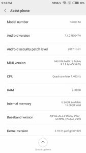
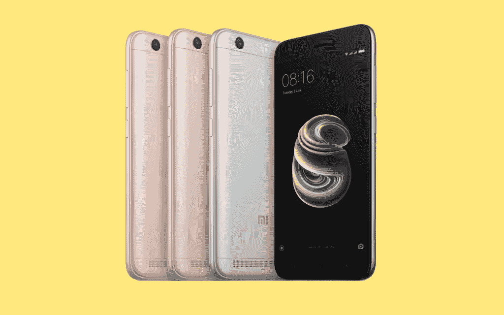

# 小米红米 5A XDA 迷你评论:预算智能手机做得对

> 原文：<https://www.xda-developers.com/xiaomi-redmi-5a-xda-mini-review-buy/>

2017 年，旗舰产品突破了硬件和价格的界限。原始设备制造商的新版本变得更好，但也变得更加昂贵。但是，如果你买不起 800 美元以上的智能手机，也不需要这个价位的处理能力和功能，那该怎么办？如果你只是想要一部工作可靠、价格低廉的智能手机，该怎么办？进入小米，一个不小的原始设备制造商。

小米的智能手机让你物超所值。是的，该公司的产品组合包括小米 Mi MIX 和 Mi MIX 2 等尖端设备，这些设备偏离了传统的智能手机设计，要价相对较高。但在印度和其他东南亚国家，Redmi 系列比小米自己的旗舰 mi 手机引起的共鸣要深得多，原因是:它便宜而且有效。

凭借 Redmi 5A，小米瞄准了智能手机领域的早期预算端。Redmi 5A 的起价仅为约 80 美元，目标客户是首次购买智能手机的用户以及那些寻求价格实惠、整体体验出色的智能手机的用户。

> 那么，不起眼的 Redmi 5A 与竞争对手相比如何呢？

在这篇动手操作和第一印象的文章中，我们将通过实用的镜头来看看 Redmi 5A，而不是将其与价格高出数百美元的旗舰智能手机进行比较，我们将记住这款手机的价位和目标受众。

| 

设备名称:

 | 

小米 Redmi 5A

 | 

发布日期/价格

 | 

现已上市，₹4,999(79 美元)起

 |
| --- | --- | --- | --- |
| 安卓版本 | 基于 Android 7.1.2 牛轧糖的 MIUI 全球稳定版 9.1.8.0 | 显示 | 5 英寸 720p IPS 液晶屏(401p ppi) |
| 芯片集 | 骁龙 425，四核 Cortex-A53，4x 1.4GHz，Adreno 308 GPU | 电池 | 3000 毫安时不可拆卸 |
| 随机存取存储 | 2GB/3GB | 传感器 | 加速度计，接近，环境光 |
| 储存；储备 | 16GB/32GB，可通过专用插槽扩展 | 连通性 | microUSB 2.0、双 SIM 卡托架、3.5 毫米音频插孔、红外线增强器 |
| 规模 | 140.4 x 70.1 x 8.4 厘米(屏幕与机身的比例约为 69.1%) | 后置摄像头 | 1300 万像素，f/2.2，PDAF，1080p@30FPS 视频 |
| 重量 | 137 克 | 前置摄像头 | 5MP，f/2.0 |

## 索引

[spacer color="F85050"]

## 设计

Redmi 5A 谦逊的外观掩盖了其强大的硬件。

这款手机的外壳是由塑料制成的，尽管这里使用的聚碳酸酯有很好的金属质感。这是一个简单的设计，就像它的前任，红米 4A。事实上，Redmi 4A 和 Redmi 5A 之间的差异很少，金属质感是外观上的差异之一。

Redmi 5A 的正面，就像 Redmi 4A 一样，主要是一个 5 英寸的 720p IPS LCD 显示屏。这款手机保持了对称的外观，耳机位于中央，前置摄像头和接近传感器位于两侧。显示屏下方是用于 Android 传统 Recents、Home 和 Back 导航按钮的非背光电容式按键，以及一个白色 LED。

这款设备的顶部有一个辅助麦克风、一个红外发射器(这是一个很少在旗舰机上出现的令人惊讶的功能，更不用说 Redmi 5A 的价格了)和一个 3.5 毫米耳机插孔。该设备的底部有一个麦克风孔和一个 microUSB 端口。USB Type-C 仍然要进入 Redmi Note 系列，所以 Redmi 系列必须等待轮到它。

该设备的左侧有两个插槽，一个用于单个 nano SIM 卡，另一个用于 microSD 卡，以及另一个 nano-SIM 卡。与红米 4A 和其他小米设备不同，红米 5A 取消了混合 SIM 卡托盘，用户可以选择使用两张 SIM 卡，以及高达 128GB 的可扩展存储空间。右侧是电源按钮和音量摇杆。它们都是塑料的，但它们的点击感还不错(比小米 A1 的好得多，价格大约是红米 5A 的三倍)，但它们也有很轻微的摆动。

在设备的背面是一个后置摄像头，安装了一个 LED 闪光灯。底部有一个扬声器格栅，扬声器下方有一个小的凸起，以防止它被平坦的表面所掩盖。

Redmi 5A 上没有指纹传感器，这有点遗憾。当你考虑价格时，更容易忽略它，但考虑到它是 2017 年问世的，这并没有减少它的失望。

红米 5A 没有试图成为时尚偶像，这是一件好事。通过专注于简单而安全的设计，小米可以将更多资源集中在内部。这并不是说它卡通或丑陋，但它也无法与在廉价智能手机领域越来越受欢迎的全金属设备竞争。

聚碳酸酯的使用也有助于控制设备的重量。结合更小的设备外形，这款手机感觉坚固且易于操作。对于像我这样习惯于操作更大的 5.5 英寸手机的人来说，单手使用非常舒服。长时间拿着手机也不会导致手腕疲劳。

[spacer color="F85050"]

## 软件和性能

小米 Redmi 5A 拥有高通骁龙 425 片上系统(SoC)，这是一款经济型入门级处理器，它有两种存储和 RAM 组合:2GB RAM 和 16GB 存储，3GB RAM 和 32GB 内部存储。

骁龙 425 是一款 64 位 CPU，配有 4x Cortex A53 处理器。Cortex A53 内核通常构成 big 中效率集群的一部分。小设置，因此在单个集群设置中专门使用它们会限制您在原始性能方面所能达到的程度(尽管在大多数情况下，这也会带来出色的能效)。

即便如此，Cortex A53 内核对于普通智能手机用户可能会打电话要求的日常低强度任务来说已经足够了(这就是为什么它们如此普遍地被用作效率集群)。日常使用场景，如打电话、发短信、社交媒体应用、即时消息、轻度游戏、办公应用等在骁龙 425 上运行都没有问题。脸书和 Snapchat 的官方应用程序尤其出现了延迟和跳帧现象，但即便如此，骁龙 425 也不是罪魁祸首。

从我的日常驱动程序 OnePlus 3 (Snapdragon 820)降级到 Redmi 5A 几天，很容易发现任务中的小延迟，否则在旗舰机上会立即发生。在某些情况下，闪屏会多停留几秒钟，动画会停留一段时间来隐藏处理过程中的延迟，等等。

所以用和我们旗舰一样的尺度来衡量 Redmi 5A 将是愚蠢的——毕竟，这款手机的价格是 2017 年旗舰的 1/10。基准测试分数没什么值得大书特书的，该设备的总体体验显然无法与旗舰产品相比。对于这款设备的未来购买者来说，保持他们的期望是非常必要的。有了 Redmi 5A 和它的骁龙 425，你肯定会得到比你所支付的更多的东西，但你首先不会支付那么多。

在我们的评测单元中，2GB 的内存也限制了我们可以将设备推向多任务处理的程度，MIUI 中激进的内存管理加剧了这一限制。启动后显示在 Recents 面板中的可用内存从未超过 700 MB，而使用期间的平均内存徘徊在 300-350 MB 之间。简单的应用程序切换场景，比如 IM 应用程序之间的切换，效果非常好，而且没有像 Launcher 这样的基本应用程序需要重绘的场景。游戏场景确实会导致关闭和重置被交换到后台的应用程序(如 Reddit Sync)，在这种情况下，你会注意到手机对它可以保持打开的应用程序数量有限制。如果你更喜欢使用 Home 键，并习惯于回到你在应用程序中的旧位置，你肯定应该选择 3GB RAM 版本而不是 2GB 版本，尽管要记住预算 SoC 无论如何都会在多任务处理体验中造成瓶颈。

软件方面，小米 Redmi 5A 在小米自己的 MIUI 9 皮肤下自带 Android 7.1.2。这是红米 5A 和 4A 的另一个区分点，因为红米 4A 推出了 Android 6.0.1 棉花糖和 MIUI 8 ( [，后来升级到 MIUI 9](http://en.miui.com/thread-1119728-1-1.html) )。目前还不知道这款设备是否会接受 Android 8.0/8.1 奥利奥，我们也不会对此抱太大希望。

小米在保持其几款设备的 MIUI 版本更新方面确实有着良好的记录，这是这款手机未来可以实际期待的事情。这款手机是 2017 年 10 月 1 日的安全补丁级别，但频繁的 MIUI 更新可能会不时地升级它。

MIUI 9[是 MIUI 8 的迭代升级](https://www.xda-developers.com/xiaomi-launches-miui-9-image-search-smart-assistant-smart-app-launcher-and-performance-enhancements/)，我们已经在我们的[红米 Note 4 评测](https://www.xda-developers.com/xiaomi-redmi-note-4-xda-review-in-depth/)中广泛报道过，软件体验基本相似。小米智能助手等 MIUI 9 的几个主要功能没有出现在全球 ROM 中，甚至连 App Vault 和农历功能等更小的功能也没有找到[，尽管这些功能是专门为印度推出的](https://www.xda-developers.com/xiaomi-launches-redmi-y1-redmi-y1-lite-miui-9-global-rom/)。

MIUI 作为一个整体引发了两极分化的意见。一些用户喜欢它带来的体验和超越传统 Android 的额外功能，而另一些用户讨厌它对传统 Android 体验的深远改变。Android Go 设备距离成为早期预算细分市场的可行替代品还有几个月的时间，所以在这个领域没有太多的选择。

小米红米 5A 提供的体验比你在这个价格段能找到的更好。但由于其入门级的规格，酒吧本身并不太高。

[spacer color="F85050"]

## 电池寿命和充电

小米的廉价设备以电池寿命著称，小米 5A 有很大的市场空间。为了帮助实现这一点，这款手机配备了 3000 毫安时的电池，理论上应该可以很好地补充其小型 5 英寸高清显示屏和高能效 SoC。

虽然红米 5A 无法与红米 Note 4 这样的效率王竞争，但它确实取得了令人印象深刻的成绩。PCMark 的 Work 2.0 电池寿命测试给它的分数是在全亮度和 wifi 和 sync 激活的情况下电池寿命为 5h 50m，在最小亮度下电池寿命为 11h 29m。这意味着你可以期望在这些数字之间的任何地方得到实际的结果。电话的实际使用允许它被大量使用一整天，并且超过较低的使用水平。当我回到日常驾驶时，我个人确实想念小米经济型设备的电池实力，因为无论我使用设备的频率和强度如何，我都有信心坚持一整天。

不过，说到充电，这款设备再次成为 2017 年的典型小米设备。手机没有快速充电功能，所以从 0 到 100 次充电需要将近 3 个小时。在我们收集的三组充电数据中，手机显示出惊人的线性充电率，使用普通充电器每插上 5 分钟就能获得约 **3%的电量。**

[spacer color="F85050"]

## 发展

由于其入门级的性质，小米红米 5A 不太可能吸引一大群有经验的开发者。相反，这款设备很可能是初露头角的爱好者进入 Android 世界的第一步。这也许并不是一件坏事。

Redmi 5A 目前在 XDA 没有自己的开发论坛，但人们仍然可以为设备找到[几个线程。](https://forum.xda-developers.com/t/xiaomi-redmi-5a)

值得注意的是，这款手机有一个 TWRP 的非官方版本。解锁手机的引导加载程序将类似于小米的其他设备，这意味着你必须利用该公司的官方工具，并通过标准步骤。

因为红米 5A 与红米 4A 非常相似，所以开发者有机会找到更容易的途径在两款手机之间移植第三方开发资源。像[非官方血统 OS 14.1](https://forum.xda-developers.com/redmi-4a/development/rom-lineageos-14-1-redmi-4a-t3701237) 和[其他](https://forum.xda-developers.com/redmi-4a/how-to/update-redmi-4a-users-t3706184)这样的 rom 已经在 4A 上线运行，如果开发工作有可能像一加“T”变种一样继续进行，5A 将会受益匪浅。

[spacer color="F85050"]

## 小米 Redmi 5A 结论

Redmi 5A 是一款入门级设备，这是无法回避的事实。该设备中没有任何东西可能会吸引任何运行当前一代中端或旗舰设备的人，这绝对没问题，因为 Redmi 5A 的目标不是赢得现有 Android 用户。

Redmi 5A 旨在为小米提供一款首次使用智能手机的用户可以毫不犹豫地购买的设备。5A 将小米的产品组合扩展到一个价格段，在第一代 Android One 失败后，该价格段在价值购买方面几乎没有什么行动。这一类别的产品往往是低于标准的规格和糟糕的用户体验——小米红米 5A 是小米以自己的风格解决这一问题的尝试。

 <picture></picture> 

Redmi 5A Color Options: Pink, Gold, Dark Grey

Redmi 5A 的真正优势在于其价格标签。仅在₹4,999(约 79 美元)，你就可以买到 2GB + 16GB 版本的红米 5A。这是提供给前 500 万购买者的折扣价，之后，价格会跳到₹5,999(约 95 美元)。3GB + 32GB 版本的价格为₹6,999(约 110 美元)，这种版本没有折扣。

基本型的折扣价格使其成为寻找低成本设备但仍能做很多事情的人的绝佳竞争者。就其(打折的)价格标签而言，基本款几乎没有什么缺点。也许 2018 年的消费者唯一会错过的东西就是指纹传感器。但除此之外，小米已经设法创造了一个健康的包装，将受到那些寻找他们的第一部智能手机或简单的二手手机的人的赞赏。

折扣后的价格标签，以及更高型号的价格标签，让推荐变得有些棘手。同样，这款入门级设备的主要卖点是其价格，所以如果你把它拿走，你就不会有太多东西可以使用了。更高的价格点开始接近小米的其他产品，随着购买者的预算更加灵活，他们可以与小米红米 Note 4 或其他[骁龙 625 SoC 设备](https://www.xda-developers.com/xiaomis-love-for-the-snapdragon-625-soc-has-hurt-yet-another-successor/)等产品达成更好的交易。更不用说，Redmi Note 4 本身已经有一年的历史了，因此针对印度市场的更新版本也指日可待。

就竞争而言，最值得注意的竞争对手(令人惊讶地)来自亚马逊印度公司。作为其“为亚马逊定制”计划的一部分，[亚马逊印度已经与 OEM 合作伙伴 10.or](https://www.amazon.in/b/ref=s9_acss_bw_cg_INWLBT_6a1_w?node=14158512031) (发音为 Tenor)合作生产智能手机，专门在其在线平台上销售。

10.or D (Tenor D)是与 Redmi 5A 直接竞争的智能手机。与打折的 Redmi 5A 价格相同的₹4,999(约 79 美元)，10.or D 的定价没有“限制”，这意味着无论售出多少台，它都将继续以相同的价格出售。以这个价格，你可以获得 5.2 英寸高清显示屏，相同的高通骁龙 425 SoC，加上 2GB RAM 和 16GB 内部存储(通过专用插槽提供可扩展选项)，更大的 3,500 mAh 电池和指纹传感器。此外，10.or D 在 Android 7.1 牛轧糖上运行更轻、更接近库存的 UX，亚马逊声称它“可以升级到 Android 8.0”。更高的版本将内存和存储提升到 3GB + 32GB，但定价为₹5,999(约 95 美元)，低于竞争对手小米红米 5A。

10.or D 智能手机也有自己的缺点。首先，它只能通过在线商店购买，这对于寻找第一部智能手机的买家来说是一个难题。10 .或者输给了小米不断扩张的线下业务，也输给了小米过去几年在印度成功建立的品牌认知度。此外，亚马逊印度网站对 10.or E 和 10.or G 等其他 10.or 智能手机的评论对产品质量的评价并不高，因此消费者也会在这方面赌一把。你也失去了红外发射器，这是一个在当代智能手机中不常见的功能。Redmi 5A 上的相机体验没什么可谈的，我们也不指望 10.or D 会好到哪里去。

[spacer color="F85050"]

小米红米 5A 是小米的一款很好的迭代产品，将有助于小米吸引以前没有触及的价格段的消费者。如果您正在寻找一款预算有限的入门级设备，我们建议您选择价格优惠的基本款。如果您可以扩展您的预算或有更高的期望，您最好选择采用骁龙 62x SoC 的设备。

* * *