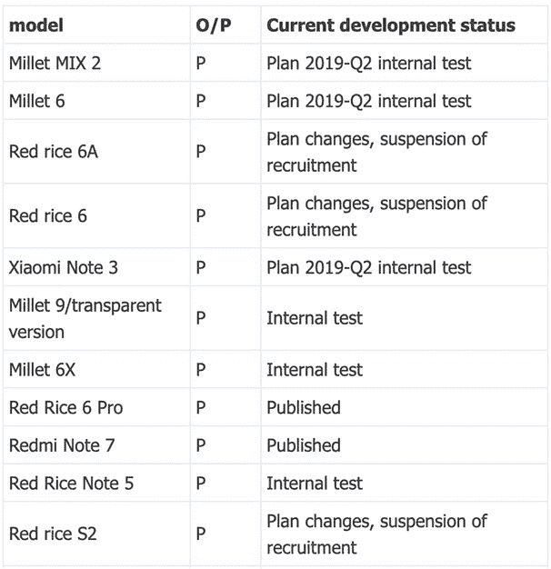

# 小米红米 6、红米 6A、红米 S2 不会得到安卓馅饼

> 原文：<https://www.xda-developers.com/xiaomi-redmi-6-6a-s2-y2-android-pie-cancelled/>

**更新 1(2019 年 4 月 24 日@ IST 下午 5:15):**red mi 的开发团队已经澄清，印度的 Redmi Y2 单元将获得更新。

**更新 2(IST 时间 2019 年 4 月 24 日晚 9 点):**红米·S2 也有可能获得更新。

小米已经全神贯注于积极将 MIUI 升级到 Android 9.0 派。今年早些时候，它注意到 [Mi 8 系列](https://www.xda-developers.com/xiaomi-mi-8-lites-stable-android-pie-based-miui-10-global-update-is-rolling-out/)、 [POCO F1](https://www.xda-developers.com/xiaomi-poco-f1-stable-android-pie-update/) 、 [Mi MIX 2S](https://www.xda-developers.com/xiaomi-mi-mix-2s-android-pie-stable-miui-10/) 、 [Mi MAX 3](https://www.xda-developers.com/xiaomi-mi-max-3-miui-10-global-android-pie/) 已经更新，并且[为其他一些设备草拟了更新时间表](https://www.xda-developers.com/android-pie-xiaomi-redmi-note-5-redmi-6-pro-mi-6x-redmi-s2/)。此外，它一直在测试其他一些设备的更新，包括 [Redmi Note 5](https://www.xda-developers.com/xiaomi-beta-test-redmi-note-6-pro-5-y2-android-pie/) (印度的 red Mi Note 5 Pro)[red Mi 6 Pro](https://www.xda-developers.com/download-xiaomi-redmi-6-pro-android-pie-beta/)和 [Mi 6X](https://www.xda-developers.com/download-miui-10-closed-beta-9311-android-pie-xiaomi-redmi-note-6-pro-mi-6x/) 。虽然该公司还承诺更新 Mi MIX 2、Mi 6、Redmi 6/6A 和 Redmi S2 (Redmi Y2)，但由于测试人员对此兴趣不大，这些设备中的一些已经从列表中删除。

**redmi 6a xd 论坛**[**【redmi 6a 论坛**](https://forum.xda-developers.com/redmi-6)[**【redmi S2(y2)**](https://forum.xda-developers.com/redmi-s2)redmi S2 论坛

根据小米发布的 MIUI 10 更新的修订时间表，红米 6/6A 和红米 S2 (Y2)将不会收到 Android 9 Pie。对于拥有这些智能手机的人来说，这一消息可能会有点令人不安，因为所有这些手机都是去年才发布的。MIUI 论坛上的更新帖子指出，测试版测试人员的招募已经暂停，这似乎是因为缺少愿意评估更新的测试人员。

 <picture></picture> 

Due to translation from Chinese, Redmi is referred to as Red Rice while Xiaomi's Mi series is referred to as Millet

然而，小米应该会继续通过最新版本的 MIUI 为红米 6/6A 和红米 S2 推出更新的功能。在推出 MIUI 9.1 之后，这三款设备都在去年基于 Android 8.1 Oreo 更新到了 MIUI 10，我们预计小米将在未来的更新中包括这些智能手机，甚至是 MIUI 11。尽管这些信息来自中国，但我们相信印度也会采取类似的行动，印度是这些入门级设备的最大市场，尤其是红米 6A。然而，由于 Redmi Y2 的更新已经在进行中，它可能是一个例外。

除此之外，小米指出，它将在今年第二季度向 Mi MIX 2、Mi 6 和 Mi Note 3 推出 Android 9 Pie。因为我们已经在 Q2，我们希望看到封闭的测试版更新很快宣布。

[**来源:MIUI 论坛**](http://www.miui.com/thread-19098473-1-1.html)

[**Via:GSMArena**](https://www.gsmarena.com/xiaomi_redmi_6_and_redmi_6a_will_not_get_android_pie-news-36573.php)

## 更新 1:红米 Y2/S2 将获得更新

开发团队在 MIUI 社区论坛上澄清印度的 Redmi Y2 设备将接收 Android Pie 更新。由于红米 Y2 和红米 S2 共享相同的更新频道，因此该更新应该在中国和印度都可用。

这篇文章被更新以修复一些被公认的开发者指出的错误 [yshalsager](https://forum.xda-developers.com/member.php?u=6084385) 。