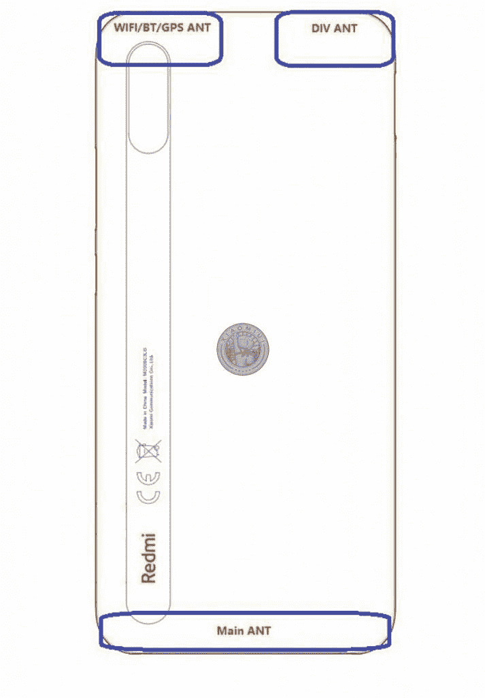

# 据称，小米红米 9A 在发布前一天在网上出现

> 原文：<https://www.xda-developers.com/xiaomi-redmi-9a-alleged-renders-leak-online-a-day-before-the-launch/>

尽管产品种类繁多，但小米在预算产品方面确实表现出色。该公司的入门级 Redmi A 系列在世界几个地区相当受欢迎，包括东南亚、拉美和欧洲。小米早在去年 9 月就推出了红米 8A，这款名为[的手机和它的前辈](https://www.xda-developers.com/xiaomi-redmi-7a-review-great-phone-even-greater-pricing/)一样，以大约 100 美元的价格提供了巨大的价值。现在，小米正准备在明天，即 6 月 30 日，推出其继任者红米 9A 以及另一款廉价设备红米 9C。但就在发布前一天，Redmi 9A 的官方渲染图似乎已经泄露到了网上。

小米马来西亚最近前往脸书[确认红米 9A 和红米 9C](https://www.facebook.com/XiaomiMalaysia/photos/a.244615769075858/1499501880253901/) 在马来西亚的发布。用于状态更新的创意代表带有 V 形凹口的普通显示器。虽然 A 系列几年来一直很强劲，但 Redmi C 系列是新推出的。

尽管 Redmi 9A 和 9C 的据称规格已经在互联网上流传了一段时间，但这些手机一直没有任何视觉曝光。这似乎在今天发生了变化，就在他们发布的前一天，因为 [*Playfuldroid*](https://playfuldroid.com/redmi-9a-official-renders-show-off-device-in-3-different-colorways/) 声称已经获得了 Redmi 9A 的官方渲染。在这些所谓的渲染图中，这款手机有三种不同的颜色——午夜灰、孔雀绿和暮光蓝。

虽然我们建议对这些渲染图持保留态度，但它们与 FCC 上列出的一款型号为 **M2006C3LG** 的红米手机的[框图相吻合，通过查找 FCC 文件中注册的峨眉编号可以确认这是红米 9A。清单还显示，Redmi 9A 将采用 4900mAh 电池，10W 充电，并在 MIUI 12 上运行。此外，Redmi 9A 还获得了泰国 NBTC](https://fccid.io/2AFZZC3LG) 的[认证，但上市并没有透露太多关于这款手机的信息。](http://mocheck.nbtc.go.th/search/1522423)

 <picture></picture> 

Redmi 9A's block diagram from FCC listing, image by Telegram channel @Xiaomiui

该手机的其他规格还有待于通过其 Twitter 别名@Sudhanshu1414 所知的情报人员核实，该情报人员声称知道 Redmi 9A、Redmi 9C 和 Redmi 9 的关键规格。除此之外，情报人员建议的 Redmi 9 的规格[被证明是准确的](https://www.xda-developers.com/xiaomi-redmi-9-launched-spain/)，这让我们对他们关于其他两款设备的提示有了一些信心。

Redmi 9A 预计将采用联发科 Helio G25 芯片组，背面配有一个 1300 万像素的摄像头和一个 500 万像素的自拍摄像头。预计这款手机还将配备 6.5 英寸高清显示屏，并提供 3GB/32GB 的配置。另一方面，Redmi 9C 预计将采用 Helio G35 芯片组，也将搭载与 Redmi 9A 和 9C 同一天在马来西亚发布的 [Realme C11](https://www.xda-developers.com/realme-c11-launch-mediatek-helio-g35-square-camera-bump/) 。

由于没有多少时间留给官方披露，我们不会花太多时间考虑这些泄漏的真实性。