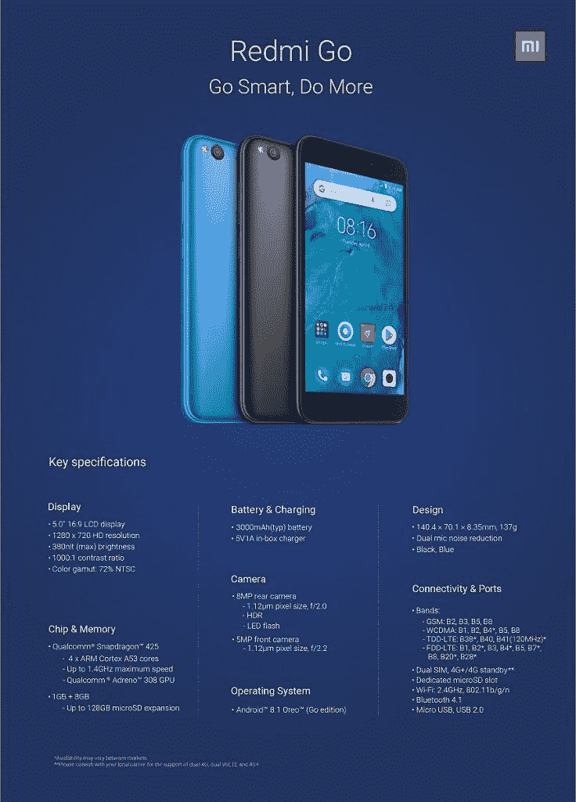

# 【更新:官方消息】小米 Redmi Go 可能是小米的首款 Android Go 智能手机

> 原文：<https://www.xda-developers.com/xiaomi-redmi-go-android-go-smartphone/>

**2019 年 1 月 29 日更新:**小米已经正式公布了 Android Oreo (Go 版)上运行的 Redmi Go。下面泄露的信息是 100%准确的，因为它是在发布之前从营销材料和未列出的产品页面上获取的。Redmi Go 将于 2 月份在欧洲为€80 上市销售。它也将在菲律宾上市，尽管价格还有待确认。其他市场也将有售。

如果要我用一个词来形容小米，那就是“实惠”。小米设备，即使是更高端的设备，也以更“便宜”而不损害整体体验而闻名——只需看看这些例子，如 [POCO F1](https://www.xda-developers.com/miui-10-camera-port-xiaomi-poco-f1/) 和 [Redmi Note 7](https://www.xda-developers.com/redmi-note-7-launch-specifications-pricing-availability/) 。但小米有几款价格实惠的设备，有些比其他设备更便宜或更好。然而，小米没有推出的是一款 Android Go 手机。这种情况现在显然要改变了。

由于知名技术泄密者 Ishan Agarwal 在 Twitter 上发布了小米 Redmi Go 的图片，展示了小米首款基于 Android Go 的智能手机及其规格。正如所料，它不会让你大吃一惊:一台高通骁龙 425 为引擎盖下的一切提供动力，加上少得可怜的 1 GB 内存和 8 GB 存储空间。这不是很好，但对于低端 Android 手机来说，这已经是最好的了。

 <picture></picture> 

The Xiaomi Redmi Go.

至于软件，它运行的是现成的 Android 8.1 Oreo (Go edition)，但 Android Pie 的更新虽然可能，但可能性很小，尤其是对这样一款低端手机而言。然而，从媒体渲染来看，它看起来不像运行 MIUI，也不像他们的 Android One 手机那样是普通的 Android。我们可能会看到一个更浅色调的 MIUI，带有小定制的股票 Android，或者专为 Android Go 手机制作的全新皮肤。

定价信息尚未泄露，鉴于这是小米首次进军 Android Go 市场，因此很难预测。了解他们过去的定价哲学，虽然，它预计零售卢比。5000 英镑(70 美元)和低至卢比。3000 ($45).如果属实，这将是小米迄今为止最便宜的设备。你觉得 Redmi Go 怎么样？请在评论中告诉我们。