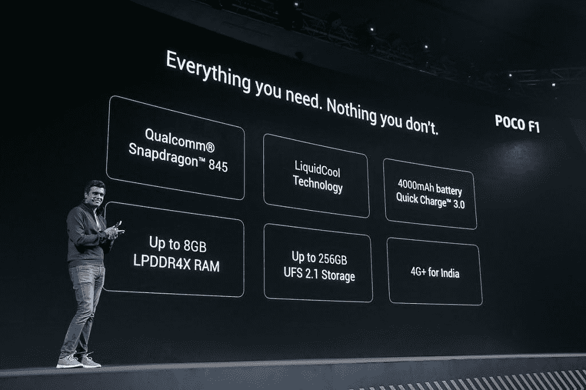

# Redmi K20 的价格反应显示，POCO F2 仍有市场

> 原文：<https://www.xda-developers.com/xiaomi-redmi-k20-pro-price-reaction-poco-f2/>

2018 年年中，关于[小米正在开发一款采用高通骁龙 845 SoC 的新款旗舰智能手机](https://www.xda-developers.com/xiaomi-flagship-smartphone-india-snapdragon-845/)的信息首次浮出水面。让这条信息有趣的是，小米打算以一个名为“ [POCO](https://www.xda-developers.com/xiaomi-launches-poco-brand-india/) ”的新子品牌在印度推出这款手机。在那个阶段，小米的旗舰产品 mi 系列未能抓住印度观众的心，因此小米将“旗舰”产品授予新的子品牌的决定相当勇敢和雄心勃勃。POCO 团队面临着艰巨的任务，因为他们必须在小米手机未能打入的价格区间竞争，特别是在印度等地区。随着 POCO F1 在[的发布，他们开始创造智能手机的历史。现在，小米带着红米 K20 系列回来了，但是魔力还在吗？](https://www.xda-developers.com/xiaomi-poco-f1-specs-pricing-availability-india/)

## POCO 的魔力

在很多方面，POCO F1 重现了一加用自称为当时“旗舰杀手”的 [OnePlus One](https://www.xda-developers.com/its-settled-the-oneplus-one-has-stood-the-test-of-time/) 带来的同样魔力。OnePlus One 的特点是高端规格，但也有一些非常明显的妥协。然而，其激进的定价使这些妥协更容易接受，而且你几乎没有什么选择可以提供与 OnePlus 一样的性价比。最高端的处理器？检查。充足的内存和存储空间？检查。像样的建造质量？检查。比其他旗舰便宜一半？绝对检查。同样的检查也适用于 OnePlus One 和 POCO F1，因为它们都为“平价旗舰”一词带来了意义和实质。这意味着您可以体验顶级旗舰级性能，而无需倾家荡产，这让那些不得不满足于相同价位的中端性能的客户欢欣鼓舞。对于 16GB 版本的₹18,999(按当前汇率计算约 275 美元)和 64GB 版本的₹21,999(约 320 美元)的发布价格来说，OnePlus One 的“旗舰杀手”是一笔很好的交易，让你可以接受它的妥协。

一加紧随 OnePlus One 的成功，推出了其他设备系列，价格慢慢上涨，直到今天，其最新旗舰产品[一加 7 Pro](https://forum.xda-developers.com/oneplus-7-pro) 不再与“负担得起”这个词联系在一起，而是与“[旗舰产品](https://www.xda-developers.com/oneplus-7-pro-review/)联系在一起。一加的价格攀升基本上留下了“平价旗舰”空间的真空，POCO F1 的推出试图利用这一非常空的空间。

与 OnePlus 一样，POCO F1 也不是一款完美的设备。但就像 OnePlus One 一样，POCO F1 的妥协很容易消化。小米新子品牌的第一款设备使用聚碳酸酯作为主要材料，在这个时代，即使是廉价设备也有金属机身。你还得到了一个 LCD 面板，而不是其他旗舰产品附带的 AMOLED 显示器(POCO 的辩护是，他们使用的面板是一个不错的 LCD，所以这不是一个真正的妥协)。你也失去了其他旗舰机附带的其他较小的功能，如 OIS 和防水。另一方面，你花的钱没有你在比赛上花的多。你甚至得到了一台非常物有所值的相机，因为[差点赢得了 MKBHD 的盲人相机枪战](https://www.xda-developers.com/xiaomi-poco-f1-blind-camera-comparison/)。POCO F1“速度大师”推出时，6GB/64GB 版本的价格为₹20,999(约 305 美元)，6GB/128GB 版本的价格为₹23,999(约 348 美元)，8GB/256GB 版本的价格为₹28,999(约 421 美元)。

POCO F1 巩固了小米在印度的领先地位，并使其成为全球舞台上更具辨识度的品牌。在发布的大约三个月时间里，POCO F1 [在全球售出了 70 万台](https://twitter.com/manukumarjain/status/1070259897848221696)，这个数字表明该产品相当受欢迎。小米没有分享 POCO 的进一步销售数据，但我们没有理由认为这款手机表现不佳。因此，人们很自然地会期待小米发布一款表现出如此承诺的产品系列的继任者。

## Redmi K20 定价争议

随着红米 K20 和红米 K20 Pro 的发布，小米正式张开双臂拥抱“旗舰黑仔”的称号。Redmi K20 被公司自己称为“旗舰黑仔 2.0”*，将自己标榜为不折不扣的旗舰产品，但具有只有小米才能做到的激进定价。Redmi K20 显然是两者中规格较低的兄弟，但它仍然保留了 Redmi K20 Pro 的相同设计和构造。虽然红米 K20 Pro 由高端[高通骁龙 855](https://www.xda-developers.com/qualcomm-snapdragon-855-snapdragon-elite-gaming-3d-sonic-sensor/) 驱动，但红米 K20 的特点是中端[高通骁龙 730](https://www.xda-developers.com/qualcomm-snapdragon-665-snapdragon-730g/) 。Redmi K20 Pro 相对于 Redmi K20 的其他优势包括更高的存储容量选项，索尼 IMX 586 相对于索尼 IMX582 的后置 48MP 传感器，以及 Redmi K20 Pro 上相对更快的充电解决方案。红米 K20 的 6GB/64GB 版本在₹21,999 的售价约为 319 美元，6GB/128GB 版本在₹23,999 的售价约为 348 美元，而红米 K20 Pro 的 6GB/128GB 版本在₹27,999 的售价约为 406 美元，8GB/256GB 版本在₹30,999 的售价约为 450 美元。*

 *奇怪的是，Redmi K20 系列的定价在小米的在线观众中引起了轩然大波。根据许多同意这一观点的人的说法，Redmi K20 的定价预计将撼动印度智能手机行业，但₹21,999 基本款的“高”定价(约 319 美元)让这些消费者有很多期望。被定价决定激怒的消费者继续前进，甚至[创建了一份 Change.org 请愿书](https://www.change.org/p/xiaomi-reduce-redmi-k20-price-to-20k)要求小米降低₹2,000 红米 K20 的价格(29 美元)，声明“*红米 K20 的规格确实非常昂贵！对于 22000，我们得到 6+64，这是一个很少的存储！*“即使考虑到媒体对请愿书的报道，也只有大约 3500 人签署了协议，与小米通常在印度销售的设备数量相比，这是一个很低的数字。

这些消费者的负面情绪确实给小米带来了足够的轰动，以至于它[发布了一份官方声明](https://twitter.com/manukumarjain/status/1151809628784619520):

红米 K20 的批评者很快指责高通骁龙 730，认为这是对高通骁龙 855 本可以提供的旗舰体验的“*妥协*”的证据。但在这样做的时候，他们似乎将自己限制在基于高通采用的命名惯例和对“*妥协*”一词的字面解释的差异上。骁龙 730 配备了我们在骁龙 855 上看到的几个功能，例如用于改进人工智能应用的张量加速器，以及 ISP 内的集成人工智能功能。虽然基准测试显示，在纯粹的性能数据方面存在差异，但骁龙 730 仍然是高通的中端高端芯片。正如 Manu Jain 先生所说，这是第三强大的高通 SoC，因此 855 和 730 在日常使用场景中的实际性能差异很难发现。

在我们看来，Redmi K20 和 Redmi K20 Pro 的定价都很高。Redmi K20 系列是小米在 red mi 系列中首次尝试真正的旗舰产品，该系列拥有众多“第一”。正如 Manu 所说，这两款设备拥有相同的 DNA，这意味着你可以在两款手机上获得相同的优秀构建，没有明显的支持 Pro 的常规变体。[图沙尔对 Redmi K20 Pro 的第一印象很深刻](https://www.xda-developers.com/redmi-k20-pro-first-impressions-masterpiece-xiaomi/)——由于这两款手机具有相同的外观，因此在这些方面所做的陈述是真实的，对 Redmi K20 和 Redmi K20 Pro 都没有任何限制。

根据评论家的普遍看法，Redmi K20 的主要竞争来自于 Redmi K20 前两天推出的 Realme X。

Realme X [提供了 Redmi K20 的几个功能](https://www.xda-developers.com/realme-x-review-premium-affordable/)，但也有一些差异，在我们看来，这证明了竞争品牌的两种产品之间的价格差异。高通骁龙 710 在许多方面也不如较新的骁龙 730,比高通命名惯例的差异要大得多。因此，虽然这两种产品在相邻的价格段竞争，并因此相互竞争，但两者并不是彼此的平等替代品，因此价格差异必然存在。仅仅因为 Realme X 提供了更多的 RAM 和存储空间就对 Redmi K20 进行苛刻的评判，这是对智能手机及其基本体验的糟糕评估。

## 红米面临的压力

Redmi K20 系列最大的压力点可以说是 POCO F1 的先例及其成功。我们在 OnePlus One 上也看到了类似的情况。OnePlus 2 一直是在它的前辈带来的价值的阴影下被评判的，有一个案例可以证明，如果 OnePlus 1 不存在，如果 Snapdragon 810 不是那么糟糕，OnePlus 2 会受到更好的欢迎。([马里奥过去已经讲过这个了](https://www.xda-developers.com/opinion-the-810-held-back-a-generation-with-deliberate-apologism-damage-control/))。

凭借 Redmi K20 系列，小米正在偏离他们为 POCO F1 遵循的理念。Redmi K20 Pro 代表了小米为印度市场量身定制的不妥协旗舰体验的尝试。因此，Redmi K20 Pro 上确实存在的较小妥协，如缺乏 OIS 和无线充电，对其目标受众来说基本上不是问题。对于智能手机来说，这是一种不同的方式，这决定了所采取的决策。

对于 POCO F1，有更大和更明显的妥协，如显示技术和聚碳酸酯建设。这两个组成了 Redmi K20 系列中一些更昂贵的升级，向更好更高端技术的转变必然会付出实际成本。POCO F1 并不是一款不妥协的旗舰产品——它妥协了，但妥协得很好。Redmi K20 系列和 POCO F 系列是遵循不同哲学的两个不同分支，因此仅仅因为一年前存在更便宜的 POCO F1 就判定 Redmi K20 为“*定价过高*”并取消其所有升级是不完全公平的。

小米也要为他们试图为 Redmi K20 系列制造的发布前宣传负部分责任。“旗舰杀手”的绰号似乎诱导了对基础变种 sub-₹20,000(低于 300 美元)定价的期望，因为 Change.org 请愿书清楚地证明了。此外，Redmi K20 系列的[预发布 Alpha 销售允许用户在不知道其定价的情况下预订该设备。自然，普通消费者会选择 POCO F1 作为他们的定价预期基线，因为他们没有任何其他线索。](https://twitter.com/manukumarjain/status/1148230501729050626)

虽然预订一款设备并不新奇，但预订一个未知系列的第一款设备是一个冒险的举动。那些发现自己被预期和现实之间的差距弄得不知所措的消费者会抓住救命稻草来挽回他们不利的处境，不管这种情况有多可能。小米确实提供了一种退出 alpha 销售的方法，即通过向购物车中的消费者提供等量的退款，但我们无法辨别是否有一种方法可以直接获得这笔金额的现金/银行退款。

## 失踪的 POCO F2 的离奇案件

在所有的 Redmi K20 定价戏剧中，仍有一个问题需要问:下一个 POCO 在哪里？

这个问题的答案是一个不那么激动人心的:“我们真的不知道”。

大约在去年的这个时候，我们开始听到关于小米正在开发 POCO F1 的传言。由于我们的谨慎，大量未经证实的谣言永远不会出现在我们的头版，所以即使我们的第一份报告后来出现，我们也确实有一个初步的想法，即最终会成为 POCO F1 的设备的存在。但到目前为止，对于 POCO F2，我们还没有遇到任何可信的信息表明它的存在。有传言说，在中国推出的 Redmi K20 系列最终将在印度更名为 POCO，但我们都知道结果如何。

此外，POCO 作为小米的子品牌并没有明确的界限。当 [Redmi 本身升级为子品牌](https://www.xda-developers.com/xiaomi-spins-redmi-sub-brand/)时，小米的子品牌游戏变得更加混乱。在推出 Redmi K20 之前，人们可以将 Redmi 定位于预算和早期中端，将 POCO 定位于平价旗舰细分市场，将 mi 定位于高端和更具实验性的设备。但 Redmi K20 系列本质上侵占了 POCO 所占据的空间，其中一个将不可避免地以某种形式蚕食另一个。

更糟糕的是，还有消息称 Jai Mani 先生将辞去 POCO India 产品负责人的职务。虽然 POCO 和小米都没有发布官方声明，但马尼在 Twitter 上的简历称他是“前 PM @PocophoneGlobal 和@XiaomiIndia”，这证实了他的离职。

 <picture></picture> 

Jai Mani, then-Product Lead, POCO Global at the launch of Poco F1 in India

马尼先生是 POCO F1 决策背后的一个关键驱动因素，所以他的离开，加上上面提到的其他变化，确实对 POCO F2 和 POCO 作为一个独立的子品牌的存在提出了质疑。小米一直未对 POCO 的情况做出回应，因此情况可能会向两个方向转变。

## “POCO F2”让位于“a”POCO F2

Redmi K20 定价争议的一个关键要点是，**POCO F2 仍有一席之地。POCO F1 拥有你需要的一切，没有你没有的。同样，公司和消费者都认为，它对“旗舰”概念的妥协是必要的，以使它“买得起”。虽然在我们看来，普通的 Redmi K20 价格*偏高*，但在消费者看来，它的价格*并不实惠*。因此，POCO F1 留下了一个真空，小米或其竞争对手没有完全填补这个真空。这一真空只能由 POCO F1 或 OnePlus One 填补，这款设备能够正确评估市场的优先次序，并在可接受的折衷方案中提供旗舰级的 Android 体验。今年我们还会得到一个吗？**

 ****[红米 K20 论坛](https://forum.xda-developers.com/mi-9t) || [红米 K20 Pro 论坛](https://forum.xda-developers.com/k20-pro) || [POCO F1 论坛](https://forum.xda-developers.com/poco-f1)*****