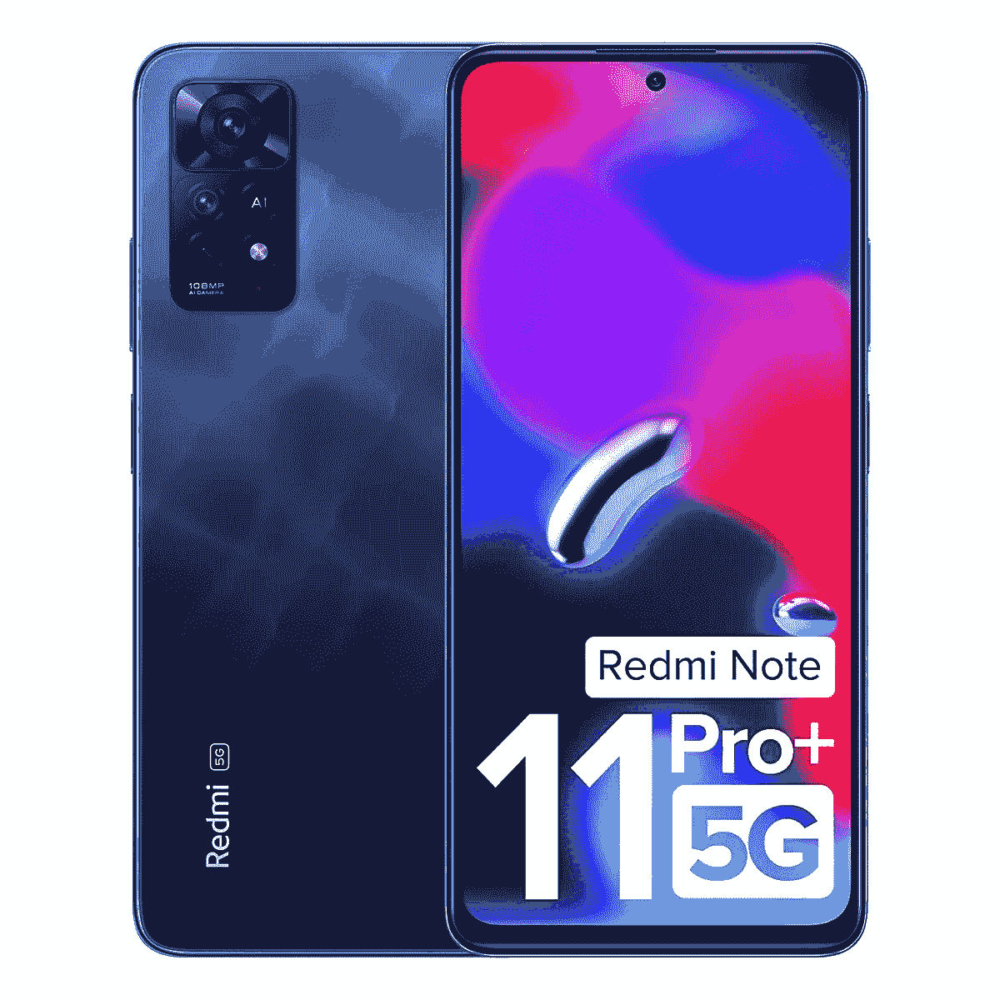

# 小米 Redmi Note 11 Pro Plus 5G(印度)零售盒子里面有什么？

> 原文：<https://www.xda-developers.com/xiaomi-redmi-note-11-pro-plus-5g-unboxing/>

# 红米 Note 11 Pro Plus 5G 拆箱:盒子里是什么？

Redmi Note 11 Pro Plus 5G 是小米的一款全面的中端产品，适合大多数普通用户。这就是你在盒子里得到的东西！

小米在印度、中国、印度尼西亚等主要亚洲市场拥有广泛的产品组合。由于其疯狂的价值，Redmi Note 系列是全球最受欢迎的手机系列之一。2022 年，小米对其红米 Note 产品线进行了全面更新，像红米 Note 11 Pro Plus 5G 这样的设备占据了这个品牌的高端。小米 3 月在印度发布了 Redmi Note 11 Pro Plus 5G ，T2 也为全球市场发布了另一款同名设备。如果你想知道印度 Redmi Note 11 Pro Plus 5G 的包装盒内有什么，我们可以为你回答这个问题。

## 红米 Note 11 Pro Plus 5G(印度)零售包装盒里面有什么？

红米 Note 11 Pro Plus 5G(印度)[设备代号:peux]的包装盒内包含以下内容:

*   红米 Note 11 Pro Plus 5G(您选择的颜色)
*   m66w 声波加载 3.0
*   USB-A 至 USB-C 电缆
*   基本 TPU/硅外壳
*   SIM 弹出工具
*   特定于地区的文档，包括快速入门指南
*   基本屏幕保护(预应用)

小米在零售手机盒子方面有相当大的优势。不像其他原始设备制造商甚至为他们的中端设备采用无充电器包装，Redmi 在盒子里包括一个充电器，至少到目前为止是这样。Redmi Note 11 Pro Plus 5G 不是普通的充电器，而是 67W 的 Mi SonicCharge 3.0 充电器，这是一款高通快速充电 3.0 充电器，也可以用来为智能手机以外的设备充电。小米还为这款设备提供了一个相当基本的外壳，这款手机配备了一个基本的屏幕保护装置。

 <picture></picture> 

Redmi Note 11 Pro Plus 5G (India)

##### 红米 Note 11 Pro Plus 5G(印度)

Redmi Note 11 Pro Plus 5G 是小米面向印度市场的中端产品之一。以全面的规格为特色，这款手机拥有大多数普通用户需要的一切。

总而言之，盒子里有让你开始正确使用设备的所有东西，尽管我们确实建议几个月后换成更具保护性或更时尚的东西。