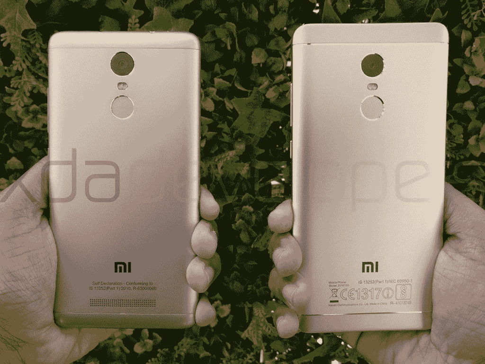
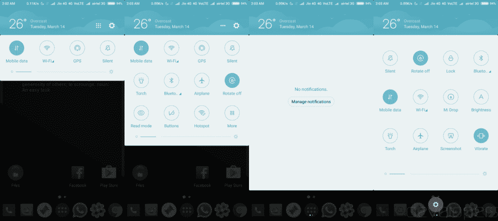
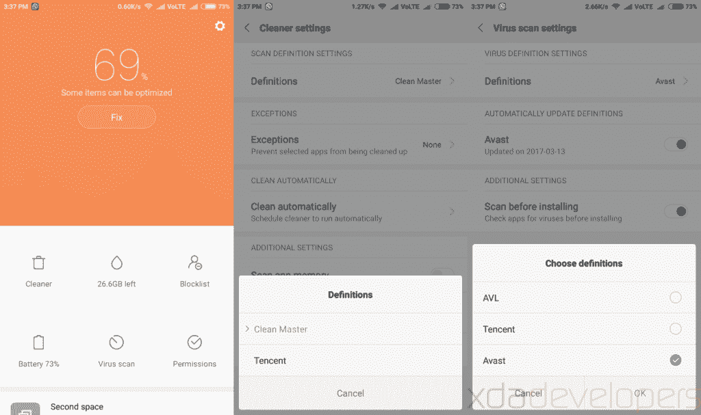
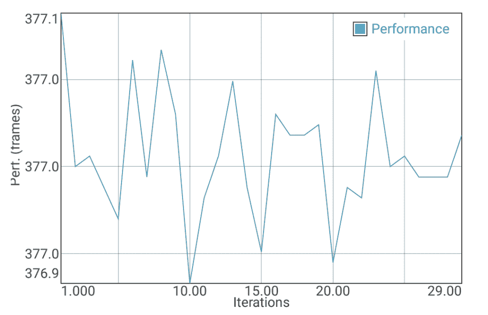

# 小米红米 Note 4 XDA 评测:为又一年的成功做好准备

> 原文：<https://www.xda-developers.com/xiaomi-redmi-note-4-xda-review-in-depth/>

印度是小米国际市场至关重要的一部分。在这里，他们的旗舰产品并没有取得多大成功。另一方面，该公司凭借物美价廉的高价值预算和低端产品继续受到欢迎。

搭载[高通骁龙 650](https://www.xda-developers.com/tag/snapdragon-650/) SoC 的[小米红米 Note 3](https://forum.xda-developers.com/redmi-note-3) 是小米在印度最畅销的手机，也是该国最畅销的(在线)手机，仅 10 个月就售出 360 万部。对于一个市场饱和且竞争激烈的发展中国家的预算设备来说，这是一个很大的数量。随着[小米红米 Note 4](https://www.xda-developers.com/xiaomi-launches-the-redmi-note-4-snapdragon-625-variant-in-india/) 的推出，小米的销售数字目标更高，希望通过仅在该国销售至少 700 万部手机，将数字翻一番。

> 但是红米 Note 4 的升级足以达到这个数字吗？它提供了多少价值，它在竞争中的地位如何？

* * *

在这篇评论中，我们将深入探讨 Redmi Note 4。该功能试图提供与我们的读者群相关的内容，而不是列出规格和谈论体验感受。在 XDA，我们的评论不是为了告诉用户一部手机是否值得购买——相反，我们试图通过我们的话语把手机借给你，并帮助你自己做出决定。开始之前，让我们先看看规格表:

| 

设备名称:

 | 

小米 Redmi Note 4

 | 

发布日期/价格

 | 

现已上市，₹9,999(150 美元)起

 |
| --- | --- | --- | --- |
| 安卓版本 | 6.0.1 (MIUI 全球 8.1 ROM) | 显示 | 5.5 英寸 1080p IPS 液晶屏(401p ppi) |
| 芯片集 | 骁龙 625，八核 Cortex-A53，8x 2GHz，Adreno 506 GPU | 电池 | 4100 毫安时不可拆卸 |
| 随机存取存储 | 2/3/4GB LPDDR3 | 传感器 | 指纹、霍尔、加速度计、陀螺仪、接近度、环境光、电子罗盘 |
| 储存；储备 | 32/32/64GB eMMC | 连通性 | USB 2.0 微型 USB、混合 SIM 卡托盘(微型 SIM + Nano SIM 或微型 SIM +微型 SD 卡)、3.5 毫米音频插孔、红外发射器 |
| 规模 | 151 x 76 x 8.5 厘米(屏幕与机身的比例约为 72.7%) | 后置摄像头 | 1300 万像素 CMOS 传感器，PDAF，f/2.0，1080p@30FPS / 720p@120FPS 视频 |
| 重量 | 165 克 | 前置摄像头 | 500 万像素 CMOS、固定焦距、f/2.0、720p@30FPS 视频 |

## 索引

[spacer color="F85050"]

## 设计

小米红米 Note 4 采用了铝制机身，其设计被描述为小米 Max 的较小版本，而不是红米 Note 3 的直接继任者。虽然 Redmi Note 3 的侧边曲线更明显，但 Redmi Note 4 由于中间框架扁平，所以外观更像盒子。只有细微的曲线出现在背部的侧边。

第一眼看上去，这个装置似乎是一个整体结构。然而，就像 Redmi Note 3 和其他几款小米手机一样，金属并没有延伸到整个背部。背面的顶盖和底盖都是塑料材质，方便信号传输。有一个闪亮的装饰将塑料和金属区域分开，这个条带为手机背面增添了一点个性。MI 徽标位于底部，还有一些声明标记。

背面的摄像头设置看起来与 Redmi Note 3 相同，但摄像头传感器和指纹扫描仪位于背面下方，防止它们被划伤。闪亮的颜色装饰也出现在相机镜头和指纹传感器的边缘。背部不再容纳扬声器和略显笨拙的突起，以保持扬声器抬起。相反，扬声器现在位于设备的底部框架。小米这次很小心地在 micro-USB 端口的两侧钻了相同的孔，但只有右侧有扬声器。左侧装有麦克风，但其余的孔只是装饰性的。

设备的右侧有音量摇杆和电源按钮。按钮设计得很好，在两个方向上都没有晃动，但是它们有轻微的点击反应——不过没有什么太糟糕的。设备的左侧有放置混合 SIM 卡托盘的空间。

设备顶部有 3.5 毫米耳机插孔、红外发射器和辅助麦克风。

该设备的正面有一个 5.5 英寸的 IPS LCD 显示屏，2.5D 弧形玻璃边缘占据了正面的大部分。对称感继续与扬声器在中心和两侧的两个相同的孔-左边拥有接近和光传感器，右边拥有前置摄像头。

我们的审查单元是金色背面和白色正面的颜色变体，其中 LED 通知灯整齐地隐藏在彩色正面下方，只有在点亮时才可见。传统的小米电容式按钮——最近、主页和返回——出现在底部。

至于设备的操作，对于任何习惯于操作标准尺寸 5.5 英寸手机的人来说，这款手机都很舒适。该设备的物理尺寸相比其前身仅长 1 毫米，但宽度保持不变。Redmi Note 4 几乎不比 Redmi Note 3 薄 0.2 毫米，但由于其平坦的侧面，它看起来比 red mi Note 3 更薄。2.5D 弧形玻璃边缘使正面的边缘变得有点尖，但从玻璃到金属底盘的过渡感觉很明显。

白色机型上确实存在黑色边框，但小米似乎正在努力减少色差。该设备上的(总)挡板(72.7%)实际上与 Redmi Note 3 上的挡板(72.4%)相同，但由于设备的形状，我在握持手机时有更多的手掌放在显示屏上。小米在股票 MIUI 上的 palm rejection 感觉不太达标，我在边上经常出现令人讨厌的 mistouches。我不得不经常在拿着手机的时候调整我的握法，因为我的手掌会导致 UI(尤其是滚动条)发疯，到处乱跳。

> 背部的装饰线条以一种非常微妙的方式增添了一种精致的感觉。

在设计方面，小米确实在预算范围内谨慎行事，除了经过尝试和测试之外，没有进行太多实验。Redmi Note 3 的设计语言很快在印度的预算阵容中传播开来，其他各种原始设备制造商也有意无意地推出了类似的产品。因此，通过让该设备从 Mi Max 中获得线索来进行一点转换，可以让它在本已饱和的价格范围内有一年的差异化。背部的装饰线条以一种非常微妙的方式增加了一种不错的高级触感。

 <picture></picture> 

Xiaomi Redmi Note 3 and the Xiaomi Redmi Note 4

总的来说，我对红米 Note 4 握在手中的感觉很满意。除了偶尔调整以应对不稳定的手掌拒绝，我单手握持和使用设备没有任何问题。这种金属设备在整个使用过程中保持凉爽，并且在水平表面上不会打滑。构建质量很好，设备本身就说明了问题。

这款设备看起来肯定比它的价格标签要好。在 Redmi Note 4 成为常识之前，当被要求猜测零售价格时，我周围的人经常会报出高达设备价格两倍的数字。白金颜色的变体看起来非常漂亮，整体的构建质量确实让人相信这是一款高端的中档设备。

这款手机还有另外两种颜色:深灰色搭配黑色正面和哑光黑色搭配黑色正面。在印度的发布会上，我用哑光黑色进行了有限的实践，我确实发现在设备的背面指纹相当明显，尽管这没有什么快速擦拭不能解决的。

[spacer color="F85050"]

## 软件

*安卓 6.0.1 棉花糖上 MIUI 8.1.15.0 稳定版(MCFMIDI)*

Redmi Note 4 上的棉花糖与任何运行股票 Android 的设备上的棉花糖都不一样，这完全归功于小米广泛的 MIUI“皮肤”(ROM)，它铺设在 Android 的核心之上。MIUI 的修改足够深入，以至于称之为“皮肤”是对小米多年努力和无数改变的完全不公平，无论是外观还是其他方面，即使它并不等同于完美的体验。

小米所做的改变存在于整个 Android 操作系统中:从锁屏到通知栏到启动器，甚至到计算器和拨号器等“库存”应用程序。虽然 MIUI 仍然基于基本的 Android 框架，但对这个框架的更新将会在最终用户身上消失(即使谷歌做了明显的表面改变)，而 MIUI 本身的重大更新将会显而易见，即使基本的 Android 平台保持不变。

我们已经广泛详细地介绍了早期版本 MIUI(即小米红米 Note 3 上的 MIUI 7)中存在的各种变化。红米 Note 4 自带 MIUI 8 开箱。

Redmi Note 3 运行的是开箱即用的 Android 5 . 1 . 1 Lollipop(Android 6.0 是未来的更新版本)，而 Redmi Note 4 运行的是 Android 6.0.1 Marshmallow，并有望很快更新到 Android Nougat。根据我们的经验，只要 MIUI 存在，基本的 Android 版本在很大程度上还是无关紧要的。

MUI 8 确实建立在 MIUI 7 的基础上，而不是一个完整的革命性的重新设计，但 MIUI 本身是一个完整的重新设计的 Android，就像在 AOSP 上看到的那样。

### 通知面板和锁屏更改

人们很容易注意到的最引人注目的变化之一是 MIUI 上通知阴影的实现方式。这是 MIUI 8 与 MIUI 7 的变化之一，也是与 AOSP 不同的地方。通知栏上的默认下拉菜单显示通知窗格以及一组可扩展的快速设置切换。它们被放置在一个天气小部件的下面，这个小部件根据一天中的时间改变背景颜色(尽管没有去掉这个小部件的选项)。对于可扩展的快速切换，一组四个切换以紧凑的形式显示，然后扩展到总共 11 个切换和一个用于切换本身的设置按钮。您可以重新排序切换，但是可以显示的最大和最小数量保持不变。用户可以选择切换到双面板布局，将切换解耦到它自己的面板，通过通知面板上的侧扫来访问。

 <picture></picture> 

3 & 4: Separate Layout

我个人对通知面板的看法褒贬不一。一方面，我喜欢大量的切换来方便设置。另一方面，我不喜欢整个实施过程如此死板。MIUI 8 还对扩展通知做了奇怪的改变。通知仍然可以扩展，但只能严格地用双指滑动通知，不管你收到了多少通知，也不管应用程序启动了通知。这意味着所有的应用程序都会默认小通知，甚至是你选择的音乐播放器！在通知上启动的单个手指滑动不会扩展通知，但会扩展快速设置磁贴。这种变化相当不和谐，我根本无法习惯，影响了我单手使用设备。

关于中断通知的话题，锁屏还显示了**无法展开或清除**的通知。**压根**。除了通过锁屏之外，没有什么快速的方法可以找到你的通知内容或者把它们刷掉。这种行为独立于控制信息和内容显示的锁屏通知设置。幸运的是，设备背面的指纹扫描仪反应迅速，工作非常好，所以如果你手里拿着手机，通过锁屏需要一秒钟。

### 启动器:应用抽屉和主屏幕

MIUI 8 上的启动器与 MIUI 7 上的基本相同。没有应用程序抽屉，所以你所有的应用程序都直接放在主屏幕上。周围有大量的动画，所以我们邀请你来[我们的 MIUI 7 评论](https://www.xda-developers.com/going-over-to-the-dark-side-the-comprehensive-miui-review/)查看其中一些动画的 gif。人们可以很容易地安装和使用不同的发射器，所以如果你不喜欢这个发射器，还有很多选择。

### 最近面板

MIUI 8 上的 Recents 面板比 MIUI 7 略有改进。默认情况下，图标会扩展成较大的卡片，你也可以切换回较小的图标。如果在一个应用程序中启动了多个活动，比如设置，这些卡片会堆叠在一起，可以单独展开。该面板向侧面滚动，不像 AOSP 最近的实现那样平滑，所以它确实妨碍了你快速跳转到不同的应用程序。

### 共享操作

另一个显著不同的变化是共享操作的呈现方式。[这里有一个快速的 GIF](https://www1-lw.xda-cdn.com/files/2017/03/2017_03_14_02_23_28_02_25_23.gif) 展示了在截图等操作上可用的分享活动(以及截图动画)。

* * *

尽管到目前为止有很多抱怨，但 MIUI 8 做的还有很多，而且做得很好。例如，来电应用程序内置视频通话功能(假设两端都有支持的设备)以及通话记录器和来电显示。通话记录器在印度非常普遍，尤其是在城市地区，因此烘焙这一功能很好地引起了目标受众的共鸣。

MIUI 8 值得注意的新增功能还包括双应用和第二空间。双应用程序允许您创建独立的应用程序副本，这些应用程序将彼此共存。这在有问题的应用程序不支持以简单的方式切换帐户的情况下非常有用。例如，你可以有两个 WhatsApp 账户，每个 SIM 卡一个，同时存在于同一台设备上。如果你愿意，你也可以使用 Second Space 创建一个全新的手机设置，包括自己的设置、应用和应用数据，然后在这两者之间切换。

此外，还增加了一些功能，如长屏幕截图、通知控制、精简模式、儿童模式、访客模式、单手模式、应用程序锁定、计划的电源开/关、计划的电池配置文件、计划的通知配置文件、应用程序防火墙、带有 sim 卡和 WiFi 的单独图表的数据使用监控、自动启动管理器等等。我们在[之前的评论](https://www.xda-developers.com/going-over-to-the-dark-side-the-comprehensive-miui-review/)中广泛地讨论了其中的一些方面，大多数功能及其捆绑的优势和劣势从 MIUI 7 延续到 MIUI 8。

> MIUI 适用于对 AOSP 没有特别好感的普通用户

MIUI 的内容太多了，我们无法在一篇文章中涵盖。MIUI 仍然是一系列设备上搭载的功能最丰富的 ROM 之一。MIUI 最好的一点是，设计用于运行 MIUI 的手机实际上运行得非常好，而且整体 ROM 适用于对 AOSP 没有特别好感的普通用户。

还有几个问题领域。一个是【MIUI 如何处理 RAM 和多任务。ROM 在系统层面上积极处理多任务，对硬件封装中大量的 RAM 造成了极大的不公平。我全心全意地建议禁用“内存优化”和“MIUI 优化”，这大大提高了应用程序的切换能力，让应用程序在后台以自然状态和活动周期逗留更长时间。

随着 MIUI 7 中安全应用的加入，这份可疑的添加列表也延续到了 MIUI 8 中。我们真的需要在安卓系统上安装一个“病毒扫描”应用程序，里面有来自腾讯、Avast 和 AVL 的病毒定义吗？我们真的需要一个来自 Clean Master 和腾讯的扫描定义的更干净的应用程序吗？在中国的 rom 上预装这些应用是很常见的，但是在全球的 rom 上同时运行 Play 服务是有问题的。更糟糕的是，没有 root 用户，这些应用程序包都不能完全禁用。

 <picture></picture> 

Yeah, no.

也有人担心 MIUI 向其用户推送广告。**我想澄清的是，我在红米 Note 4** (以及之前的小米设备)上使用期间，没有收到 MIUI/小米的任何广告。但这方面的初步调查表明，ROM 中存在一种**手段来推送广告。在设置>附加设置>隐私>广告服务中，有一个禁用个性化广告的开关。我还经常发现一个名为“MSA”的应用，包名为“com.miui.systemAdSolution”在后台运行。没有办法完全禁用该应用程序。最糟糕的是，应用程序经常在后台自动更新。其他用户抱怨手机收到“隐形广告”(唤醒手机但立即自行消失以避免被发现的广告)，但检查我设备上的通知日志没有给出这样的指示。如果你使用普通的 MIUI 浏览器，收到广告的机会会增加，但即使在这样使用之后，我还没有遇到过。**

**注意:**广告框架与分析框架是分开的。两者都存在，都不能完全去除。我们可以看到为什么分析存在，但看不到为什么广告对一次性购买硬件和软件的 OEM 有用。

* * *

如果你绝对需要在 Android 上有一个自定义皮肤，MIUI 展示了如何实现。它无论如何都不是完美的，但是遍布 UI 的各种添加给了它超越极简皮肤的优势。即使是看似微不足道的小变化也会影响你如何使用你的手机。

例如- MIUI 在截图中添加原始应用程序包名称极大地帮助了我查看设备和整理 500 多张截图。当我写关于在世界不同地方推出的手机时，计算器内置的货币转换功能也帮助了我。我的亲戚购买了自己的 Redmi Note 4，享受通话记录功能，以及它如何可以开始记录选定的联系人；以及他如何在同一部手机上使用两个 WhatsApp 账户。

通过使用各种应用程序或修改，所有这些功能都是可能的，但对于没有耐心寻找或意识到自己的工作流程因它们的存在而得到改善的普通用户来说，将这些功能内置会更好。

作为软件部分的总结，我想说的是，我整体上喜欢 MIUI，但确实有一些问题，让我有一个混合的看法。我们急切地等待 Android 7.0 牛轧糖上稳定的 MIUI 的到来，看看更新会带来什么改进。

[spacer color="F85050"]

## 性能和电池寿命

*以下部分是我们之前关于红米 Note 4 的电池寿命和性能的文章的完整副本，[你可以在这里找到](https://www.xda-developers.com/redmi-note-4-xda-review/)进行分享或单独阅读。*

正如其前辈一样，小米红米 Note 4 有两种 SoC 版本:[一种采用联发科 Helio X20](https://www.xda-developers.com/xiaomi-announces-the-redmi-note-4-with-deca-core-helio-x20-soc/) ，另一种采用[高通骁龙 625](https://www.xda-developers.com/xiaomi-launches-the-redmi-note-4-snapdragon-625-variant-in-india/) 。除了这些芯片组，您还可以找到不同的 RAM +存储选项组合，如下所示:

| 

社会学

 | 

随机存取存储

 | 

内存储器

 |
| --- | --- | --- |
| 联发科 Helio X20 | 2GB | 16GB |
|  | 3GB | 64GB |
| 高通骁龙 625 | 2GB | 32GB |
|  | 3GB | 32GB |
|  | 4GB | 64GB |

我们的评估单元来自印度市场，因此它配备了高通骁龙 625 SoC，以及 4GB 的 RAM 和 64GB 的内部存储。

* * *

## 表演

我们评测的小米红米 Note 3(骁龙 650)在基准测试和现实世界中，SoC 在处理速度和能效方面的出色表现给我们留下了深刻的印象。在单独的性能集群中添加 2 个 Cortex-A72 内核，补充了效率集群中的 4 个 Cortex-A53 内核，使该设备能够轻松应对各种基准测试。Redmi Note 3 在平价细分市场的竞争中树立了绝对不可撼动的性能墙，这一事实在很大程度上促成了它成为小米在印度市场最成功的产品。

然而，从表面上看，小米红米 Note 4(骁龙 625)在纯粹的规格上落后于红米 Note 3(骁龙 650)。**高通骁龙 625** 搭载 **8x Cortex-A53** 内核，采用**14 纳米**制造工艺。据称，集群设置应该分为性能(4 个内核)和效率(4 个内核)组合(如预期的那样)，但在现实世界中，我们经常看到所有 8 个内核都能够达到 **2.0GHz 峰值时钟速度**并保持不变，因此我们倾向于认为集群的实施相当均匀。

Cortex-A72 内核的移除应该在性能密集型场景中感觉最好，而不是在 Cortex-A53 内核应该足够的日常使用情况下，尽管一些快速突发操作也可能会影响性能。缺少 A72 内核也会影响基准测试分数。需要改进的方面是电池寿命，因为 SD625 SoC 也将受益于 14 纳米制造工艺，而不是 SD650 的 28 纳米工艺。虽然这种优势也转化为在类似条件下更好的性能，但它在很大程度上被内核设置的差异所抵消。

那么小米红米 Note 4 到底怎么样呢？

* * *

### CPU 和系统

小米 Redmi Note 4 在基准性能方面处于中低端。它落后于其前身的几个基准，这与我们对规格表的初步评估一致。虽然 RN3 在其最佳性能时是一个强大的中端设备，但 RN4 充其量是一个高效的中端设备。

从帮助精确评估 CPU 性能的基准测试 GeekBench 开始，我们发现 Redmi Note 4 远远落后于 Redmi Note 3。RN4 的最高分是 841/2927，而 RN3 在我们上次评测中的最高分是 1492/3482。单个数字本身没有什么意义，但作为两代设备的比较，它表明了 2016 年产品和 2017 年产品之间纯粹的计算能力的下降。

其他通过抽象算法衡量性能的测试，如 BaseMark OS II 和 AnTuTu，也有类似的结果。与 Redmi Note 3 和 Mi Max(骁龙 650，3GB RAM)相比，BaseMark OS II 的总得分较低，尽管系统得分较高，内存得分较低，但还是出现了异常行为。红米 Note 4 上的 AnTuTu 得分也较低。差异的幅度可能不是很大，但它们始终存在。

我们确实发现的惊喜是在 PCMark 测试中，红米 Note 4 的得分高于小米红米 Note 3 和小米 Mi Max。事实上，在 PCMark 上的 Work 1.0 测试中，Redmi Note 4 的分数更接近于 OnePlus 3 的高通骁龙 820 SoC 和 6GB lpddr 4 RAM 分数(分别为 6692 和 6748)。这种行为令人惊讶，因为 PCMark 的测试并不完全是抽象的测试，而是采取一种整体的基准测试方法，将设备放在一个不太分散的测试环境中，该环境仍然使用系统资源。

PCMark 的结果反映了器件的总体性能。当我得知 Redmi Note 4 在纸面上比其前身降级时，我个人感到失望。**但是手机的实用性能给我留下了惊喜。**

MIUI 8 充满了动画，这可以给操作系统体验一种流畅的感觉，但最终感觉不那么爽快，也不那么即时。动作感觉刻意而缓慢，所以在使用手机的前几个小时，感觉好像该设备有意识地故意减慢动作，给底层 SoC 电源带来一种无能的空气。缓慢的反应时间非常明显，因为我从一个非常敏捷和反应迅速的 OnePlus 3 跳到了 Redmi Note 4。

在后期设置中浏览菜单时，我尝试了一些设置，以获得一种不会让人昏昏欲睡的体验。在开发者设置中，我将窗口动画、过渡动画和动画师持续时间的动画从默认的 1 倍加速到 0.5 倍，只是为了看看设备是否开始口吃。**我还关闭了内存优化和 MIUI 优化**，这两个设置在工作中是不透明的，并且在我过去的小米体验中被发现有损于真正的硬件潜力。我还关闭了电池设置中的“系统动画”,尽管我不确定这些动画指的是哪些动画仍然继续存在于所有预期的地方。

一旦动画加速，并关闭“*优化*”，红米 Note 4 的日常使用体验就可以与红米 Note 3 和该价格范围内的其他产品相媲美。这不是一种旗舰般的体验，因为应用程序仍然需要很长时间才能打开(当你完全关闭开发者设置中的所有动画时，这一点变得很明显)。但对于一个日常工作的普通用户来说，红米 Note 4 和理论上更好的红米 Note 3 之间不会有明显的区别。

> Redmi Note 4 凭借出色的散热性能让其前辈引以为豪

出色的性能带来了热节流。前身 Redmi Note 3 使用起来绝对是一种热快感，因为散热非常好，而且由于热量积累而产生的节流现象并不明显。Redmi Note 4 让其前辈感到自豪，因为它实现了相同的结果。在我们连续运行基准测试的节流测试中，Redmi Note 4 在温度上升时，基准测试分数仅略有下降。温度停滞不前，徘徊在 36°C 左右，性能只有微小的变化。请注意，由于我所在的城市处于热带气候，环境温度较高，因此这一特殊的节流测试从 30°C 的基准温度开始——在比较我们从 28°C 左右开始的其他设备评测的节流性能时，需要记住这一点。

另外要指出的是，骁龙 625 的最低频率是 652MHz，出于某种原因不能再低了。这款手机在电池方面仍然表现良好，我们将在本文后面提到这一点。

* * *

### GPU 和游戏

GPU 是红米 Note 4 显示出比红米 Note 3 降级幅度更大的一个领域。

RN4 利用了 **Adreno 506** ，而 RN3 利用了 Adreno 510。虽然 Adreno 506 基于**14 纳米**制造工艺，具有更高的时钟速度，但它的 ALU 数量更少(96 对 128)，GFLOPS 分数也更低(130 对 180)。Redmi Note 4 上的大多数游戏都以最低的图形设置作为推荐设置，但你可以在热门游戏上增加图形设置，同时仍保留可玩性。

GPU 的基准测试分数远低于 Redmi Note 3。红米 Note 4 在类似测试中的帧率大约为⅔。

另一方面，GPU 节流是绝对可以忽略的。诚然，GPU 不是最好的性能，但我们的节流分析表明，它是一个相当一致的性能。GFXBench 的曼哈顿 3.1 耐久性测试显示，该设备在连续 30 次基准测试中获得了相当一致的 377 帧的成绩。在测试中，分数的变化大约为 0.1 帧，因此虽然分数本身并不令人印象深刻，但一致性是令人印象深刻的。

 <picture></picture> 

GPU Throttling

说到游戏，大多数游戏在 Redmi Note 4 上的表现与在 Redmi Note 3 上的表现一样好。游戏开始时质量确实很低，但你可以毫无问题地将它们提升到最大细节，因为流行的游戏往往会人为地将大多数设备的帧率限制在 30 帧。沥青 8 和战锤 40k Freeblade 在最高设置的游戏中没有产生 30FPS 上限的问题。另一方面，与 Redmi Note 3 在最高设置下达到的 55FPS 平均值相比，Dead Trigger 2 的性能更接近 45FPS。

从 CPU 和 GPU 性能部分可以看出，Redmi Note 4 确实是 Redmi Note 3 的实际降级。但是这种说法从其前景来看是相当短视的，因为实际场景中的性能几乎相等，差异不明显。在基准测试范围之外，红米 Note 4 不会被视为劣质设备，正常用户在处理日常任务时将无法区分红米 Note 3 和红米 Note 4。我甚至可以说，高级用户也无法区分骁龙 650 和骁龙 625 的性能，除非他们特意通过并排测试来寻找差异。

在我使用该设备后，我对小米决定采用没有性能集群设置的 SoC 更加放心，因为他们最终还是采用了令人印象深刻的封装。应用程序和操作系统的性能很快，流行的免费增值游戏通常以每秒每秒的速度达到最大，该设备在长时间使用的情况下表现令人钦佩，具有最小的节流和舒适的最高温度上限。

* * *

### RAM 管理和存储

Redmi Note 3 包装中最薄弱的环节之一是其有限的 RAM 和可居住的存储空间。基本版本配备了 2GB + 16GB 的 RAM 和存储组合，而更高版本将这些提高到 3GB + 32GB。我们回顾了 Redmi Note 3 的 2GB 版本，并注意到该设备令人失望的多任务处理能力。MIUI 在处理后台应用程序方面的笨拙以及它自身的臃肿最终给了我们一个非常糟糕的表现。我们对骁龙 650 SoC 的 3GB RAM 版本进行了 Mi Max 评测，注意到额外的 3GB RAM 为体验带来了改善。

通过 Redmi Note 4，小米试图解决这一问题。为了迎合更广泛的预算方案，该设备在印度有三种 RAM +存储组合: **2GB+32GB** 、 **3GB+32GB** 和 **4GB+64GB** 。我们的评测单元是最顶级的变体，我们的经验证实，在运行 MIUI 的设备上，更多的 RAM 实际上是好的，值得额外的成本。

> 在运行 MIUI 的设备上，更多的内存实际上是好的，值得付出额外的成本

然而，为了真正利用所有这些内存，人们需要关闭小米的 MIUI“***优化*** ”。这些设置试图无情地关闭后台应用程序和进程，旨在获得更长的“电池寿命”。因此，即使您可能有超过 2GB 的空闲内存，您也会发现您最后访问的后台应用程序会被关闭并在屏幕关闭时重置，或者您在意外呼叫到来之前正在玩的最后一个游戏已不在内存中，需要从头重新加载。

该设备的 **4GB LPDDR3** RAM 变体，没有 MIUI 的优化干扰，可以在内存中容纳超过 12 个应用程序。这足以满足大多数人的需求。当你有很多应用程序打开时，没有什么奇怪或异常的行为。你甚至可以从战锤 40K Freeblade 和沥青 8 这样的游戏切换回来，没有任何问题。至于在内存中保存应用程序，这种体验可以与现代旗舰产品相媲美。

格式化为 **EXT4 文件系统**的**64GB eMMC 存储** ( **用户可访问:56GB** )让 Redmi Note 4 在很大程度上可以与 Redmi Note 3 和 Mi Max 在读写速度上相媲美。唯一看到的改进是顺序写入速度，该设备更接近旗舰级性能。当将视频等大型文件写入内部存储时，高顺序写入速度会带来好处，因此，除非您计划在预算有限的设备上创建大量数据，否则这些改进的效果有限。

除了内部存储， **Redmi Note 4 还通过 microsd 卡插槽**(通过混合双 SIM 卡托盘)提供存储可扩展性。鉴于即使在基本版本上也没有 16GB 的存储选项，大多数用户自己会对 32GB 和 64GB 的选项感到满意。但是有选择总是好的，我们感谢这种选择。

小米红米 Note 4 上的 App 打开速度*还好*。看到这毕竟是一个预算设备，我们没有很高的期望。在大多数情况下，该设备提供的打开速度(冷启动)可与其他低端和廉价设备相媲美，并且正如自然预期的那样，与旗舰产品相比有灰尘的味道。即使与 Mi Max 相比，RN4 在 Play Store、Gmail、Hangouts 和 Chrome 的平均运行中打开应用程序(冷启动)的速度也要慢大约 1 秒。这个差别可能看起来很小，但如果你保持默认的 MIUI“*优化*”启用，它会在一天中累积起来。如果你不这样做，那么应用程序的热启动时间就会显著下降。

总体而言，在性能方面，小米 Redmi Note 4 是小米的另一个稳健的表现者。在某些领域，这是一种理论上的降级，但不会影响它在现实世界中的表现。重要的是要记住，小米这款手机的目标人群是预算受众，即喜欢联想 Moto G4 等设备的人。之前的 Redmi Note 3 在价格范围内绝对是一个庞然大物，甚至对小米来说也是一个过高的标准。因此，即使红米 Note 4 为明星拍摄并错过，它仍然以相当高的价格结束。

* * *

## 电池寿命和充电

Redmi Note 4 相对于 Redmi Note 3 的升级来自电池寿命部门，这本身就是一项成就。红米 Note 3 是我体验过的电池寿命最好的手机之一，仅次于小米 Max T1，并超过了 T2 OnePlus 3 T3。因此，超越这一点绝非易事。

为了向前和向后比较，我们在 PCMark 的两个电池寿命测试版本上测试了 Redmi Note 4。在 Work 2.0 上，该设备在最低亮度下的电池寿命为惊人的**16 小时 41 分钟**，而在最大亮度下的电池寿命为令人印象深刻的**8 小时 15 分钟**。在 Work 1.0 上，我们在评测 [OnePlus 3](https://www.xda-developers.com/oneplus-3-xda-review/) 、 [Mi Max](https://www.xda-developers.com/xiaomi-mi-max-xda-review/) 和 [Redmi Note 3](https://www.xda-developers.com/xiaomi-redmi-note-3-xda-review/) 时使用的是 Work 1.0，Redmi Note 4 在最小和最大亮度下的寿命分别为 19 小时 15 分钟和 9 小时 31 分钟。

> 小米红米 Note 4 是我迄今为止使用过的所有设备中电池寿命最好的

这里的大部分功劳，尤其是在电池性能指标评测期间，要归功于 4000/4100 mAh(最小值/典型值)的不可拆卸大电池和高通骁龙 625 SoC 及其基于 14 纳米 FinFET 制造工艺的 Cortex-A53 内核。高通声称与上一代产品(在这种情况下是骁龙 61x 系列)相比，功耗降低了 35%。小米声称电池寿命比红米 Note 3 增加了 25%。我们不同意这些数字，但与同类最佳产品相比，这无疑是一个显著的进步。

杀死这个设备是如此的困难，以至于为了测试充电时间，我们最终花了 1 小时 42 分钟试图让手机从 20%降到 0%！

就屏幕打开时间而言，大多数日子结束时，屏幕打开时间约为 6 个半小时，电池电量约为 25%。由于持续的 LTE 连接(由 Reliance Jio 提供)和双卡使用，我的使用在这些场景下被归类为重度使用。这 6 个小时将是 Chrome 浏览、Whatsapp、Telegram、Slack、Reddit Sync、YouTube 和大约 1 个半小时的 Ingress 和虚荣游戏的组合。当谈到电池时，Redmi Note 4 是纯粹的野兽模式，并且具有可接受的性能水平，在实现这些疯狂的数字方面根本没有权衡。

在中度到轻度使用的情况下，随着更多的设备待机和 wifi 切换，手机可以轻松维持两天的使用时间。普通用户绝对会对这款设备的电池续航时间感到满意，不管他们的使用强度如何。

这种疯狂的电池性能的最好部分是，这款手机在保持标准尺寸外形的同时，不需要庞大的电池和机身。正如我们将在我们的全面审查中展开的那样，Redmi Note 4 提供了令人愉快的人体工程学设计，并允许舒适的操作。

虽然电池寿命很疯狂，但小米 Redmi Note 4 的充电速度却完全相反。这款手机的包装盒里有一个 5V/2A 的充电器。小米没有提到该设备的任何快速充电功能，尽管骁龙 625 支持高通快速充电 3.0。

使用提供的箱式充电器充电持续需要**大约 3 个小时才能将**一台没电的小米红米 Note 4 充电至 100%。收费率朝着更高的百分比显著降低。

一小时的电量足以让电池从 0 到 50%。当手机处于空闲/睡眠状态时，充电时的外部温度保持在 36-38°C，尽管充电器本身在充电时可以达到 50°C 以上(这不是一个问题，因为没有人需要经常处理充电器，但这是值得一提的)。鉴于小米 Max 和红米 Note 3 的充电性能相似，我们原本希望小米在这方面做出改进，但可惜事实并非如此。

[spacer color="F85050"]

## 照相机

*后置:1300 万像素 BSI CMOS 传感器，f/2.0，PDAF，1080p@30fps/720p@120fps*

*前置:5MP CMOS 传感器，f/2.0，定焦*

小米 Redmi Note 4 自带 1300 万主摄像头，f/2.0 光圈，PDAF。和红米 Note 3 一样，红米 Note 4 在相机部门表现*还行*。这种改进来自于色彩再现，相机能够捕捉更广泛的色彩，并且精确度更高。

只要光线对你有利，Redmi Note 4 的拍摄效果就会比 Redmi Note 3 好。我们还没有机会检查印度市场上其他中型流浪者的相机性能，这些人实际上将相机性能作为他们的强项，如旧的 Moto G4 Plus 和新的 Moto G5 Plus，以及相机系列的其他手机，如 Oppo 的 F 系列和 Vivo 的几款手机。所以很难对这款相机在其价格范围内的表现做出一个绝对的说法。

与红米 Note 3 相比，摄像头是一个进步。首先，色彩再现得到改善，整体动态范围略有提高。捕捉到的颜色更接近主体的代表，如果光线好，你可以获得相当好的细节和精确度。红米 Note 3 上的 HDR 经常因为过度照亮照明区域而表现糟糕，但红米 Note 4 上的 HDR 做得更好，更一致，更可预测。但作为一个缺点，我确实觉得它比 RN3 慢，因为 HDR pics 经常让我等待大约 2-3 秒钟来完成图像处理(并且**过早的移动会模糊并破坏图像**)。

低光性能也是一个痛点。即使有改善，也几乎看不到。预算以及对智能手机性能其他领域的关注并没有给我们在相机部门提出更高期望的空间，因此我们认为相机性能符合我们的预期。

正面的自拍摄像头是 5MP 的拍摄器。同样，如果光线自然充足，你可以获得很好的点击，而低光自拍最好不要吹嘘。你可以玩一些美容模式设置，智能模式有“级别”的修改，以及专业模式，给你一个滑块来微调软件修改对象的脸。将手指放在指纹扫描仪上确实会点击图片(后置和前置摄像头都适用)，因此定位手机并单手点击自拍比用拇指在屏幕上点击更舒适。

视频也是如此。作为典型的预算，这款手机可以以 30 fps 的速度捕捉 1080p，但没有 OIS 或 e is 的规定。RN4 的色彩和动态范围更好。但是，如果你的相机或你的拍摄对象有移动，持续自动对焦还有很多不足之处。你也可以切换到点击对焦，但在视频中对焦需要一些时间。

相机 UX 仍然与红米 Note 3 上的 MIUI 7 非常相似。你可以访问一系列图像过滤器和拍摄模式，并可以在前置摄像头上选择一些美颜模式设置。Redmi Note 4 确实具有手动模式，但非常有限的一组控件(即白平衡和 ISO 级别)并没有给你提供名称可能会让你相信的微调控件。

总的来说，虽然这一代红米 Note 的相机有所改进，但仍然不是你可以夸耀的东西。对于这款手机的预算来说，它在电池寿命等其他方面的过度补偿让我们没有多少空间在相机方面进行广泛的抱怨。

[spacer color="F85050" ]

## 显示

*5.5 英寸 1080p IPS 液晶屏(401 dpi)*

Redmi Note 4 配备了标准的 5.5 英寸 IPS LCD 显示屏，分辨率为 FHD 1080x1920。在尺寸或分辨率方面没有什么可抱怨的，因为两者都足够了，并且符合近年来手机的标准。

红米 Note 4 上的显示屏就其价位而言还是不错的。它在最大设置下变得非常亮，足以减轻阳光直射下的任何可读性问题。它的最低设置也变得非常暗，甚至在漆黑的环境中，最暗的设置对我来说也太低了。在这些方面，Redmi Note 4 的表现与 Redmi Note 3 一样好，甚至更好。我们没有红米 Note 3 的评测单元，因此在没有数字和客观数据的情况下，很难在这方面进行比较。

Redmi Note 4 的色彩准确度有点差，因为显示器倾向于优先考虑饱和度，使红色流行。这对于许多用户来说效果很好，但是如果您想要更真实的颜色表现，这可能是一个问题。显示器有一些设置可以用来调整温度和对比度，这很方便，因为我发现默认设置对我来说有点热。

[spacer color="F85050" ]

## 声音的

就音频而言，Redmi Note 4 比前代产品有明显的升级。所有的改进都来自于扬声器的重新定位，从设备的背面到现在从中间框架的底部发射。扬声器仅出现在对称钻孔的一侧。您可以将手机放在屏幕的任何方向，仍然保持高音量和清晰度，使观看视频等任务变得更加愉快。如果你盖住了这些洞，你仍然可以用消音器，但是现在无意中这样做更加困难了。

3.5 毫米耳机插孔和听筒的体验与我用过的其他各种智能手机不相上下。清晰度和音量对于音频的预期用途来说不成问题。您可以通过耳机和听筒非常舒适地使用这款手机进行长时间通话。

[spacer color="F85050" ]

## 开发和未来验证

当我去年开始评论 Redmi Note 3 时，我怀疑这款设备在这一领域的表现如何。许多问题源于 MIUI 当时复杂的解锁程序，这个程序带来的麻烦比它解决的问题更多。

三款小米手机之后，头痛仍然存在，但总体开发情况(至少对于骁龙的变体来说)出乎意料地好。

OEM 提供的**解锁程序仍然是一个问题领域**，其中请求需要很长时间才能获得批准。一旦获得批准，你必须通过官方解锁工具中的几个错误。如果你的运气很好，星星排成一行，你第一次就可以解锁手机。如果没有，而且对很多人来说也没有如果论坛是证据的话，那么你需要结合方式、按键和步骤重复这个过程的一部分。坦率地说，官方解锁是一个不必要地复杂的领域，甚至对于那些按照 t。

有了 Redmi Note 3，就有了非官方解锁设备的方法。这些方法看起来比官方解锁过程的简单指令复杂，但实际上更容易完成，因为讽刺的是它们有更大的成功机会。最终，随着设备的老化，有更多的社区成员和开发人员来贡献和试验，人们可以安装 rom 并做一些修改，而根本不需要解锁设备的引导加载程序。

事实上，[小米红米 Note 3](https://forum.xda-developers.com/redmi-note-3) 成长为 XDA 开发者最受欢迎的设备论坛之一，排在现任国王 [OnePlus 3/3T](https://forum.xda-developers.com/oneplus-3) 之后，甚至领先于 [Nexus 6P](https://forum.xda-developers.com/nexus-6p) 和[谷歌 Pixel](https://forum.xda-developers.com/pixel) 。有大量来自社区的定制工作可供 [Redmi Note 3](https://forum.xda-developers.com/redmi-note-3) 使用，包括但不限于指南、常见问题解答、rom(包括[lineage OS 14.1](https://forum.xda-developers.com/redmi-note-3/development/rom-lineageos-14-t3542491)的官方夜生活)、工具、内核、恢复等等。在 MIUI 论坛上也有更多关于这款设备的内容，以防你认为这并不令人印象深刻。

#### 红米 Note 3 在开发和第三方软件修改方面为小米手机设定了很高的标准。红米 Note 4 是否不负众望？

简短的回答是，它会在适当的时候出现。

红米 Note 4 看起来正在实现很多让红米 Note 3 成为论坛热门选择的东西。Bootloader 解锁仍然是断断续续的(这一部分可能看不到任何改进)，但一旦你通过解锁你的设备，你可以在设备上加载一个[正式版的 TWRP](https://forum.xda-developers.com/redmi-note-4/xiaomi-redmi-note-4-snapdragon-roms-kernels-recoveries--other-development/recovery-twrp-3-0-2-0-t3550061) 。想摆脱 MIUI？还有[血统 OS](https://forum.xda-developers.com/redmi-note-4/xiaomi-redmi-note-4-snapdragon-roms-kernels-recoveries--other-development/rom-lineageos-13-0-t3554630) 要闪。想在 MIUI 上试试牛轧糖吗？有小米自己发布的开发者测试版 ROM 在红米 Note 4 上预览 MIUI 8 上的[安卓牛轧糖。想摆脱 MIUI，尝试牛轧糖？有](http://c.mi.com/in/thread-103696-1-0.html)[血统 OS 14.1](https://forum.xda-developers.com/redmi-note-4/xiaomi-redmi-note-4-snapdragon-roms-kernels-recoveries--other-development/rom-lineageos-14-0-t3566095) 供你试用。

选项可能看起来有限，但请记住，该设备只有两个月的历史。Flash 销售已经在 10 秒钟内售完了他们的股票(对于我尝试的所有 5 次销售)，因此该设备正在不断受到欢迎，MIUI 的性质很可能会邀请许多爱好者成为社区的一部分。小米最近还宣布，他们在 45 天内售出了超过 100 万台这款设备，所以它的受欢迎程度已经很高了。

就官方更新而言，小米承诺 MIUI 8 上的 Android 7 牛轧糖更新正在全球稳定发布。如前所述，如果你不耐烦，有[开发者预览](http://c.mi.com/in/thread-103696-1-0.html)可以试用。小米更新他们的手机很慢，绝对是因为 MIUI 和它所做的深度修改，这需要移植每个基本更新。这种延迟场景还扩展到基础版本没有更新的更新。例如，MIUI 8.2(在棉花糖上)将从 2 月 20 日开始“逐步”推出，但截至 3 月 14 日，红米 Note 4 的更新仍遥遥无期。因此，虽然更新会来，但请做好等待的准备，因为这可能需要一段时间。

> 虽然 Android 7.0 牛轧糖将在 Redmi Note 4 上发布，但请做好等待的准备，因为这可能需要一段时间。

红米 Note 4 无论何时发布都会收到 Android O 吗？这个问题有点太遥远了，但它有助于我们通过它的前身的例子来评估这个装置的范围。小米迄今为止对红米 Note 3 是否会收到牛轧糖保持沉默。正如我们在软件评论中指出的，基本的 Android 版本无关紧要，所以用户不太可能体验到 Android O 带来的任何变化，除非 MIUI 本身带来了它们。不过，小米已经承诺为红米 Note 3 提供 MIUI 8.2(棉花糖)，并将继续为其产品线中其他更老但受支持的设备提供该版本。我们预计对红米 Note 3 的 MIUI 更新支持将持续一段时间，但 Android 版本更新支持的前景更加黯淡。所以期待红米 Note 4 也是如此。

至于内核源代码，小米需要一段时间来发布，但他们最终会这样做。红米 Note 3 已经将其完整的内核源代码上传到[小米的 Github](https://github.com/MiCode/Xiaomi_Kernel_OpenSource) ，但这些最近没有更新，所以它们已经过时了。Redmi Note 4 没有公开其来源，但未来可能会公开。也有可能小米选择在 MIUI 8.2 或者牛轧糖更新之后直接发布内核源码，所以未来有等待涉及。

[spacer color="F85050" ]

## 杂项观察

#### 红外线增强器

Redmi Note 4 配有红外增强器。这是一个很好的添加硬件的方式，使事情变得更容易。我喜欢用手机控制其他一些电器的便利。然而，这一功能和 Mi Remote 应用程序本身并不显眼，并且随后被拥有其前身的大量用户所使用。

#### 调频广播

Redmi Note 4 还配有一个 FM 收音机应用程序。这不是基于互联网的，而且看到调频广播在半城市和农村的普及，这也会被少数人欣赏。我当然很欣赏这项功能的存在，尽管我并不积极使用它，因为当我不在网络上，厌倦了本地存储上的音乐时，我经常在我的日常驱动程序(OnePlus 3)上错过它。

#### 缺乏 NFC

但是，红米 Note 4 没有的是 NFC 功能。印度城市(Redmi Note 4 的主要市场)的用例仍然没有邀请 NFC 的广泛使用，因为移动钱包解决方案在这里不依赖 NFC。Android Pay 在中国也不存在。虽然普通用户不会在这款设备上错过 NFC，但我们更希望该功能的存在和使用它的选择，而不是未来完全不可能。

#### 购买困难-在线闪购

小米红米 Note 4 的最大缺点是其销售模式，这使得这款手机非常难以采购。仅在线销售定期在 Flipkart.com 和 mi.com 举行。然而，根据我自己为别人购买的经验，这两个网站都在瞬间售罄。即使你设法在中午准时加载两个网站(这是大多数销售的时间)，并设法点击一个需要点击的按钮，你也会和其他 1000 人一起排队。在大多数情况下，队列会持续 15 分钟以上，之后您会收到一条失败消息。

这种购买的挫折感和纯在线销售模式使得该设备在您想要紧急更换并且不希望等待数月才能买到手机的情况下并不理想。如果这意味着他们可以购买手机，并在他们想用的时候使用，而不是几个月后，没有耐心的客户更有可能转向其他次等的选择。

小米红米 Note 4 也受到非官方销售渠道的人气和需求的影响。根据我自己的经验，为一个不耐烦的用户购买手机，在五次闪电销售中失败，我们最终走进附近的一家移动商店，以高于售价的良好利润“下单”购买手机。虽然最高的版本在₹12,999 花费很高，但我们最终还是在₹15,000 非正式地预订了一部手机(外加额外的借记卡交易费用)。第二天，我们就在商店里找到了包装完好的手机。店主还提到，他们每天销售大约一部这种手机，这非常令人惊讶，因为他们的收费过高，而且他们是非官方的销售渠道。

小米正在试图补救这种情况(毕竟所有的 OEM 厂商都希望获得更大的销量)。OEM 厂商最近透露，自 2017 年 1 月 23 日首次销售以来，他们在 45 天内销售了超过 100 万台设备。记住红米 Note 3 总销量约为 360 万台，红米 Note 4 的人气已经是其前任的四分之一左右。该设备的库存正在增加，但(初始)需求实在是太多了！如果小米不及时提供更多库存来解决这一问题，它将仅仅因为采购中的挫折而将客户流失到其他竞争对手手中。

[spacer color = " f 85050 " icon = " fa-question "]

## 结论

小米红米 Note 4 是一款值得称赞的设备，当你在一个孤立的真空中观察它时，它的前身并不存在。对于一个预算和入门级的价格标签，你会得到一个非常好的规格，令人惊讶的打孔机比其面值更高，更好。规格表上的纯数字并不能完全体现 Redmi Note 4 及其整体智能手机体验。

毫无疑问，红米 Note 4 最大的话题是骁龙 625。这是前任实际上更好的地方。**但是**，这是因为红米 Note 3 里的骁龙 650 是 ***那个好的*** ，而不是因为骁龙 625 不好(其实不是)。小米将笨重的骁龙 650 换成高效的骁龙 625 是一个非常慎重的决定，因为它对设备的性能只有轻微的影响，但延长了电池寿命。对于普通用户来说，这种权衡包括失去他们没有注意到的性能提升，以及他们*会*注意到的智能手机上更多的可用时间。

此外，存储和 RAM 容量的提高带来了更多最终消费者会注意到积极差异的领域。拥有 32GB 的基本存储选项和 64GB 的最高版本，以及 2/3/4GB RAM 之间的选择，让用户在购买时有更多的选择。

小米红米 Note 4 的价格与之前的红米 Note 3 大致相同，但它的存储容量更大，内存选项更多，制造质量更好，电池续航时间更长，软件支持也更相关。除此之外，没有什么改变，但两代人之间的价格几乎没有波动，你仍然可以获得非常超值的套餐。

小米 Redmi Note 4 售价₹9,999(152 美元；2GB+32GB)、₹10,999(167 美元；3GB+32GB)和₹12,999(198 美元；4GB+64GB)以获得其各自的选项。作为对比，红米 Note 3 在₹9,999 上市(152 美元；2GB+16GB)和₹11,999(182 美元；3GB+32GB)。Redmi Note 3 本来是 Redmi Note 4 最强的竞争对手，但小米已经停止了这款设备的销售(自 RN4 问世以来，RN3 一直缺货)，在我看来这是一个非常明智的举动，因为这将损害他们自己的新产品。

但是，由于 Redmi Note 4 拥有高通骁龙 625，它也面临着来自其他原始设备制造商的更多竞争，这些原始设备制造商已经推出了基于相同芯片组并显示出类似实力的设备。

例如，联想 P2 很像红米 Note 4，但配备了更大的 5100 毫安时电池，支持₹16,999 快速充电(260 美元；3GB+32GB)和₹17,999(275 美元；4GB+32GB)。Moto G5 Plus 现在也支持 SD-625 和 Android 7.0，但采用了更小的 5.2 英寸显示屏，更小的 3000 毫安时电池，价格为₹14,999(228 美元；3GB+16GB)和₹16,999(260 美元；4GB+32GB)。如果你想在 SoC 上更上一层楼，但可以接受相对较小的品牌，[酷派 Cool 1](http://www.amazon.in/Coolpad-Cool-1-Gold-4GB/dp/B01FM7JQWI) 配备了 Snapdragon 652 和双后置摄像头，适用于₹13,999(212 美元；4GB+32GB)；但你必须假设规格表说明了器件的性能。

Moto Z Play 是另一个竞争对手，它有 USB Type-C、MotoMod 支持、更简洁的用户界面，但有更小的 3510 毫安时电池，但在₹24,999 要贵得多(380 美元；3GB+32GB)。

除了酷派 Cool 1，小米红米 Note 4 将在纯粹的价格谈判中击败竞争对手。小米激进的定价策略将吸引消费者，但这也是假设他们有足够的库存来满足需求。

我们仍然希望红米 Note 4 在几个方面有所改进。也就是说，支持更快的充电将有助于缓解充电困境，并补充疯狂的电池寿命。MIUI 本身可以在通知处理和锁屏方面做一些改进，并在内存应用方面不那么咄咄逼人。当他们这样做时，解决安全和广告软件问题也将是一个明显的优势。但除此之外，对于一台 150-200 美元的设备来说，没有什么是绝对负面的。请记住，这不是一款旗舰，因此用相同的参数来判断它将是愚蠢的。

总而言之，对于 2017 年小米 Redmi Note 4 在印度作为一款预算设备的整体表现，我们真的很满意。我的建议是更高的 RAM 版本，我觉得这是值得的，我强烈建议根据过去的经验跳过 2GB 版本。如果你是一名普通用户，小米红米 Note 4 将是你在入门智能手机中需要的一切，甚至更多。如果你需要替代品，不幸的是今年，有几个取决于你有多放松你的口袋。

小米红米 Note 4 在印度可以从[Mi.com](http://buy.mi.com/in/buy/product/note4)和 [Flipkart](https://www.flipkart.com/redmi-note-4-store) 买到。

* * *

[**查看我们的小米红米 Note 4 论坛！**](https://forum.xda-developers.com/redmi-note-4)