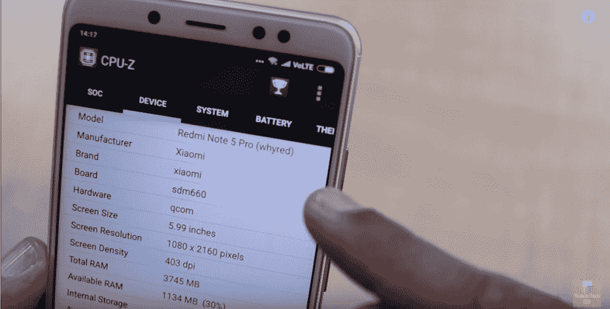

# 小米 Redmi Note 5 Pro 的 Android 8.1 奥利奥更新可能会带来 Project Treble 兼容性

> 原文：<https://www.xda-developers.com/xiaomi-redmi-note-5-pro-android-oreo-update-project-treble/>

上周，小米在新德里的一次活动中发布了红米 Note 5 和红米 Note 5 Pro。这两款设备都已经成为市场上最佳 mid-rangers 的竞争者，这要归功于小米永不失败的策略:以无与伦比的价格提供令人尊敬的规格。不幸的是，软件一直是这些设备的缺点之一(至少在我们看来)，看到这些设备推出 Android 7.1 牛轧糖令人失望。Reddit 和我们自己的论坛上一个流行的迷因是，制造商将选择在他们的设备上安装牛轧糖，以避免满足 Project Treble 的要求。嗯，我不能说这种观点有多正确，但有证据表明，红米 Note 5 Pro 不会发生这种情况:已经有一个 Android 8.1 Oreo 版本暗示了高音兼容性。

* * *

## 小米 Redmi Note 5 Pro 和 Project Treble

所以你可能会问:我们怎么知道[红米 Note 5 Pro](https://forum.xda-developers.com/redmi-note-5-pro) 可能有高音支持？事情是这样的，在这款设备发布之前，我们正在挖掘一款代号为“whyred”的设备的固件文件。当时，我们知道这是一个带有全局 ROM 的 Redmi 设备，但我们不确定该设备的真实名称是什么。现在我们知道“whyred”是小米 Redmi Note 5 Pro，我们可以从其未发布的 Android 8.1 Oreo 固件中揭示我们的发现。

 <picture></picture> 

Xiaomi Redmi Note 5 Pro Specifications Outlined in CPU-Z. Credits: [Trakin Tech](https://youtu.be/yjWVeSfSPo8?t=362)

*以下信息基于 [@FunkyHuawei](https://twitter.com/FunkyHuawei) 获得的固件文件，他是 [FunkyHuawei.club](https://funkyhuawei.club/) 服务的幕后人，该服务允许用户付费[更新](https://funkyhuawei.club/models)、[解锁](https://www.reddit.com/r/FunkyHuawei/comments/7d5wsi/introducing_funkyhuawei_unbrick_flash_tool/)或[更名](https://www.reddit.com/r/FunkyHuawei/comments/7a5sab/introducing_funkyhuawei_rebrand_tool_rebrand_any/)华为和 Honor 手机。他只向 XDA 开发者提供对这些固件文件的访问。*

首先，是的，我们看到的固件确实是运行 Android 8.1 Oreo。SDK 版本是 27，发布版本是 8.1.0，带有 1 月份的安全补丁。但最有趣的是，build.prop 中的行“`ro.treble.enabled`”被设置为 true，这是在官方 ROM 上检查 Project Treble 兼容性的最简单的方法之一。我们不确定它是否真的是高音兼容的唯一原因是因为我们无法实际测试。确认这一点的最好方法是在它上面闪一个[通用系统镜像](https://www.xda-developers.com/how-project-treble-revolutionizes-custom-roms-android-oreo/) (GSI)，看看它是否启动。

现在，Android 8.1 Oreo ROM 的存在能告诉我们该设备的更新路线图吗？不，没有迹象表明该设备将在何时接收奥利奥。尽管如此，很明显，这是在该设备发布之前就已经在工作了。可能小米的工程师正准备在设备上推出奥利奥，但由于时间限制而未能实现。你们中一些更愤世嫉俗的人会说，他们故意推迟更新，因为他们预计到了即将到来的小米 7 或 T2 小米 2。很难说，这是我们几乎肯定永远不会得到官方答案的事情。

无论如何，这对新发布的红米 Note 5 Pro 的粉丝来说是个好消息。这款手机显然在印度以小米创纪录的时间销售一空，所以将会有很多这款手机的新用户，他们可能想知道他们的手机什么时候能收到 Android Oreo。可能不会很快，但至少你知道它在那里，如果你厌倦了 MIUI，它可能会让你轻松地闪存 AOSP ROM——我们知道[你们很多人可能会有这种感觉](https://www.xda-developers.com/xiaomi-deletes-twitter-poll-android-one-miui/)。

此外，鉴于小米在内核源代码发布方面的不良记录，这意味着你可以运行 AOSP ROM，而无需等待小米发布源代码。不相信我？考虑这样一个事实:一部[的不知名手机，配有联发科 SoC，没有内核源代码](https://www.xda-developers.com/obscure-mediatek-phone-kernel-source-android-oreo-project-treble/)版本，却能运行 [LineageOS 15.1](https://www.xda-developers.com/lineageos-honor-view-10-huawei-mate-10-pro-project-treble/) 。就是因为这个原因，红米 Note 5 Pro 的机主才应该期待奥利奥的发布！

* * *

*有趣的一面——注意:在上面的截图中，“板”被列为“sdm660”。这指的是[高通骁龙 660](https://www.xda-developers.com/qualcomm-unveils-snapdragon-660-and-snapdragon-630-two-upper-mid-tier-socs/) ，它与红米 Note 5 Pro 搭载的高通骁龙 636 几乎相同。骁龙 636 具有较低的时钟速度和较弱的 GPU，但与骁龙 660 引脚和软件兼容。我看过的固件将“sdm660”列为 SoC。值得注意的是，我前几天看的 [Mi Max 3 固件](https://www.xda-developers.com/xiaomi-mi-max-3-wireless-charging-iris-scanner/)也将骁龙 660 列为其 SoC，但它也最有可能运行在骁龙 636 上。*