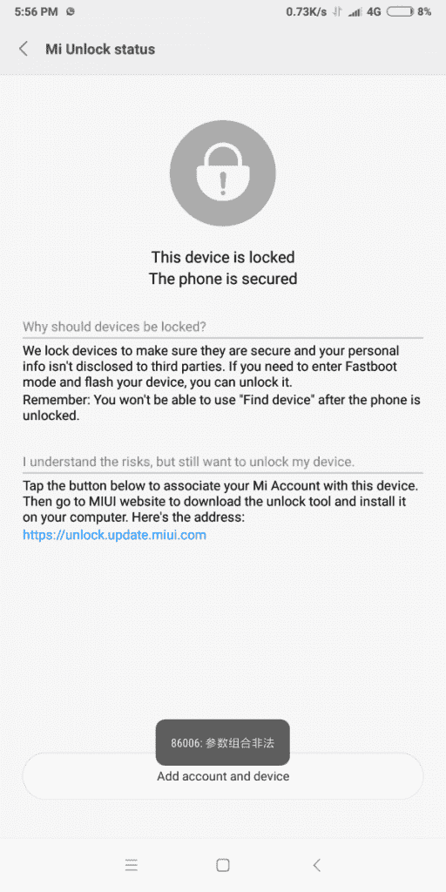

# 印度制造的小米 Redmi Note 5 Pro 设备现在可以解锁引导加载程序

> 原文：<https://www.xda-developers.com/xiaomi-redmi-note-5-pro-india-unlock-bootloader-problem/>

# 印度制造的小米 Redmi Note 5 Pro 设备现在可以解锁引导加载程序

小米红米 Note 5 Pro 可以 bootloader 解锁，但在印度生产的机型不能。小米已经确认问题已经解决，你现在可以解锁设备的引导程序了。

虽然小米传统上未能及时发布内核源代码，但他们正在努力加快速度，正如相对快速发布的[小米 Mix 2S](https://www.xda-developers.com/xiaomi-releases-kernel-sources-for-the-xiaomi-mi-mix-2s/) 内核源代码所示。幸运的是，解锁小米设备的引导加载程序通常不会造成太大的问题(除了一些设备上令人讨厌的等待时间)。小米 Redmi Note 5 Pro 也不例外，大部分情况下。但由于一些奇怪的原因，“印度制造”的 Redmi Note 5 Pro 设备无法 bootloader 解锁。仅仅尝试添加一个帐户来解锁设备就会给出一个错误代码“86006”。

 <picture></picture> 

*Error 86006, which prevented device owners from unlocking their Xiaomi Redmi Note 5 Pro.*

从[MIUI 论坛](http://en.miui.com/thread-1954215-1-1.html) 和 [我们自己的论坛](https://forum.xda-developers.com/redmi-note-5-pro/how-to/86006-error-unlocking-t3774593)的[几十篇报道](https://www.google.com/search?q=redmi+note+5+pro+error+86006)来看，这似乎是一个普遍的问题。“中国制造”的小米红米 Note 5 Pro 设备似乎没有受到影响。目前还不清楚到底是什么导致了错误 86006，尽管普通话中的错误文本翻译为“非法参数”，这表明该错误是由服务器端引起的，而不是由设备上运行的软件引起的。虽然有[似乎是一个变通办法](http://en.miui.com/thread-2328094-1-1.html)，但做起来有点麻烦。

谢天谢地，我们现在可以确认这个问题确实已经解决了。当我们联系小米确认该问题时，一位发言人告诉我们，“由于技术故障，用户无法解锁红米 Note 5 Pro 智能手机上的引导加载程序。这个问题已经得到修复，用户应该能够正常解锁他们的 Redmi Note 5 Pro 上的引导加载程序。”我们很高兴看到这个问题最终得到了解决，尽管这个问题花了一些时间才引起小米的注意。

我们已经向一些用户确认，小米红米 Note 5 Pro 的引导加载器解锁问题已经解决。如果你是有这个问题的用户之一，那么再试一次，看看你现在是否能解锁引导程序。一旦你解锁了引导程序，你就可以加入我们的[论坛](https://forum.xda-developers.com/redmi-note-5-pro)和 flash [TWRP](https://www.xda-developers.com/twrp-xiaomi-redmi-note-5-pro-xiaomi-mi-note-2-sony-xperia-xa2/) 的众多用户，这样你就可以享受 [LineageOS 15.1](https://www.xda-developers.com/unofficial-lineageos-15-1-xiaomi-redmi-note-5-pro/) 的非官方版本。