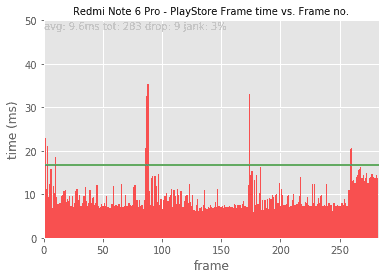
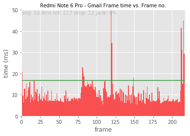
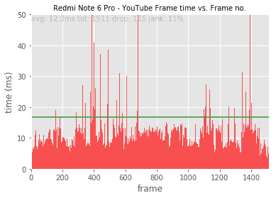
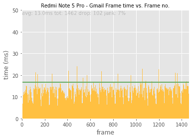

# 小米红米 Note 6 Pro 评测:等待红米 Note 7

> 原文：<https://www.xda-developers.com/xiaomi-redmi-note-6-pro-review-a-great-phone-but-wait-for-the-redmi-note-7/>

在小米红米 Note 5 Pro 取得巨大成功后，该公司又带着另一个竞争者小米红米 Note 6 Pro 回来了。Redmi Note 5 Pro 是对其前代产品的全面升级，不仅带来了新的强大的硅，还带来了现代设计，正面有 18:9 显示面板。这款手机和它的前辈一样取得了成功，并连续三个季度成为印度销售最快的智能手机。

然而，自红米 Note 5 Pro 推出以来，许多事情都发生了变化。与推出时几乎没有竞争对手的红米 Note 5 Pro 不同，[红米 Note 6 Pro](https://www.xda-developers.com/xiaomi-redmi-note-6-pro-india-specs-pricing/) 发现自己处于激烈的竞争之中。华硕(ASUS)和 Realme 等竞争原始设备制造商通过推出有竞争力的产品加大了赌注，并威胁要削弱小米作为细分市场领导者的地位。

[**红米 Note 6 Pro XDA 论坛**](https://forum.xda-developers.com/redmi-note-6-pro)

Redmi Note 6 Pro 是一款迭代更新产品，除了改进的摄像头和一些设计调整外，它并没有带来太多新的东西。尽管如此，对于小米来说，这是一款重要的设备，因为它试图保持其在印度智能手机市场的头号地位。但问题是:红米 Note 6 Pro 是否有助于证明称小米为中端之王是正当的？我们在这篇综述中找到答案。

*关于这次评测:我有红米 Note 6 Pro 6GB/64GB 的变种。审查单位由小米印度提供，用于审查目的。*

### 红米 Note 6 Pro 规格(点击展开表格)

| 

规格

 | 

详述

 | 

规格

 | 

详述

 |
| --- | --- | --- | --- |
| **软件** | 安卓 8.1 奥利奥配 MIUI 10 | **连通性** | 混合双卡槽(nano SIM + nano SIM/microSD)。双 4G VoLTE，GPS，microUSB 端口。无 NFC |
| **CPU** | 高通骁龙 636(8 个 Kyro 260 内核-4 个半定制 Cortex-A73，4 个半定制 Cortex-A53)。 | **音频** | 3.5 毫米耳机插孔。迪拉克高清音响。 |
| **GPU** | 肾上腺素 509 | **后置摄像头** | 

*   12MP f/1.9 ISOCELL Fast S5K2L7 + 5MP 三星，f/2.2
*   1.4μm 像素尺寸
*   照片分辨率:4032×3024 像素
*   单音双 LED 闪光灯
*   1080@30fps 视频录制，不支持光学防抖
*   数码变焦/双变焦
*   自动对焦:双像素自动对焦
*   电子图像稳定(EIS)

 |
| **RAM 和存储器** | 4GB / 6GB LPDDR4x 内存和 64GB eMMC 5.1 存储(microSD 支持高达 256GB) | **前置摄像头** | 

*   20MP f/2.0 ISOCELL S5K3T1，1.8μm
*   2MP OmniVision 深度传感器，f/2.2
*   面部解锁
*   照片分辨率:5184×3880 像素
*   支持 1080p 视频录制
*   数码变焦
*   自动对焦:固定焦距
*   人像模式

 |
| **电池** | 4，000 毫安时，支持快充 3.0 | **指纹扫描仪** | 是(后置) |
| **显示** |  | **在盒子里** |  |
| **无线网络** | wi-Fi 802.11 a/b/g/n/AC(2.4 GHz/5 GHz) | **颜色** | 蓝色、黑色、玫瑰金、红色 |
| **蓝牙** | 蓝牙 5.0 LE | **网络频段** |  |

* * *

## 红米 Note 6 Pro 设计与展示

Redmi Note 6 Pro 在很大程度上继续遵循与其前辈相同的设计语言，但也带来了自己的一些变化，无论是好是坏。例如，这款设备现在拥有类似 iPhone 的凹槽，类似于小米 POCO F1 以及我们去年年底看到的其他廉价 Redmi 设备。3.5 毫米耳机插孔被移到了顶部，这可能是好消息，也可能是坏消息，取决于你的喜好。

插孔旁边放置了一个红外发射器和辅助麦克风。底部有一个微型 USB 端口，两侧都有格栅，但只有右边的格栅可以容纳扬声器。

电源和音量按钮位于右侧，混合 SIM try 安装在左侧。按钮触摸起来很舒服，当你按下它们的时候会发出很好的确定的点击声。中框由塑料制成，背面有一块金属板，用于放置双摄像头和嵌入式指纹扫描仪。

尽管尺寸更大，但这款设备握起来很舒服，我也没有发现单手使用有什么问题。与 Redmi Note 5 Pro 相当光滑的边缘相比，Redmi Note 6 Pro 的边缘更加明显，增加了整体握持感。就设计而言，红米 Note 6 Pro 在这里和那里进行了小改动，以确保安全。

转到显示屏，小米红米 Note 6 Pro 使用了中国显示器制造商天马的 6.2 英寸全高清+面板，同一家制造商为许多其他小米设备提供了面板，如红米 Note 5 Pro 和 [POCO F1](https://www.xda-developers.com/xiaomi-poco-f1-design-display-gaming-performance-review/) 。虽然两代产品的大部分硬件都是相同的，但显示屏是我们看到显著改进的一个方面。这也是 Redmi Note 5 Pro 让包括我在内的许多发烧友失望的地方，因为它太沉闷和过时了。在这方面，Redmi Note 6 Pro 比前代产品前进了一大步，因为新面板不仅在色彩还原方面更准确，而且更亮，饱和度更好。

该显示器能够在最大设置下实现 500 尼特的亮度，比 Redmi Note 5 Pro 的 450 尼特高了一步。太阳清晰度在最大亮度下也很好，您可以舒适地阅读文本和查看内容，没有任何问题。它比我用过的其他中端设备要好，但不可否认没有旗舰设备那么亮。

MIUI 提供各种显示设置，根据您的喜好调整色温和对比度。您可以在三种颜色和对比度配置文件之间进行选择。

显示器不支持更宽的色域，也不支持 HDR 内容。但它支持 sRGB 模式，以防你希望你的显示准确而不是赏心悦目。视角和任何好的液晶面板一样好。虽然当从某些角度观看显示器时，可以注意到对比度的损失，但是离轴的颜色偏移是最小的。总的来说，显示性能相当令人满意，是这个价格范围内最好的之一。

* * *

## 红米 Note 6 Pro 相机画质

### 相机硬件和相机应用程序

从历史上看，相机性能一直不是 Redmi Note 系列的强项。这最终随着 Redmi Note 5 Pro 的出现而改变，这是 Redmi Note 系列中第一款配备双摄像头系统的设备。

红米 Note 6 Pro 比以往任何时候都更加关注相机性能。百万像素数量保持不变，但前后传感器都进行了升级。红米 Note 5 Pro 配备了 f/2.2 主传感器，红米 Note 6 Pro 配备了更大的 f/1.9 传感器。像素尺寸也从 1.2 微米增加到了 1.4 微米，这意味着我们可以期待在弱光拍摄方面有一些大的改进。

相机应用程序设计精良，提供非常直观的体验。向左或向右滑动可以访问不同的相机模式。闪光灯、HDR、人工智能模式和汉堡菜单的切换被安排在顶部。你还可以使用手动模式，并且可以完全控制各种参数，包括快门速度和 ISO。

### 后置摄像头质量-日光

对于相机质量的评测，我们可以从日光拍摄开始。光天化日之下，红米 Note 6 Pro 表现异常出色。动态范围很好，尽管远远落后于我们的 POCO F1 审查单元运行的[谷歌相机端口](https://www.xda-developers.com/google-camera-port-hub/)，它设法从阴影中带出更多细节。在光线充足的条件下，图像具有真实的色彩和适当曝光的高光，并在放大时保留了大量细节。相机可以快速锁定焦点，拍照也非常迅速，没有快门延迟。

使用 HDR 模式确实在一定程度上提高了动态范围，但它也倾向于使较亮的区域过度饱和。我们发现让 HDR 处于自动模式是一个更好的方法，因为它有助于从阴影中带出更多的细节。它也非常准确，只有在检测到高对比度场景时才会触发。

总的来说，日光表现非常好，如果光线条件良好，用户可以期待捕捉到一些非常好的照片。就日光性能而言，我们没有看到红米 Note 5 Pro 有任何重大改进，并发现小米的图像处理算法几乎没有变化。我们喜欢小米平衡的图像处理方法，它在大部分区域保留了大量细节，并且没有过度锐化或过饱和——这是该范围内其他类似价格设备的常见情况。

后置摄像头质量-低光

### 日光评估完成后，我们现在可以进入智能手机摄影中更具挑战性的部分:弱光相机性能。虽然大多数中端设备在填补日光相机性能方面的差距方面取得了很大进步，但在弱光和夜间摄影方面，大多数设备都表现平平。低光摄影也不是红米 Note 5 Pro 的优势之一，但该公司承诺通过红米 Note 6 Pro 解决这一痛点。

我们在不同场景下试用了 Redmi Note 6 Pro，以评估其弱光能力。在这方面，我们看到了比 Redmi Note 5 Pro 明显的改进，因为新相机由于更亮的光圈和更大的像素尺寸而能够吸收更多的光。与红米 Note 5 Pro 相比，低光拍摄更亮，保留了更多细节。低光图像几乎没有噪声，曝光和对比度在大部分时间都很好。降噪有点重，导致锐度损失，但纹理保留得很好，所以总体来说效果不错。

切换到 HDR 确实有助于弥补夜间拍摄的动态范围有限，但也有点慢。你必须保持设备稳定，并确保主体部分几乎没有移动，否则你最终会得到一个不稳定的图像。你必须要有耐心，甚至可能要拍摄多张照片才能拍出完美的照片。

这是否意味着该设备可以支持更昂贵的智能手机？不完全如此。底线是低光性能无法与旗舰级别相媲美，但无论如何，我认为它是细分市场中最好的之一。想要获得更好的弱光性能的用户建议尝试一下[谷歌相机端口](https://www.xda-developers.com/google-camera-port-hub/)，它不仅能够在弱光下产生令人惊叹的效果，而且还大大提高了白天拍摄的动态范围。

后置摄像头质量-人像模式

### 最近，肖像模式已经成为智能手机摄影的一种规范，并且已经成为几乎每个设备不可或缺的一部分。就像它的前辈一样，Redmi Note 6 Pro 也提供人像摄影，该公司声称它甚至更好。Redmi Note 6 Pro 上的辅助相机是一个深度传感器，它只为人像拍摄收集深度信息，在其他相机操作期间几乎处于休眠状态。长焦或广角传感器会更好吗？也许吧。但小米认为使用深度传感器可以让他们更好地控制深度估计和更好的主体分离，从而获得更好的人像效果。在良好的照明条件下，肖像模式在正确识别主体方面做得非常好，最终结果可能会非常惊人，主体在焦点上，背景非常模糊。

肖像模式有过度曝光或曝光不足的趋势，但如果您通过点击屏幕手动设置焦距，这可以避免。我们也遇到了一些视觉伪像和偶尔模糊的对象的小部分相当多的时间。然而，通过一些练习和耐心，你可以得到一些非常漂亮的照片，正如你在下面的图库中看到的。

不过，你不能指望肖像模式在任何情况下都完美无缺。使用双摄像头拍摄肖像的设备的普遍共识仍然是一样的:速度慢，有时令人沮丧，并不能保证每次都能正常工作。每次拍照时你都要仔细检查，以确保照片达到预期效果。我们还发现预览照片有时有点慢且不连贯。在你拍摄并点击缩略图按钮后，它不会在第一次点击时加载预览。由于设备仍在处理图像，与普通拍摄相比，人像拍摄尤其如此。

前置摄像头质量

### 前置摄像头性能是 Redmi Note 6 Pro 的突出功能之一，因为该设备在正面配备了两个而不是一个摄像头传感器。就像后置设置一样，第二个摄像头也是一个深度传感器，只有在人像模式下自拍时才有用。值得一提的是，在 Redmi Note 5 Pro 以及其他 Redmi 手机上，使用单前置摄像头进行人像摄影已经成为可能，并且效果已经相当不错。

主摄像头和红米 Note 6 Pro 一样是 20MP 的拍摄者。更多的百万像素通常意味着更好的细节，但也意味着低光性能不会那么好。小米表示，他们正在使用像素宁滨来组合来自 4 个像素的信息，以创建一个超级像素，从而捕捉更多的光线，从而改善弱光拍摄。

默认情况下，前置摄像头开启美化模式。如果你想让你的照片接近真实，我们强烈建议你关闭它。使用美颜模式拍摄的照片看起来非常不真实，皮肤光滑，而且看起来有点卡通，说实话。一旦关闭，照片出来真的很好，真实的生活色彩和适当曝光的亮点。在弱光条件下拍摄的图像也很出色，几乎没有噪点，细节和纹理都很好。

增加深度传感器的原因看起来更像是一种营销活动，因为我们发现在人像拍摄方面比 Redmi Note 5 Pro 几乎没有什么改进。即使只有一个摄像头，红米 Note 5 Pro 上的人像也一样好，如果不是更好的话。与后置摄像头人像相比，自拍人像相对容易处理，因为拍摄对象总是离设备很近。不管是哪种情况，重要的是在日光和弱光条件下的自拍表现都相当好，肯定会受到自拍爱好者的赞赏。

增加深度传感器的原因看起来更像是一种营销活动，因为我们发现在人像拍摄方面比 Redmi Note 5 Pro 几乎没有什么改进。即使只有一个摄像头，红米 Note 5 Pro 上的人像也一样好，如果不是更好的话。与后置摄像头人像相比，自拍人像相对容易处理，因为拍摄对象总是离设备很近。不管是哪种情况，重要的是在日光和弱光条件下的自拍表现都相当好，肯定会受到自拍爱好者的赞赏。

* * *

红米 Note 6 Pro 性能

## 在引擎盖下，Redmi Note 6 Pro 与它的前辈非常相似，同样的[高通骁龙 636](https://www.xda-developers.com/qualcomm-snapdragon-636-kryo-260-cpu/) SoC 运行着 4GB/6GB 的 RAM 和 64GB 的闪存。虽然像高通骁龙 660 这样的东西会更好，但 636 仍然是一个有能力的司机，可以轻松处理日常任务和轻度游戏。但是，那些希望更多的马力和世代性能提升肯定会失望，因为没有重大改进可谈。面对竞争加剧，很难证明选择旧芯片的决定是正确的。

在讨论这对于实际性能意味着什么之前，我们先来看看这款设备在我们常用的 PCMark Work 2.0 基准测试套件上的表现如何。

Work 2.0 浏览测试包括使用原生 Android WebView 呈现网页、搜索内容和向列表添加项目。中端设备已经足够好，可以毫不费力地处理日常的网络浏览任务，尽管它们仍然落后于旗舰产品。

视频编辑测试旨在测试媒体播放能力。视频测试利用 OpenGL ES 2.0、Android MediaCodec API 以及 Exoplayer 来测量视频播放、编辑和保存性能。

照片编辑测试依赖于 Android renderscript API，并测量设备编辑和保存一组图像所需的时间。照片编辑得分在较新的设备中处于平均水平，红米 Note 6 Pro 占据第一名。

写作测试使用 Android EditText 视图和 PdfDocument APIs，并测量打开、编辑和保存 PDF 文档的时间。这也是对设备峰值性能的一个很好的测试。在这里，我们看到红米 Note 6 Pro 落后于竞争对手的智能手机，而华硕 ZenFone Max Pro M1 领先。

在最终的 PCMark Work 2.0 评分中，红米 Note 6 Pro 落后于库存的 Android 设备，排名第四，华硕 ZenFone Max Pro M1 领先。

**UX 速度**

### 小米声称，凭借 [MIUI 10](https://www.xda-developers.com/miui-10-announcement-ai-features/) 的系统级优化，红米 Note 6 Pro 能够将应用程序的启动速度提高 30%。

在现实世界中，应用程序的打开时间很快，尽管不可否认没有像 POCO F1 这样的重量级冠军那样快。我们在三个流行的应用程序中测试了 Redmi Note 6 Pro 的应用程序打开时间，发现它与其他具有类似硬件的中端设备相比相当不错。我们在 Redmi Note 6 Pro 和 Redmi Note 5 Pro 上测量了 Play Store、YouTube 和 Gmail 的冷启动，结果显示在下面的图表中。

测试从 27℃的开启温度开始，快速连续开启每个应用程序 150 次。请记住，我们并不是在测量一个应用程序在所有元素都绘制在屏幕上的情况下完全渲染所需的时间。相反，我们通过记录应用程序创建应用程序的主要活动所花费的时间来使用代理。我们包括的时间度量包括启动应用程序流程、初始化其对象、创建和初始化活动、展开活动的布局以及第一次绘制应用程序。它忽略了不会阻止应用程序初始显示的内联进程，这反过来意味着记录的时间不会真正受到外部变量的影响，例如获取繁重资产的网络速度。

骁龙的 BoostFramework 也在那里，它提高了两个集群上的 CPU 频率，为突发任务提供了更高的处理能力，如应用程序启动或用相机拍照。

因此，虽然应用程序的启动时间不是最快的，但仍然非常令人满意。对于过去几个月一直在广泛使用 POCO F1 的人来说，在日常操作中，如导航 UI 和打开轻量级应用程序，性能差异并不是很大。一旦你加快了动画的速度，这款设备就会感觉和 POCO F1 一样快，甚至更好。只有在执行需要更快存储的更长时间的操作时，例如游戏，我们才会看到性能的真正下降，其中 Redmi Note 6 Pro 较慢的 eMMC 存储根本不是 POCO F1 的 UFS 的对手。

在日常操作中，如网页浏览和在多个应用程序之间玩杂耍，性能保持得相当好，我不记得在我的审查期间我不得不面对任何重大减速或严重口吃的情况。

**内存管理**

### Redmi Note 6 Pro 有两种内存配置:4GB 内存和 64GB 存储的基本型号和相同闪存容量的顶级型号。尽管 6GB 的 RAM 很快成为中端市场的标准配置，但 4GB 的 RAM 对于大多数用户来说还是绰绰有余的。在过去的 6 个月里，我一直将红米 Note 5 Pro 作为我的日常驱动程序，我不认为红米 Note 6 Pro 上额外的 2gb 内存在我的日常使用中带来了任何显著的性能改善。6GB 的 RAM 对于大型游戏来说可能是有用的，但话说回来，Redmi Note 6 Pro 根本没有足够的原始功率来证明自己是一款游戏设备，我怀疑在该领域之外是否有许多用例可以很好地利用额外的内存。此外，为顶级变体支付额外的钱也不会给你带来任何额外的好处。如果他们提供更多的存储空间和额外的内存，利润会更高。值得一提的是，内存管理似乎不是问题。该系统能够轻松地将我经常使用的所有应用程序长时间保存在内存中，而无需在后台重新加载。

**平滑度**

### 为了实现流畅的用户体验，设备必须能够在 16 毫秒的紧迫期限内渲染每一帧，这意味着用户界面将以 60FPS 的速度渲染。有多个变量会影响 UI 流畅性，例如优化不佳的软件或动力不足的硬件。然而，在大多数情况下，造成性能不稳定的不是硬件，而是没有经过 OEM 适当优化的软件。我想起了三星 Galaxy Note 7 和 T2 谷歌 Pixel 的经典例子。两者都由相同的硬件驱动，但当涉及到现实世界的性能时，它们形成了鲜明的对比。不过，我们并不指望像红米 Note 6 Pro 这样的中端设备能与谷歌 Pixel 的流畅度相媲美。相反，我们感兴趣的是找出它作为中端设备的相对地位，以及 MIUI 的优化程度。

首先，我们坐下来测试滚动性能。这是一个非常基本的测试，包括打开谷歌 Play 商店应用程序，加载排名靠前的应用程序，并向下滚动加载的应用程序条目，然后返回到列表的顶部。然后，测试转移到 Gmail 应用程序，并在主屏幕上滚动浏览电子邮件条目。

首先，我们坐下来测试滚动性能。这是一个非常基本的测试，包括打开谷歌 Play 商店应用程序，加载排名靠前的应用程序，并向下滚动加载的应用程序条目，然后返回到列表的顶部。然后，测试转移到 Gmail 应用程序，并在主屏幕上滚动浏览电子邮件条目。

接下来，我们对设备进行一些综合测试。这些测试旨在测量应用内的性能，并涉及复杂的 UI 导航，如搜索内容、打开新窗口、调出侧面板等。

 <picture></picture> 

Play Store Scrolling Test

 <picture></picture> 

Gmail Scrolling test

Gmail 综合测试包括滚动收件箱条目、打开侧面板、检查垃圾邮件框、浏览常规设置，以及打开窗口撰写电子邮件。该测试在相同条件下重复三次。

正如你所看到的，性能远非平稳，当加载新窗口和打开电子邮件条目时，可以看到很多帧丢失。只有滚动部分看起来是平滑的。

 <picture></picture> 

Gmail Composite Test

在 YouTube 复合测试中，测试执行以下操作:

搜索 Nyan 猫视频

1.  从列表中打开视频
2.  最小化正在播放的视频并返回到搜索列表
3.  搜索:xdadevelopers
4.  打开频道主页
5.  滑动到社区部分
6.  返回主屏幕
7.  关闭最小化的视频
8.  最后，侧面板测试包括在 Gmail 应用程序中多次打开和关闭侧面板。

 <picture></picture> 

YouTube Composite Test

总的来说，对于一款中端设备来说，结果是令人满意的，也是我们通常对这个价格范围的设备的期望。不是特别流畅，但是现实世界体验也没那么差。那些来自旗舰的人更有可能注意到平滑度的差异。然而，正如我们在开始时所说的，这些测试的目的不是对每一帧的丢失吹毛求疵，而是了解从中端设备中能得到什么。值得一提的是，我认为红米 Note 6 Pro 表现不错，MIUI 似乎也进行了很好的优化。

 <picture></picture> 

Gmail Sidepanel

**游戏**

### Adreno 509 处理图形方面的事情，很明显 Redmi Note 6 Pro 不是一款游戏玩家的设备。这并不意味着它完全不能玩重度游戏。只是大多数高端游戏只能在中低设置下玩，但仍保留可玩性。我们尝试了各种流行的游戏来评估游戏性能。

*游戏分析之所以成为可能，要感谢 [Gamebench](https://www.gamebench.net/) ，这是一个工具，它允许任何人测量他们设备的游戏性能，而不需要任何花哨的设置。*

【应用盒子 Google play com。游戏长凳。指标收集器]

首先，我们玩了 [PlayerUnknown 的战场](https://www.xda-developers.com/tag/playerunknown-bg/)，这是一个非常受欢迎的皇家战役游戏，也是最激烈的游戏之一。游戏以推荐的中等图形设置开始，在我们 15 分钟的会议中，游戏基本上很流畅。中值帧速率保持在可观的 26 fps。

接下来，我们玩沥青 9:传奇。虽然没有 PUBG 那么密集，但 Gameloft 最新的手机赛车系列仍然是一款要求很高的游戏，有一些令人惊叹的视觉效果。游戏的最高帧率为 30fps，Redmi Note 6 在整个过程中保持稳定的帧率没有任何问题。

我们还尝试了一些其他游戏，如死亡触发器 2，现代战斗 5，和奥拓的奥德赛，仅举几例，所有这些设备都处理得很轻松。大多数图形密集型游戏可以在中低设置下流畅运行，尽管性能会受到最大图形设置的影响，这是可以理解的。它不是为严肃的游戏而设计的，但对于轻度到休闲的游戏，Redmi Note 6 Pro 做得相当好。

我们还尝试了一些其他游戏，如死亡触发器 2，现代战斗 5，和奥拓的奥德赛，仅举几例，所有这些设备都处理得很轻松。大多数图形密集型游戏可以在中低设置下流畅运行，尽管性能会受到最大图形设置的影响，这是可以理解的。它不是为严肃的游戏而设计的，但对于轻度到休闲的游戏，Redmi Note 6 Pro 做得相当好。

* * *

红米 Note 6 Pro 软件

## 红米 Note 6 Pro 运行基于 Android 8.1 Oreo 的 MIUI 10。MIUI 10 带来了一个大的视觉革新以及许多底层优化。新的用户界面不仅在视觉上令人耳目一新，而且还解决了我们在旧版本 MIUI 中遇到的许多麻烦。我们已经在另一篇文章中讨论了大部分的大变化，所以也来看看吧。

MIUI 充满了功能和定制选项，虽然从普通 Android 爱好者的角度来看是压倒性的，但在亚洲用户中很受欢迎，那里的用户往往更关心丰富多彩的 UI 和软件功能。开箱后，该设备安装了一堆第三方应用程序，所有这些程序都可以很容易地卸载。这些应用包括脸书、网飞、Opera Mini browser 等热门应用，以及 PhonePe、Share Chat、Dailyhunt 和 Smart News 等地区性应用。

默认启动器仍然不提供应用抽屉功能。你得到的是一个 la' iOS 界面，你所有的应用程序都在主屏幕上组织起来。如果你不是这种安排的粉丝，Android 不缺乏奇妙的第三方发射器，从流行的 Nova 发射器到基于像素的发射器，如 [Lawnchair](https://forum.xda-developers.com/android/apps-games/lawnchair-customizable-pixel-launcher-t3627137) 或 [Hyperion](https://forum.xda-developers.com/apps/substratum/official-hyperion-launcher-t3881654) 。你也可以试试 [POCO 发射器](https://www.xda-developers.com/poco-launcher-customize-desktop-grid-icon-size/)。

虽然 MIUI 在外观和功能方面一直与传统的 Android 相差甚远，但 MIUI 10 从 Android 派[中获得了一些灵感。首先，通知阴影被彻底改造了，现在有一个醒目的白色背景和蓝色开关，提醒我们 Android Pie 的快速设置面板。音量控制菜单也非常类似于 Android Pie 的方法，具有一个垂直的音量滑块，现在默认控制音乐音量。](https://xda-developers.com/tag/androidpie/)

MIUI 10 带来的其他大变化是新的最近屏幕。在以前的 MIUI 版本中，最近的屏幕以水平排列的卡片显示应用程序，但在新版本中，概览菜单现在以马赛克风格并排显示应用程序，允许更好的多任务处理，并在给定的空间中安装更多的应用程序卡片。您可以从列表中清除应用程序，方法是将它们拖到左侧或右侧，或者使用底部的 FAB 按钮一次性清除所有应用程序。同时，长按任何应用程序卡都会显示三个浮动按钮，可用于执行快速操作，例如将应用程序锁定到内存，进入分屏模式，以及打开应用程序的设置。

MIUI 在其一些第一方应用程序中显示广告，如默认浏览器和音乐应用程序。请注意，广告只显示在应用程序中，而不显示在锁屏或通知区域，你也可以选择[完全禁用它们](https://forum.xda-developers.com/redmi-note-5-pro/how-to/tutorial-how-to-remove-ads-redmi-note-5-t3842425)。

默认情况下，您会看到屏幕上的导航按钮，但您可以启用全屏导航手势来充分利用显示屏。手势非常直观，没有需要记忆的复杂步骤或组合。MIUI 提供了一个很好的演示，演示如何使用手势来执行各种导航操作。若要返回上一个屏幕，您可以从屏幕的右边缘或左边缘轻扫。从底部向上滑动会将你带回主屏幕。执行相同的向上滑动手势，然后中途暂停会显示最近的应用概述。你确实错过了谷歌助手的长按触发器，但在我看来，手势提供的便利非常值得这个小交易。

MIUI 完全支持主题化，并有自己的主题商店，你可以下载新的主题，字体，壁纸和铃声，根据你的喜好完全个性化你的设备的外观和感觉。一些 MIUI 功能真的很有用，我希望它们也可以在 Android 上使用。这包括滚动屏幕截图的能力，内置的屏幕录制功能(可能会在 [Android Q](https://www.xda-developers.com/android-q-dark-theme-desktop-mode-permission-revamp/) 中出现)，应用程序锁和连接速度指示器，等等。

MIUI 中仍然令人烦恼的一点是，系统仍然没有为所有应用程序默认显示锁屏通知。你在锁屏上得到的唯一通知来自小米的默认应用。如果你想让所有应用都这样，你必须在设置中为每个应用单独启用它。此外，由于缺口占据了状态栏的大部分区域，你也会错过通知图标。如果你是一个大部分时间都让手机保持静音的人，你就没有办法知道在你使用手机时是否收到了新的通知。MIUI 确实提供了浮动通知和 LED 灯，但你必须深入了解每个应用程序的设置才能启用它们。好像这还不够，在 MIUI 上锁屏通知也处理得很奇怪。只要设备处于锁定状态，通知就只会停留在锁定屏幕上。一旦解锁设备，它会清除所有通知，只显示新的通知。希望小米在未来的更新中解决这个问题。

当谈到系统声音时，MIUI 也采取了一种有趣的方法。它提供了受自然启发的系统声音，而不是同样无聊的曲调。它为新来的通知播放水滴声音效果，连续的通知将产生不同水滴的韵律。删除图像，联系人或文件，同时，将播放沙的声音。

MIUI 处理后台应用程序的能力相对较好，我在日常使用中所依赖的应用程序也没有出现通知延迟的问题。你还可以获得应用程序电池节省功能，它的工作方式非常类似于股票 Android，你可以完全控制哪些应用程序和活动，你想允许在后台，并可以限制那些你觉得讨厌的。

MIUI 可能不是每个人都喜欢的，但它也不可怕。它在过去的几年里有了很大的改进，已经成为 Android 的一个很好的替代品，提供了一个精致的软件体验和很好的定制选项。

MIUI 可能不是每个人都喜欢的，但它也不可怕。它在过去的几年里有了很大的改进，已经成为 Android 的一个很好的替代品，提供了一个精致的软件体验和很好的定制选项。

* * *

音频、来电接收和面部解锁

## Redmi Note 6 Pro 采用了单个底部发射扬声器。虽然这是一个单声道扬声器，但它的响度和清晰度让我们感到惊喜。它不仅明显比它的前身更响亮，即使在高音量下，失真水平也保持在可控范围内。它提供了一个平衡的声音，低音恰到好处，乐器和人声之间有很好的分离。在 Redmi Note 5 Pro 上，声音在最大音量时开始变得低沉和失真。另一方面，Redmi Note 6 Pro 在最大音量方面表现出色，声音输出也没有明显下降。通过耳机输出的声音也相当响亮，没有引入任何失真，正如我们在一加子弹耳塞和索尼耳机上测试的那样。虽然这里没有什么特别的，但话说回来，中档设备并不以其出色的音频性能而闻名。

手机信号非常好，我没有遇到过意外掉线的情况。该设备在两个 SIM 卡插槽上都支持 4G LTE 连接。在设备通话中，质量非常好，输出声音也足够大，您可以将设备放在离耳朵几英寸远的地方，仍然可以舒适地听到呼叫者的声音。

这款设备还提供了面部解锁功能，但我发现与红米 Note 5 Pro 相比，它的速度有点慢。在我最初的印象中，缓慢非常明显，后来当我并排测试这两款设备时，这一点得到了证实。在多次测试中，Redmi Note 5 Pro 几乎总是以瞬间的优势领先。在使用 POCO F1 的超快速红外面部解锁后，我对不得不等待近一秒钟才能进入设备并不特别满意。我发现自己在整个审查期间更经常地依赖指纹传感器，这仍然是解锁设备的最快方式。

这款设备还提供了面部解锁功能，但我发现与红米 Note 5 Pro 相比，它的速度有点慢。在我最初的印象中，缓慢非常明显，后来当我并排测试这两款设备时，这一点得到了证实。在多次测试中，Redmi Note 5 Pro 几乎总是以瞬间的优势领先。在使用 POCO F1 的超快速红外面部解锁后，我对不得不等待近一秒钟才能进入设备并不特别满意。我发现自己在整个审查期间更经常地依赖指纹传感器，这仍然是解锁设备的最快方式。

* * *

**电池&充电速度**

## 如果说小米设备有一点是众所周知的，除了它们的可负担性，那就是它们高于平均水平的电池性能。特别是 Redmi Note 系列，一直给我们留下惊人的电池备份印象。我们高度评价了[红米 Note 3](https://www.xda-developers.com/xiaomi-redmi-note-3-xda-review/) 和[红米 Note 4](https://www.xda-developers.com/xiaomi-redmi-note-4-xda-review-in-depth/) 令人惊叹的电池备份，同样的 4,000mAh 电池和高效的骁龙 636 SoC，红米 Note 6 Pro 将继续保持这一称号。从我们通常的 PCMark 电池基准开始，我们在亮度设置为 100%的情况下进行了全面测试。红米 Note 6 Pro 续航 6 小时 42 分钟。客观来看，在同一次测试中，Redmi Note 5 Pro 的电池寿命为 7 小时 15 分钟。在第二轮测试中，我们将两款设备的亮度设置为 50%，其中 Redmi Note 6 Pro 持续了近 12 个小时，而 Redmi Note 5 Pro 则持续了 12 小时 45 分钟。

与此同时，在 Geekbench 4 的电池测试中，该设备获得了令人印象深刻的 5850 分。测试是在全放电模式下进行的，暗屏开关打开。在同一次测试中，红米 Note 5 Pro 的得分为 5792 分。

就其本身而言，分数相当不错，但与上一代 Redmi Note 设备相比仍有差距。然而，我们也必须记住，Redmi Note 6 Pro 的显示屏比它的前辈更大更亮，所以在相同的亮度水平下，它显然消耗了更多的功率。

所有这些测试都是在关闭数据连接并从内存中清除所有后台应用程序的情况下进行的。

说到现实世界的性能，在我的正常使用过程中，该设备能够轻松地让我在充满电的情况下度过一天半，平均屏幕打开时间在 6-7 小时之间。我的使用量偏高，在此期间，我还用这款设备拍了很多照片，偶尔还会玩会游戏。在适度使用的情况下，我相当肯定你可以轻松获得两天的电池续航时间。

闲置电池消耗最小，设备在关闭数据服务的情况下，一夜之间会损失约 1-2%的电量。

小米继续用 micro USB 口真可惜。该设备确实支持[高通快速充电 3.0](https://www.xda-developers.com/charging-comparison-oneplus-huawei/) 以获得更快的充电体验，但在盒子里，你只能得到相同的旧 5V / 2A 充电器。你将不得不支付一些额外的钱来买一个快速充电器。使用捆绑充电器，该设备需要近两个半小时才能充满电。相比之下，POCO F1 的快速充电器能够在两个小时内将设备从没电状态充满。

设备在充电过程中不会过热。只要你不执行任何高强度的任务，例如玩游戏，最高温度就会在 36-38 摄氏度之间徘徊。

设备在充电过程中不会过热。只要你不执行任何高强度的任务，例如玩游戏，最高温度就会在 36-38 摄氏度之间徘徊。

**结论**

## 最后，红米 Note 6 Pro 没什么好抱怨的，但也没什么好夸的，除了相机性能。小米一直谨慎行事，采用久经考验的公式，并不时进行一些迭代改进。Redmi Note 6 Pro 的可预测性很高，如果你愿意的话，几乎很无聊。正如阿米尔在[他的亲身体验](https://www.xda-developers.com/xiaomi-redmi-note-6-pro-hands-on/)中指出的那样，这款设备感觉更像是红米 Note 5 Pro 的 Plus 变种，而不是合适的继任者。就其本身而言，Redmi Note 6 Pro 仍然是一款非常棒的智能手机，但我们不能再将其视为中端之王。在大致相同的价格下，华硕 ZenFone Max Pro M2 提供的价值远远超过红米 Note 6 Pro。Realme 2 Pro 也成为了一个不错的竞争者，它配备了骁龙 660 SoC 和更好看的设计。顺便说一下，这两款设备都支持开箱即用的 4K 视频录制，这是 Redmi Note 设备尚未解决的问题。你还可以在这些设备上获得双 sim 卡支持以及专用的 microSD 插槽，不像 Redmi Note 6 Pro 的混合 SIM 卡托盘。

很明显，小米这次被竞争对手抢先了一步。该设备在推出不到一个月的时间里就开始公开销售，这表明首销表现平平。小米很清楚这种情况，并已经采取措施控制损害。首先，该公司已经[大幅削减了](https://www.xda-developers.com/xiaomi-mi-a2-price-cut-inr-3000-india/)[小米 Mi A2](https://www.xda-developers.com/xiaomi-mi-a2-review/) 的价格，该产品现在与 [ZenFone Max Pro M2](https://www.xda-developers.com/asus-zenfone-max-pro-m2-launch-india/) 和 [Realme 2 Pro](https://www.xda-developers.com/realme-2-pro-realme-c1-india-launch-specifications/) 直接竞争，具有相同的骁龙 660 SoC。很少有其他设备[也获得了永久降价](https://www.xda-developers.com/xiaomi-cuts-prices-redmi-note-5-pro-mi-a2-redmi-y2-india/)，包括 Redmi Note 5 Pro 和 Redmi 6 Pro。很难像我们对以前的红米 Note 手机一样自信地推荐红米 Note 6 Pro。最好是等待红米 Note 7 在印度上市。

这不可避免地也会影响定制 ROM 的开发。在撰写本文时，已经有 TWRP 和 T2 的 15.1 版本的工作端口可供该设备使用，但我们不太可能看到 Redmi Note 设备获得的相同水平的社区支持。

这不可避免地也会影响定制 ROM 的开发。在撰写本文时，已经有 TWRP 和 T2 的 15.1 版本的工作端口可供该设备使用，但我们不太可能看到 Redmi Note 设备获得的相同水平的社区支持。

[**小米红米 Note 6 Pro 论坛**](https://forum.xda-developers.com/redmi-note-6-pro)

[**小米红米 Note 6 Pro 论坛**](https://forum.xda-developers.com/redmi-note-6-pro)

[**从 Mi.com 购买**](https://store.mi.com/in/buy/product/redmi-note-6-pro)

[**从 Mi.com 购买**](https://store.mi.com/in/buy/product/redmi-note-6-pro)

[**从亚马逊购买**](https://www.amazon.in/Redmi-Note-Pro-Black-64Gb/dp/B07HK4JNV1)

[**从亚马逊购买**](https://www.amazon.in/Redmi-Note-Pro-Black-64Gb/dp/B07HK4JNV1)

[**从 Flipkart 购买**](https://www.flipkart.com/redmi-note-6-pro-black-64-gb/p/itmfayzxqnzjhtbh)

[**从 Flipkart 购买**](https://www.flipkart.com/redmi-note-6-pro-black-64-gb/p/itmfayzxqnzjhtbh)