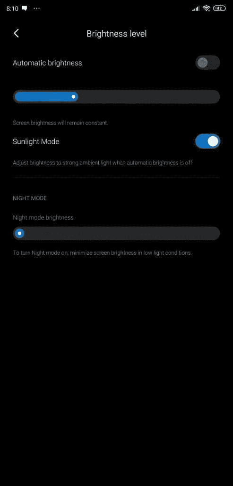

# 小米在 MIUI 11 中测试新的“阳光模式”显示设置

> 原文：<https://www.xda-developers.com/xiaomi-sunlight-mode-miui-11/>

# 小米在 MIUI 11 中测试新的“阳光模式”显示设置

小米正在测试 MIUI 11 中名为阳光模式的新显示设置。此设置根据强烈的环境照明调节亮度。

智能手机的最大显示屏亮度通常不是大多数消费者担心的事情，但在某些情况下,[显示屏可能无法变得足够亮，无法在户外使用。在这种情况下，许多原始设备制造商采用一种特殊的“高亮度模式”，当环境照明足够亮时，该模式会自动触发。在红米 K20 Pro/米 9T Pro 的最新 MIUI 11 夜间版本中，我们发现了一个名为“阳光模式”的新设置。当你在阳光直射下使用手机时，这一新设置会将显示屏亮度提升到最高水平。](https://www.xda-developers.com/google-pixel-4-high-brightness-mode-fix/)

具体来说，日光模式的描述说，该功能“[调整]亮度，以强烈的环境光时，自动亮度关闭。”我们深入研究了框架代码，发现当环境照明超过 12，000 勒克斯持续 5 秒钟时，这种新模式就会激活。当该模式激活时，显示器亮度大概增加到最大水平。当环境照明低于 12，000 勒克斯持续 2 秒钟时，显示屏亮度将恢复到进入日光模式前的设置值。

 <picture></picture> 

Credits: XDA Member kacskrz

这个设置似乎并不依赖于任何特殊的“高亮度模式”，但对于那些关闭自动亮度的人来说，它会很有用。启用此模式后，每次外出时，您都不必手动将亮度调整到 100%。这项功能似乎只是使用环境光传感器，因此它可能会在大多数运行 MIUI 11 的小米设备上可用。