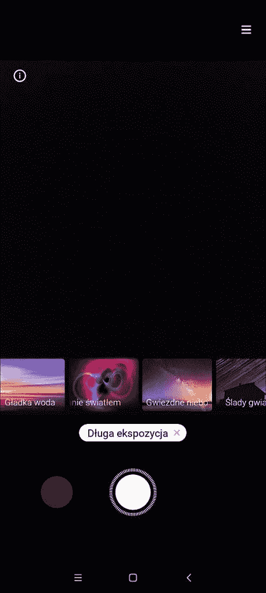

# 小米正在测试 MIUI 12 中类似谷歌相机的天体摄影模式

> 原文：<https://www.xda-developers.com/xiaomi-testing-google-camera-astrophotography-mode-miui-12-camera/>

小米的 MIUI 12 [为小米、Redmi 和 POCO 智能手机的 UX 增加了许多新口味](https://www.xda-developers.com/miui-12-hands-on-new-features-added-xiaomi-android/)。尽管 Android 皮肤[已经开始在全球一些设备上推出](https://www.xda-developers.com/download-miui-12-stable-update-rolling-out-several-xiaomi-redmi-mi-poco-devices/)，但这并不妨碍小米尝试并不断添加新功能。说到相机，小米已经在中国 MIUI 12 测试版的相机应用中添加了一系列漂亮的功能，如“[魔法克隆](https://www.xda-developers.com/xiaomi-miui-12-beta-magic-clone-miui-camera/)”和[全屏手势支持](https://www.xda-developers.com/xiaomi-miui-camera-app-full-screen-gesture-support-miui-12-beta-builds/)，并且还在测试[另一个类似于谷歌 Top Shot](https://www.xda-developers.com/xiaomi-working-top-shot-like-feature-smartphones-miui-12-mi-camera/) 的功能。现在，我们得知小米可能正在测试另一个类似于[谷歌相机的天文摄影](https://www.xda-developers.com/google-pixel-4-astrophotography-preview-google-camera-7-0/)模式的功能。

XDA 消息人士 *[kacskrz](https://forum.xda-developers.com/member.php?u=8240900) 和@Deiki* 最近通知我们，小米正在 MIUI 12 相机应用程序中开发长曝光模式。该功能将允许用户拍摄星空、移动的人群、光绘、柔滑的水等图像。通过捕捉移动物体的轨迹。

长曝光功能的这些选项是在 APK 从最新的 MIUI 12 中国测试版 ROM 中拆卸 MIUI 相机应用程序时首次发现的。相机应用程序代码中的以下字符串描述了长曝光模式中的不同选项:

```
 <string name="ambilight_description_title">About long exposure</string>
<string name="ambilight_intro_crowd_moving_part1">When shooting on a crowded street, ask your subject to stand still. Other people will appear as blurry trails.</string>
<string name="ambilight_intro_crowd_moving_part2">You can also take pictures of busy traffic and moving crowds. Long exposure will keep the buildings crisp, but all moving objects will be blurry.</string>
<string name="ambilight_intro_light_track">Use a light source to \"paint\" over a dark scene to bring all the lit pieces together in one image.</string>
<string name="ambilight_intro_magic_star">Use this mode in places with low light pollution. The exposure will be set to %d seconds, so using a tripod is a great idea.</string>
<string name="ambilight_intro_silky_water_part1">Use this mode when shooting moving clouds. It will give the sky an \"oil painting\" effect.</string>
<string name="ambilight_intro_silky_water_part2">This mode makes moving water (rivers, waterfalls, and lakes) look like satin.</string>
<string name="ambilight_intro_star_track">Shooting the starry sky for a long time can capture the trajectories of stars. Don\'t forget to use a tripod and shoot continuously for at least %d minutes.</string>
<string name="ambilight_intro_star_track_2">对星空进行长时间的拍摄，可将星星的移动路径完整保留在画面中，请使用三脚架。拍摄%d 分钟以上时，可同时获得星轨视频与照片。</string>
<string name="ambilight_intro_traffic_light">At night, you can capture the trajectory of bright moving lights (on cars and ships, for example). This mode allows to preview the final result on your screen in real time.</string>
<string name="ambilight_scene_crowd_moving">Moving crowd</string>
<string name="ambilight_scene_light_track">Light painting</string>
<string name="ambilight_scene_magic_star">Starry sky</string>
<string name="ambilight_scene_silky_water">Silky water</string>
<string name="ambilight_scene_star_track">Star trails</string>
<string name="ambilight_scene_traffic_light">Neon trails</string>
<string name="ambilight_tips_for_longtime_using_tripod">Use a tripod to capture a longer exposure</string>
<string name="ambilight_tips_for_suggest_using_tripod">Use a tripod</string>
<string name="ambilight_tips_for_using_tripod">Use a tripod</string>

```

有趣的是，该功能已经在 MIUI 12 测试版中为[POCO F2 Pro](https://www.xda-developers.com/poco-f2-pro-notchless-pop-up-camera-design-qualcomm-snapdragon-865-launch/)([red mi K30 Pro](https://www.xda-developers.com/xiaomi-redmi-k30-pro-notchless-pop-up-camera-design-snapdragon-865-china-launch/))推出。从波兰电报用户 *@hardziol* 分享的截图中，我们可以看到该功能可以使用自动慢速快门速度进行光线绘画、柔滑的水、星空。我们可以期待该功能在其他设备上可用——除非小米只是有选择地为带有[特定相机传感器](https://www.xda-developers.com/redmi-k30-pro-64mp-sony-imx686-sensor-8k-video-recording-dual-ois/)的手机推出该功能。

 <picture></picture> 

Thanks to Telegram user @hardziol for the screenshot

当该功能更广泛可用时，我们将分享更多更新。