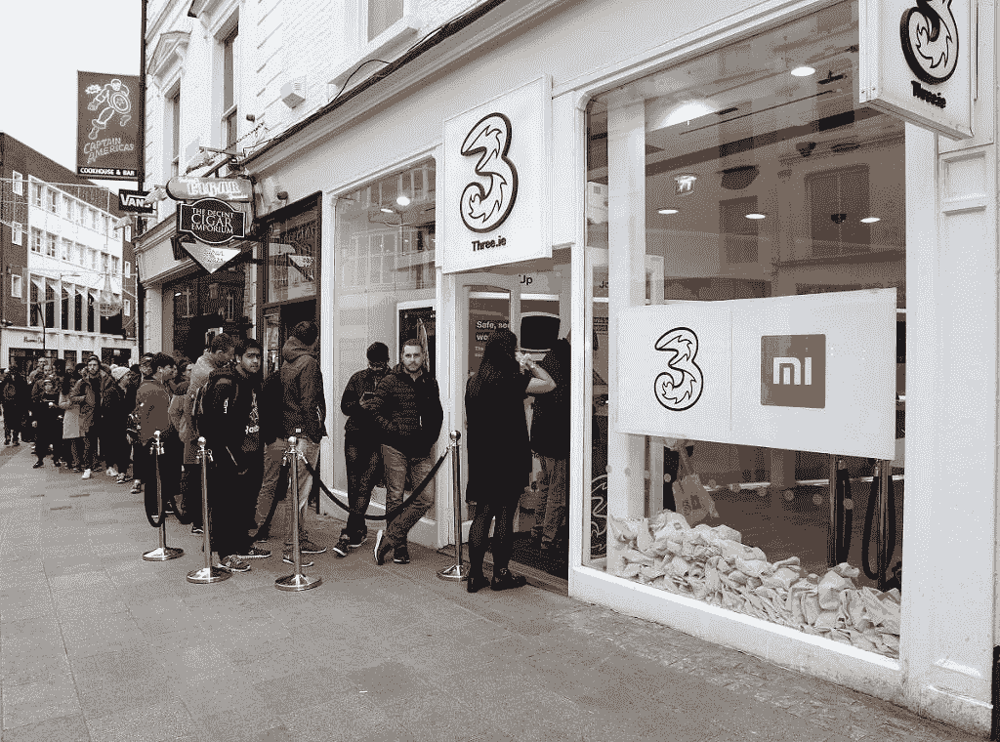

# 小米在英国的发布被《成长的烦恼》玷污了，但该公司仍在向前看

> 原文：<https://www.xda-developers.com/xiaomis-uk-launch-has-been-sullied-by-growing-pains-but-the-company-is-still-looking-forward/>

尽管小米是世界上第四大智能手机供应商(根据 IDC 的数据,),但在亚洲和欧洲部分地区之外，小米作为一个品牌相对不为人知。例如，走在伦敦或都柏林的街道上，你很难发现有人手里拿着小米手机。然而，随着小米向欧洲，尤其是英国的扩张，他们的手机变得越来越普遍。

小米是一家因其低价、高性能的智能手机而在印度和中国备受尊崇的公司。他们以不超过 5%的利润率出售他们的设备，这意味着他们的智能手机价格非常接近物料清单。因此，您可以获得类似于三星、索尼或任何其他主要原始设备制造商的旗舰产品的性能，但价格却很低。

也就是说，这不是一条容易的路。该公司有一些重大的营销失误，这严重阻碍了它的扩张。

## 精心策划的行动

我们联系了小米英国和爱尔兰的销售和营销总监 [Wilkin Lee](https://twitter.com/wilkinlee?lang=en) ，讨论该团队在组织英国发布会时面临的障碍，以及他们是如何克服这些障碍的。

小米这个品牌以前主要局限于印度、中国和电子商务网站，最近将目光投向了全球扩张。英国和爱尔兰是小米首批扩张的欧洲国家之一。“欧洲是我们全球扩张的重点，英国和爱尔兰在这一过程中扮演着关键角色。特别是英国和爱尔兰的消费者，他们是欧洲乃至世界上联系最紧密的人群之一，我们相信他们会喜欢我们价格合理的智能手机以及我们的联网硬件，”Wilkin 说道。

小米在英国的扩张获得了他们在其他欧盟国家难以置信的成功。据[科纳仕公司](https://www.canalys.com/newsroom/smartphone-shipments-fall-63-europe-q1-2018#)称，2018 年，由于在[西班牙](https://www.xda-developers.com/xiaomi-expands-spain-online-sales/)、罗马尼亚[法国](https://www.xda-developers.com/xiaomi-france-italy-expansion/)的持续增长，他们在欧盟市场的份额在 Q1 增长了 1000%以上。

但是无论怎么想象，这都不是一次轻松的旅程。*“我们进入英国+爱尔兰市场的最大障碍之一是品牌认知度——在英国+爱尔兰，消费者对我们的了解相对较少，”*Wilkin 说。

小米已经采取了几项措施来提高品牌知名度。第一家英国 Mi 商店于去年 11 月在伦敦韦斯特菲尔德购物中心开业。在爱尔兰，T2 公司还与网络服务提供商 Three 合作，在爱尔兰的线下商店销售他们的产品。结合[小米的在线商店](https://www.mi.com/uk/)现在在英国提供他们的许多产品，这是一个令人鼓舞的扩张开端。

## 发育期痛

然而，到目前为止增长缓慢。根据 StatCounter 的数据，该公司自去年 11 月在 T2 推出新产品以来，只获得了不到 2%的爱尔兰市场份额。我们使用爱尔兰市场作为基线，因为英国还没有统计数据，尽管市场大体相似。考虑到发射基本上顺利进行，这是令人惊讶的。这种缓慢增长的一个可能原因是小米产品的可用性非常有限。这些产品只能通过三家商店在爱尔兰正式销售。这极大地限制了该公司的销售能力，因为三名员工提到，小米产品的销售速度已经达到了三人能买到的最快速度。

 <picture></picture> 

People queueing outside of Three Ireland's store on Grafton Street, Dublin, to receive a free Xiaomi goodie bag.

在英国，市场份额不太清楚，但威尔金表示，密歇根州韦斯特菲尔德购物中心的商店在开业周末表现非常好。最初的反应让我们不知所措。在它开放的那个周末，我们有 100 多名粉丝排队等待第一次看到这款联网产品，在第一个周末的交易中，有超过 1500 名客户。”我亲自去过这家商店，有几个顾客在那里闲逛，凝视着陈列的各种产品。这家商店令人印象深刻；顾客的数量没有减少。话虽如此，我确实是在接近打烊的时候去的，所以我看到的顾客数量很可能不能代表商店的日常客流量。另一方面，我参观了小米专卖店后面的苹果专卖店(也在西田购物中心)，那里挤满了顾客。当然，在英国，苹果是比小米更大的品牌，但消费者数量的差异是惊人的。这引发了人们对 Mi 商店经营状况的质疑。

小米在英国发布的最大错误是误导性的闪购。小米在中国和印度广泛使用闪购营销技术来提升他们的形象。它通常涉及某些商品的超低价格。显然，供应是有限的，所以在快速销售中吹捧的产品通常很快售罄。然而，当小米宣布他们将在英国举行快闪销售来庆祝他们的发布时，人们期待的是更传统的快闪销售，其中有许多产品可供选择。然而，小米有不同的想法。只有 10 部手机可供销售，这意味着它们很快就销售一空。结果，人们登录小米的网站，期望以 1 美元的价格买到一部漂亮的智能手机，[，却发现](https://www.bbc.com/news/technology-46183480)所有东西都“售罄”

可以理解，公众对此反应强烈。有人担心，闪电销售的条款不明确，而且实际上没有 1 英镑的手机。然而，小米在 Twitter 上发布了一份声明，澄清确实有 10 款设备以 1 的价格出售。然而，这并没有平息这场大火，因为该公司的脸书页面上投诉不断。[一名用户](https://twitter.com/phil_williams81/status/1060871367812415488)甚至声称网站上的代码是这样写的，以至于销售一开始就显示“售罄”的横幅，甚至没有检查手机是否已经售出。

## 此时此地

抛开灾难性的闪购不谈，小米似乎已经覆盖了迄今为止的所有基础。威尔金表示，在小米的全球扩张计划中，向英国和爱尔兰市场扩张是“合乎逻辑的下一步”。根据他的说法，小米将英国视为*“一个非常成熟和创新的市场。*“尽管很谨慎(威尔金说他们仍然需要从消费者和商业伙伴那里学习很多东西)，小米似乎对自己相当有信心。“*在过去的八年里，我们高性能、价格合理的智能手机以及生态系统产品提高了整个行业的性能和质量标准，为中国移动互联网的崛起做出了重大贡献。我们现在希望将这种积极的影响扩展到整个世界。*

不过，他们有充分的理由自信。根据[小米第三季度财报](http://blog.mi.com/en/2018/11/19/xiaomis-q3-revenue-surges-49-1-achieves-rapid-growth-across-all-business-segments/)显示，2018 年第三季度，他们的国际业务收入同比增长 112.7%，占总收入的 43.9%。这意味着，2018 年第三季度，来自中国以外国家的收入占其总收入的近一半。虽然这可能是你对大公司的期望，但重要的是要记住，小米还不到 10 岁，而且在不到 5 年前才首次拓展出中国。这是巨大的增长，因此该公司继续扩张是有道理的。

事实上，小米在中国的增长如此迅猛，以至于他们在成立 4 年内就花 360 万美元买下了中国最贵的域名 mi.com[。](https://www.cnet.com/news/xiaomi-spent-3-6m-on-new-two-letter-domain/)

## 展望未来

我问威尔金，他对公司在英国和爱尔兰市场的未来有什么预测。他说，他们“肯定想成为世界上最重要、最大的科技公司之一，但市场份额不是我们唯一努力的目标。”小米已经进入全球 82 个市场，并在其中 30 个市场中名列前 5。虽然最初的统计数据——至少对爱尔兰市场来说——并不令人印象深刻，但这仍是该公司发展的早期阶段。同样值得注意的是，OPPO 等竞争对手[的到来将使该公司的处境更加艰难。](https://www.xda-developers.com/oppo-rx17-pro-rx17-neo-find-x-uk/)

毫无疑问，小米最大的障碍是品牌知名度。一旦更多的消费者看到小米销售其设备的价格，很难相信他们不会涌向小米商店。威尔金说，他们确实计划在未来的某个时候开设更多的商店，但目前还不清楚这一计划会走多远。

毫无疑问，小米将寻求在英国和爱尔兰市场继续增长和扩张。要做到这一点，最好的方法是创新和超越竞争对手。事实上，这似乎正是他们的目标。小米 Mix 3 最近在英国推出[，5G 版正在筹备中](https://www.xda-developers.com/xiaomi-mi-mix-3-snapdragon-855-5g-europe/)。虽然小米的智能手机通常价格低廉，但 5G 支持[似乎会在要价](https://www.xda-developers.com/oneplus-snapdragon-855-5g-expensive/)上增加几百美元，所以值得注意的是，这款手机很可能不会便宜。

总而言之，小米在英国和爱尔兰的发布会是成功的，但只是在某种意义上。我的意思是这次发射没有重大问题，没有延迟，没有类似的事情。然而，根据我们目前掌握的统计数据，小米在市场上的表现似乎并不是特别好。尽管人们可能会说，小米仍处于扩张的早期阶段，但鉴于小米在其他国家的迅猛增长，人们可能会对迄今的结果有点失望。

我们已经改变了数亿人的生活方式，我们希望未来成为全球数十亿人生活的一部分。——威尔金·李