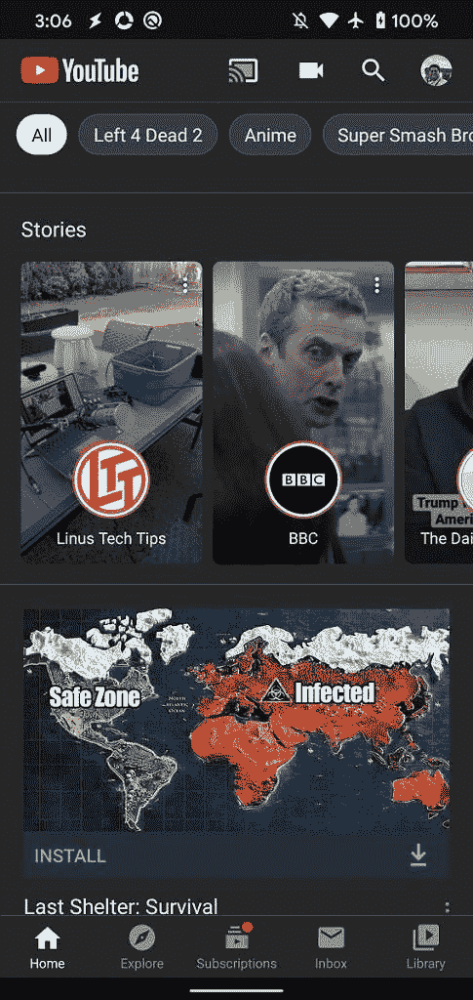

# YouTube 准备了睡前提醒和抖音式的“短裤”

> 原文：<https://www.xda-developers.com/youtube-prepares-bedtime-reminders-shorts/>

当数百万人因为新冠肺炎而被困在家中时，YouTube、网飞和亚马逊 Prime Video 等视频流媒体服务的流量正在大幅增加。为了利用这种增长，每个视频平台都做出了改变，并引入了新的功能，以保持用户观看而不会使他们的服务器过载。比如 YouTube，在全球范围内将默认视频质量设置为 480p，有些国家甚至[将最高视频质量设置为 480p](https://www.xda-developers.com/youtube-android-restricts-maximum-video-streaming-quality-480p-standard-definition-india-covid19/) 。该平台还准备在 Android 应用程序中添加[默认视频质量偏好](https://www.xda-developers.com/youtube-151233-prepares-video-quality-preferences-android/)。在最新版本的 Android 版 YouTube 应用程序 15.13.33 中，我们发现了 YouTube 正准备添加“睡前提醒”的证据，以警告用户不要在晚上观看太多视频。更重要的是，一份新的报告称，谷歌将通过在 YouTube 上引入“短片”来挑战短视频平台抖音。

APK 拆卸通常可以预测应用程序未来更新中可能出现的功能，但我们在这里提到的任何功能都可能不会出现在未来的版本中。这是因为这些特性目前还没有在实时构建中实现，并且可能会被开发人员在未来的构建中随时引入。

**睡前提醒**

YouTube 应用程序 15.13.33 版本中的新字符串暗示了“就寝提醒”功能。这项功能将允许用户设置就寝时间，在此期间，如果用户仍在观看视频，应用程序将提醒用户睡觉。一个选项将允许用户推迟提醒，直到他们看完当前视频。

```
 <string name="bedtime_reminder_end_time">End time</string>
<string name="bedtime_reminder_setting_dialog_title">"Remind me when it's bedtime"</string>
<string name="bedtime_reminder_setting_summary">Tap to customize time</string>
<string name="bedtime_reminder_setting_title">"Remind me when it's bedtime"</string>
<string name="bedtime_reminder_start_time">Start time</string>
<string name="bedtime_reminder_wait_until">Wait until I finish video to show reminder</string> 
```

该设置将位于“常规”设置页面，但它是 YouTube 添加数字福利工具的更广泛努力的一部分。目前，用户可以通过设置中“观看时间”部分的一些功能来管理他们的 YouTube 观看时间。

**【短裤】**

去年 10 月，[](https://www.wsj.com/articles/google-weighs-acquisition-of-rival-to-video-app-tiktok-11570213344)*报道称，谷歌有意收购一项名为“Firework”的类似抖音的服务现在，根据[](https://www.theinformation.com/articles/youtube-plans-shorts-to-rival-tiktok)*(via[*9 to 5 Google*](https://9to5google.com/2020/04/01/youtube-shorts-tiktok/))的信息，YouTube 正计划于今年年底在现有应用中发布一项“短裤”功能。据报道，该功能将允许用户使用 YouTube 许可的音乐库创建和上传短视频。这些视频将出现在 Android 和 iOS 客户端的新提要中。与“故事”功能一样，“短片”最初可能仅限于拥有一定订阅量的 YouTubers。**

 **<picture></picture> 

YouTube home page showing Stories

几个字符串和其他资源出现在 YouTube 应用程序的最近版本中，用于一个名为“短裤”的功能。然而，这些字符串并没有揭示关于该特征的太多信息。

```
 <string name="shorts_create_a_video">Create a video</string>
<string name="shorts_gallery_upload">Upload</string>
<string name="shorts_multi_segment_progress_bar_start_label">Start</string>
<string name="shorts_multi_segment_progress_bar_stop_label">Stop</string>
<string name="shorts_speed_control_fast_label">Fast</string>
<string name="shorts_speed_control_fast_text">2X</string>
<string name="shorts_speed_control_normal_label">Normal</string>
<string name="shorts_speed_control_normal_text">1X</string>
<string name="shorts_speed_control_slow_label">Slow</string>
<string name="shorts_speed_control_slow_text">0.5X</string>
<string name="shorts_speed_control_very_fast_label">Very fast</string>
<string name="shorts_speed_control_very_fast_text">5X</string>
<string name="shorts_speed_control_very_slow_label">Very slow</string>
<string name="shorts_speed_control_very_slow_text">0.2X</string> 
```

一旦这项新功能即将推出，我们可能会了解更多相关信息。

* * *

*感谢 PNF 软件为我们提供了使用许可 [JEB Decompiler](https://www.pnfsoftware.com/?aid=xdadev) ，这是一款针对 Android 应用的专业级逆向工程工具。***