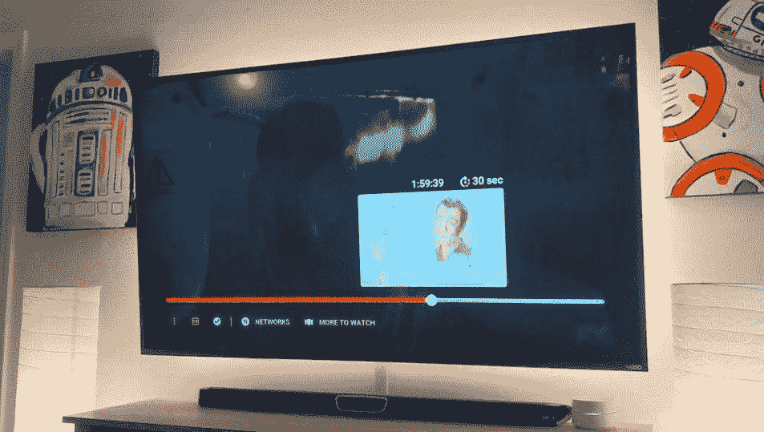

# Youtube 电视更新添加了渐进式快进和刷新的用户界面

> 原文：<https://www.xda-developers.com/youtube-tv-progressive-fast-forward-ui/>

# Youtube 电视更新添加了渐进式快进和刷新的用户界面

YouTube 电视更新增加了快进和刷新的“正在播放”用户界面。它目前已经推广到 50%的用户。

YouTube TV 是谷歌的免费直播电视服务，每月收费 50 美元。它可以在许多不同的平台上使用，包括 Android TV、Apple TV、Roku 和许多游戏机。最新的更新在过去一周已经向用户推出，增加了一些功能，如渐进式快进、更好的建议和更大的缩略图。该服务的 subreddit 上的一名 YouTube 电视工程师表示，该展示已经发送给了 50%的用户。他们还建议，如果你现在想要更新，重新安装应用程序会给你一个新的访问者 ID，并有机会获得更新。你可以重新安装多次，直到你得到它。显然，这还不能在所有平台上运行。

正如你在上面看到的，预览缩略图更大了。然而，此次更新中引入的最佳改进是渐进式快进。对于那些不知道的人来说，渐进式快进是指当你按住快进按钮跳过时，你按住它的时间越长，速度越快。它从每秒 15 秒开始，然后到每秒 30 秒，最后，每秒 1 分钟。这是大多数平台上的一个典型特性，认为它花了这么长时间才实现是疯狂的。按住快进也不会再显示其他节目的缩略图。

 <picture></picture> 

Fast-forward on the new YouTube TV // Source: [9to5Google](https://9to5google.com/2019/07/01/youtube-tv-progressive-fast-forward/)

对于那些使用 YouTube 电视的人来说，他们现在可以在观看节目时享受更干净的体验。更新只影响正在播放的 UI，正如已经提到的，50%的用户已经有了。如果你不能通过不断卸载和重新安装应用程序来让它工作，那么你只能等待。如果目前的首次展示进展顺利，没有任何重大问题，更新应该很快就会发布给所有用户。

* * *

**来源:[/r/YouTube TV](https://www.reddit.com/r/youtubetv/comments/c6ayr3/new_interface_on_roku/)//Via:[9 to 5 Google](https://9to5google.com/2019/07/01/youtube-tv-progressive-fast-forward/)**