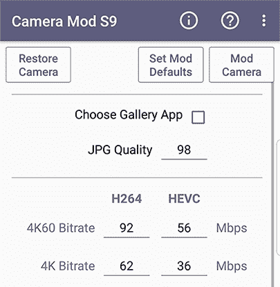

# 三星 Galaxy S9 的零相机模式提高了比特率

> 原文：<https://www.xda-developers.com/zero-camera-mod-samsung-galaxy-s9/>

# 三星 Galaxy S9 的零相机模式提高了图片和视频比特率，并消除了录制限制

三星 Galaxy S9 的零相机模式提高了图片和视频比特率，同时也消除了拍摄限制。

三星 Galaxy S9 相机简直令人惊叹。事实上，这可能是我们目前拥有的最好的手机相机之一。然而，仅仅因为它是最好的，并不意味着没有任何改进的余地。XDA 资深成员 [zeroprobe](https://forum.xda-developers.com/member.php?u=2516635) 一直致力于 Zero Camera Mod，这是对三星 Galaxy S9 的修改，旨在使相机变得更好。它改变了一些设置，取消了一些限制，以提供更高质量的相机。这些限制的存在可能是有原因的，但没有一个原因会立即显现出来。

你会注意到的第一个变化是三星 Galaxy S9 的 Zero Camera Mod 将录制视频的比特率提高了约 30%。虽然这并不意味着视频质量提高 30%，但这意味着您的视频将更加一致。这也意味着，有时，视频会比股票质量更高。图像和视频拍摄的其他值得注意的改进包括更高的 JPG 质量，没有录制时间限制，以及所有模式下的自动对焦跟踪。要安装所有这些，你需要刷新线程中的 flashable zip。如果这还不够，你还可以通过安装修改后的应用程序来访问更多内容。

 <picture></picture> 

A huge amount of features are offered in the Samsung Galaxy S9 Zero Camera Mod.

修改后的应用程序提供了许多额外的功能。4GB 的视频限制被取消，同时允许您选择自己的自定义比特率。更好的是，现在支持设置超过 10 秒的快门时间。

如果你想给国防部一个尝试，你可以按照下面的链接去我们的论坛。**它只在 Exynos 版本的设备**上工作，所以如果你有[一个为数不多的可解锁的骁龙设备](https://www.xda-developers.com/snapdragon-samsung-galaxy-s9-lineageos-15-1/)，你现在就不走运了。

* * *

[**三星 Galaxy S9 论坛上的 Zero Camera Mod**](https://forum.xda-developers.com/galaxy-s9/themes/zero-camera-mod-bitrates-jpg-remove-t3793395)